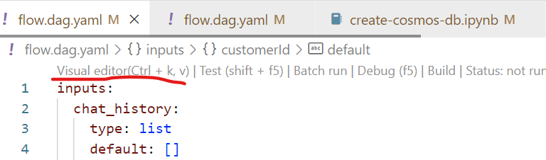

# End to End LLM App development with Azure AI Studio and Prompt Flow

**Table Of Contents**

1. [Learning Objectives](#1-learning-objectives)
2. [Pre-Requisites](#2-pre-requisites)
3. [Setup Development Environment](#3-development-environment)
    - 3.1 [Pre-built Container, GitHub Codespaces](#31-pre-built-environment-in-cloud-github-codespaces)
    - 3.2 [Pre-built Container, Docker Desktop](#32-pre-built-environment-on-device-docker-desktop)
    - 3.3 [Manual Python env, Anaconda or venv](#33-manual-setup-environment-on-device-anaconda-or-venv)
4. [Provision Azure Resources](#4-create-azure-resources)
    - 4.1 [Authenticate With Azure](#41-authenticate-with-azure)
    - 4.2 [Run Provisioning Script](#42-run-provisioning-script)
    - 4.3 [Verify config.json setup](#43-verify-configjson-setup)
    - 4.4 [Verify .env setup](#44-verify-env-setup)
    - 4.5 [Verify local Connections](#45-verify-local-connections-for-prompt-flow)
    - 4.6 [Verify cloud Connections](#46-verify-cloud-connections-for-prompt-flow)
5. [Populate With Your Data](#5-populate-with-sample-data)
6. [Build Your Prompt Flow](#6-building-a-prompt-flow)
    - 6.1 [Explore contoso-chat Prompt Flow](#61-explore-the-contoso-chat-prompt-flow)
    - 6.2 [Understand Prompt Flow Components](#62-understand-prompt-flow-components)
    - 6.3 [Run The Prompt Flow](#63-run-the-prompt-flow)
7. [Evaluate Your Prompt Flow](#7-evaluating-prompt-flow-results)
8. [Deploy Using Azure AI SDK](#8-deployment-with-sdk)
9. [Deploy with GitHub Actions](#9-deploy-with-github-actions)


_If you find this sample useful, consider giving us a star on GitHub! If you have any questions or comments, consider filing an Issue on the [source repo](https://github.com/Azure-Samples/contoso-chat)_.


## 1. Learning Objectives

Learn to build an Large Language Model (LLM) Application with a RAG (Retrieval Augmented Generation) architecture using **Azure AI Studio** and **Prompt Flow**. By the end of this workshop you should be able to:

 1. Describe what Azure AI Studio and Prompt Flow provide
 2. Explain the RAG Architecture for building LLM Apps
 3. Build, run, evaluate, and deploy, a RAG-based LLM App to Azure.


## 2. Pre-Requisites

- **Azure Subscription** - [Signup for a free account.](https://azure.microsoft.com/free/)
- **Visual Studio Code** - [Download it for free.](https://code.visualstudio.com/download)
- **GitHub Account** - [Signup for a free account.](https://github.com/signup)
- **Access to Azure Open AI Services** - [Learn about getting access.](https://learn.microsoft.com/legal/cognitive-services/openai/limited-access)
- **Ability to provision Azure AI Search (Paid)** - Required for Semantic Ranker

## 3. Development Environment

The repository is instrumented with a `devcontainer.json` configuration that can provide you with a _pre-built_ environment that can be launched locally, or in the cloud. You can also elect to do a _manual_ environment setup locally, if desired. Here are the three options in increasing order of complexity and effort on your part. **Pick one!**

 1. **Pre-built environment, in cloud** with GitHub Codespaces
 1. **Pre-built environment, on device** with Docker Desktop
 1. **Manual setup environment, on device** with Anaconda or venv

The first approach is _recommended_ for minimal user effort in startup and maintenance. The third approach will require you to manually update or maintain your local environment, to reflect any future updates to the repo.

To setup the development environment you can leverage either GitHub Codespaces, a local Python environment (using Anaconda or venv), or a VS Code Dev Container environment (using Docker).

### 3.1 Pre-Built Environment, in cloud (GitHub Codespaces)

**This is the recommended option.**
 - Fork the repo into your personal profile.
 - In your fork, click the green `Code` button on the repository
 - Select the `Codespaces` tab and click `Create codespace...` 
 
This should open a new browser tab with a Codespaces container setup process running. On completion, this will launch a Visual Studio Code editor in the browser, with all relevant dependencies already installed in the running development container beneath. **Congratulations! Your cloud dev environment is ready!**

### 3.2 Pre-Built Environment, on device (Docker Desktop)

This option uses the same `devcontainer.json` configuration, but launches the development container in your local device using Docker Desktop. To use this approach, you need to have the following tools pre-installed in your local device:
 - Visual Studio Code (with Dev Containers Extension)
 - Docker Desktop (community or free version is fine)

**Make sure your Docker Desktop daemon is running on your local device.** Then,
 - Fork this repo to your personal profile
 - Clone that fork to your local device
 - Open the cloned repo using Visual Studio Code

If your Dev Containers extension is installed correctly, you will be prompted to "re-open the project in a container" - just confirm to launch the container locally. Alternatively, you may need to trigger this step manually. See the [Dev Containers Extension](https://marketplace.visualstudio.com/items?itemName=ms-vscode-remote.remote-containers) for more information.

Once your project launches in the local Docker desktop container, you should see the Visual Studio Code editor reflect that connection in the status bar (blue icon, bottom left). **Congratulations! Your local dev environment is ready!**

### 3.3 Manual Setup Environment, on device (Anaconda or venv)

1. Clone the repo

    ```bash
    git clone https://github.com/azure/contoso-chat
    ```

1. Open the repo in VS Code

    ```bash
    cd contoso-chat
    code .
    ```

1. Install the [Prompt Flow Extension](https://marketplace.visualstudio.com/items?itemName=prompt-flow.prompt-flow) in VS Code
      - Open the VS Code Extensions tab
      - Search for "Prompt Flow"
      - Install the extension

1. Install the [Azure CLI](https://learn.microsoft.com/cli/azure/install-azure-cli) for your device OS

1. Create a new local Python environment using **either** [anaconda](https://www.anaconda.com/products/individual) **or** [venv](https://docs.python.org/3/library/venv.html) for a managed environment.

    1. **Option 1**: Using anaconda

        ```bash
        conda create -n contoso-chat python=3.11
        conda activate contoso-chat
        pip install -r requirements.txt
        ```

    1. **Option 2:** Using venv

        ```bash
        python3 -m venv .venv
        source .venv/bin/activate
        pip install -r requirements.txt
        ```


## 4. Create Azure resources

We setup our development ennvironment in the previous step. In this step, we'll **provision Azure resources** for our project, ready to use for developing our LLM Application.


### 4.1 Authenticate with Azure

Start by connecting your Visual Studio Code environment to your Azure account:

1. Open the terminal in VS Code and use command `az login`. 
1. Complete the authentication flow. 

**If you are running within a dev container, use these instructions to login instead:**
 1. Open the terminal in VS Code and use command `az login --use-device-code`
 1. The console message will give you an alphanumeric code
 1. Navigate to _https://microsoft.com/devicelogin_ in a new tab
 1. Enter the code from step 2 and complete the flow.

In either case, verify that the console shows a message indicating a successful authentication. **Congratulations! Your VS Code session is now connected to your Azure subscription!**

### 4.2 Run Provisioning Script

The project requires a number of Azure resources to be set up, in a specified order. To simplify this, an auto-provisioning script has been provided. (NOTE: It will use the current active subscription to create the resource. If you have multiple subscriptions, use `az account set --subscription "<SUBSCRIPTION-NAME>"` first to set the desired active subscription.)

Run the provisioning script as follows:

  ```bash
  ./provision.sh
  ```

The script should **set up a dedicated resource group** with the following resources:

 - **Azure AI services** resource
 - **Azure Machine Learning workspace** (Azure AI Project) resource
 - **Search service** (Azure AI Search) resource
 - **Azure Cosmos DB account** resource

The script will set up an **Azure AI Studio** project with the following model deployments created by default, in a relevant region that supports them. _Your Azure subscription must be [enabled for Azure OpenAI access](https://learn.microsoft.com/azure/ai-services/openai/overview#how-do-i-get-access-to-azure-openai)_.
 - gpt-3.5-turbo
 - text-embeddings-ada-002
 - gpt-4

The Azure AI Search resource will have **Semantic Ranker** enabled for this project, which requires the use of a paid tier of that service. It may also be created in a different region, based on availability of that feature.

### 4.3 Verify `config.json` setup

The script should automatically create a `config.json` in your root directory, with the relevant Azure subscription, resource group, and AI workspace properties defined. _These will be made use of by the Azure AI SDK for relevant API interactions with the Azure AI platform later_.

If the config.json file is not created, simply download it from your Azure portal by visiting the _Azure AI project_ resource created, and looking at its Overview page.

### 4.4 Verify `.env` setup

The default sample has an `.env.sample` file that shows the relevant environment variables that need to be configured in this project. The script should create a `.env` file that has these same variables _but populated with the right values_ for your Azure resources.

If the file is not created, simply copy over `.env.sample` to `.env` - then populate those values manually from the respective Azure resource pages using the Azure Portal (for Azure CosmosDB and Azure AI Search) and the Azure AI Studio (for the Azure OpenAI values)

### 4.5 Verify local connections for Prompt Flow

You will need to have your local Prompt Flow extension configured to have the following _connection_ objects set up:
 - `contoso-cosmos` to Azure Cosmos DB endpoint
 - `contoso-search` to Azure AI Search endpoint
 - `aoai-connection` to Azure OpenAI endpoint

Verify if these were created by using the [pf tool](https://microsoft.github.io/promptflow/reference/pf-command-reference.html#pf-connection) from the VS Code terminal as follows:

```bash
pf connection list
```

If the connections are _not_ visible, create them by running the `connections/create-connections.ipynb` notebook. Then run the above command to verify they were created correctly.

### 4.6 Verify cloud connections for Prompt Flow

The auto-provisioning will have setup 2 of the 3 connections for you by default. First, verify this by
 - going to [Azure AI Studio](https://ai.azure.com)
 - signing in with your Azure account, then clicking "Build"
 - selecting the Azure AI project for this repo, from that list
 - clicking "Settings" in the sidebar for the project
 - clicking "View All" in the Connections panel in Settings

You should see `contoso-search` and `aoai-connection` pre-configured, else create them from the Azure AI Studio interface using the **Create Connection** workflow (and using the relevant values from your `.env` file).

You will however need to **create `contoso-cosmos` manually from Azure ML Studio**. This is a temporary measure for _custom connections_ and may be automated in future. For now, do this:

1. Visit https://ai.azure.com and sign in if necessary
1. Under Recent Projects, click your Azure AI project (e.g., contoso-chat-aiproj)
1. Select Settings (on sidebar), scroll down to the Connections pane, and click "View All"
1. Click "+ New connection", modify the Service field, and select Custom from dropdown
1. Enter "Connection Name": contoso-cosmos, "Access": Project.
1. Click "+ Add key value pairs" **four** times. Fill in the following details found in the `.env` file:
      - key=key, value=.env value for COSMOS_KEY, is-secret=checked
      - key=endpoint, value=.env value for COSMOS_ENDPOINT
      - key=containerId, value=customers
      - key=databaseId, value=contoso-outdoor
1. Click "Save" to finish setup. 

Refresh main Connections list screen to verify that you now have all three required connections listed.


## 5. Populate with sample data

In this step we want to populate the required data for our application use case.

1. **Populate Search Index** in Azure AI Search
    - Run the code in the `data/product_info/create-azure-search.ipynb` notebook.
    - Visit the Azure AI Search resource in the Azure Portal
    - Click on "Indexes" and verify that a new index was created
1. **Populate Customer Data** in Azure Cosmos DB
    - Run the code in the `data/customer_info/create-cosmos-db.ipynb` notebook. 
    - Visit the Azure Cosmos DB resource in the Azure Portal
    - Click on "Data Explorer" and verify tat the container and database were created!

## 6. Building a prompt flow

We are now ready to begin building our prompt flow! The repository comes with a number of pre-written flows that provide the starting points for this project. In the following section, we'll explore what these are and how they work.

### 6.1. Explore the `contoso-chat` Prompt Flow

A prompt flow is a DAG (directed acyclic graph) that is made up of nodes that are connected together to form a flow. Each node in the flow is a python function tool that can be edited and customized to fit your needs. 

- Click on the `contoso-chat/flow.dag.yaml` file in the Visual Studio Code file explorer. 
- You should get a view _similar to_ what is shown below.
- Click the `Visual editor` text line shown underlined below.
    

- This will open up the prompt flow in the visual editor as shown:  - 
    

### 6.2 Understand Prompt Flow components

The prompt flow is a directed acyclic graph (DAG) of nodes, with a starting node (input), a terminating node (output), and an intermediate sub-graph of connected nodes as follows:

| Node | Description |
|:---|:---|
|*input*s  | This node is used to start the flow and is the entry point for the flow. It has the input parameters `customer_id` and `question`, and `chat_history`. The `customer_id` is used to look up the customer information in the Cosmos DB. The `question` is the question the customer is asking. The `chat_history` is the chat history of the conversation with the customer.|
| *question_embedding* | This node is used to embed the question text using the `text-embedding-ada-002` model. The embedding is used to find the most relevant documents from the AI Search index.|
| *retrieve_documents*| This node is used to retrieve the most relevant documents from the AI Search index with the question vector. |
| *customer_lookup* | This node is used to get the customer information from the Cosmos DB.|
| *customer_prompt*|This node is used to generate the prompt with the information retrieved and added to the `customer_prompt.jinja2` template. |
| *llm_response*| This node is used to generate the response to the customer using the `GPT-35-Turbo` model.|
| *outputs*| This node is used to end the flow and return the response to the customer.|
| | |

### 6.3 Run the prompt flow

Let's run the flow to see what happens.  **Note that the input node is pre-configured with a question.** By running the flow, we anticipate that the output node should now provide the result obtained from the LLM when presented with the _customer prompt_ that was created from the initial question with enhanced customer data and retrieved product context.

- To run the flow, click the `Run All` (play icon) at the top. When prompted, select "Run it with standard mode".
- Watch the console output for execution progress updates
- On completion, the visual graph nodes should light up (green=success, red=failure).
- Click any node to open the declarative version showing details of execution
- Click the `Prompt Flow` tab in the Visual Studio Code terminal window for execution times

For more details on running the prompt flow, [follow the instructions here](https://microsoft.github.io/promptflow/how-to-guides/init-and-test-a-flow.html#test-a-flow).

**Congratulations!! You ran the prompt flow and verified it works!**

### 6.4 Try other customer inputs (optional)

If you like, you can try out other possible customer inputs to see what the output of the Prompt Flow might be. (This step is optional, and you can skip it if you like.)

- As before, run the flow by clicking the `Run All` (play icon) at the top. This time when prompted, select "Run it with interactive mode (text only)."
- Watch the console output, and when the "User: " prompt appears, enter a question of your choice. The "Bot" response (from the output node) will then appear.

 Here are some questions you can try:
  - What have I purchased before?
  - What is a good sleeping bag for summer use?
  - How do you clean the CozyNights Sleeping Bag?

## 7. Evaluating prompt flow results

Now, we need to understand how well our prompt flow performs using defined metrics like **groundedness**, **coherence** etc. To evaluate the prompt flow, we need to be able to compare it to what we see as "good results" in order to understand how well it aligns with our expectations. 

We may be able to evaluate the flow manually (e.g., using Azure AI Studio) but for now, we'll evaluate this by running the prompt flow using **gpt-4** and comparing our performance to the results obtained there. To do this, follow the instructions and steps in the notebook `evaluate-chat-prompt-flow.ipynb` under the `eval` folder.

## 8. Deployment with SDK

At this point, we've built, run, and evaluated, the prompt flow **locally** in our Visual Studio Code environment. We are now ready to deploy the prompt flow to a hosted endpoint on Azure, allowing others to use that endpoint to send _user questions_ and receive relevant responses.

This process consists of the following steps:
 1. We push the prompt flow to Azure (effectively uploading flow assets to Azure AI Studio)
 2. We activate an automatic runtime and run the uploaded flow once, to verify it works.
 3. We deploy the flow, triggering a series of actions that results in a hosted endpoint.
 4. We can now use built-in tests on Azure AI Studio to validate the endpoint works as desired.

Just follow the instructions and steps in the notebook `push_and_deploy_pf.ipynb` under the `deployment` folder. Once this is done, the deployment endpoint and key can be used in any third-party application to _integrate_ with the deployed flow for real user experiences.


## 9. Deploy with GitHub Actions

### 9.1. Create Connection to Azure in GitHub
- Login to [Azure Shell](https://shell.azure.com/)
- Follow the instructions to [create a service principal here](hhttps://github.com/microsoft/llmops-promptflow-template/blob/main/docs/github_workflows_how_to_setup.md#create-azure-service-principal)
- Follow the [instructions in steps 1 - 8  here](https://github.com/microsoft/llmops-promptflow-template/blob/main/docs/github_workflows_how_to_setup.md#steps) to add create and add the user-assigned managed identity to the subscription and workspace.

- Assign `Data Science Role` and the `Azure Machine Learning Workspace Connection Secrets Reader` to the service principal. Complete this step in the portal under the IAM.
- Setup authentication with Github [here](https://github.com/microsoft/llmops-promptflow-template/blob/main/docs/github_workflows_how_to_setup.md#set-up-authentication-with-azure-and-github)

```bash
{
  "clientId": <GUID>,
  "clientSecret": <GUID>,
  "subscriptionId": <GUID>,
  "tenantId": <GUID>
}
```
- Add `SUBSCRIPTION` (this is the subscription) , `GROUP` (this is the resource group name), `WORKSPACE` (this is the project name), and `KEY_VAULT_NAME` to GitHub.

### 9.2. Create a custom environment for endpoint
- Follow the instructions to create a custom env with the packages needed [here](https://learn.microsoft.com/en-us/azure/machine-learning/how-to-manage-environments-in-studio?view=azureml-api-2#create-an-environment)
  - Select the `upload existing docker` option 
  - Upload from the folder `runtime\docker`

- Update the deployment.yml image to the newly created environemnt. You can find the name under `Azure container registry` in the environment details page.

<br/>

## Contributing

This project welcomes contributions and suggestions.  Most contributions require you to agree to a
Contributor License Agreement (CLA) declaring that you have the right to, and actually do, grant us
the rights to use your contribution. For details, visit https://cla.opensource.microsoft.com.

When you submit a pull request, a CLA bot will automatically determine whether you need to provide
a CLA and decorate the PR appropriately (e.g., status check, comment). Simply follow the instructions
provided by the bot. You will only need to do this once across all repos using our CLA.

This project has adopted the [Microsoft Open Source Code of Conduct](https://opensource.microsoft.com/codeofconduct/).
For more information see the [Code of Conduct FAQ](https://opensource.microsoft.com/codeofconduct/faq/) or
contact [opencode@microsoft.com](mailto:opencode@microsoft.com) with any additional questions or comments.

## Trademarks

This project may contain trademarks or logos for projects, products, or services. Authorized use of Microsoft 
trademarks or logos is subject to and must follow 
[Microsoft's Trademark & Brand Guidelines](https://www.microsoft.com/en-us/legal/intellectualproperty/trademarks/usage/general).
Use of Microsoft trademarks or logos in modified versions of this project must not cause confusion or imply Microsoft sponsorship.
Any use of third-party trademarks or logos are subject to those third-party's policies.
