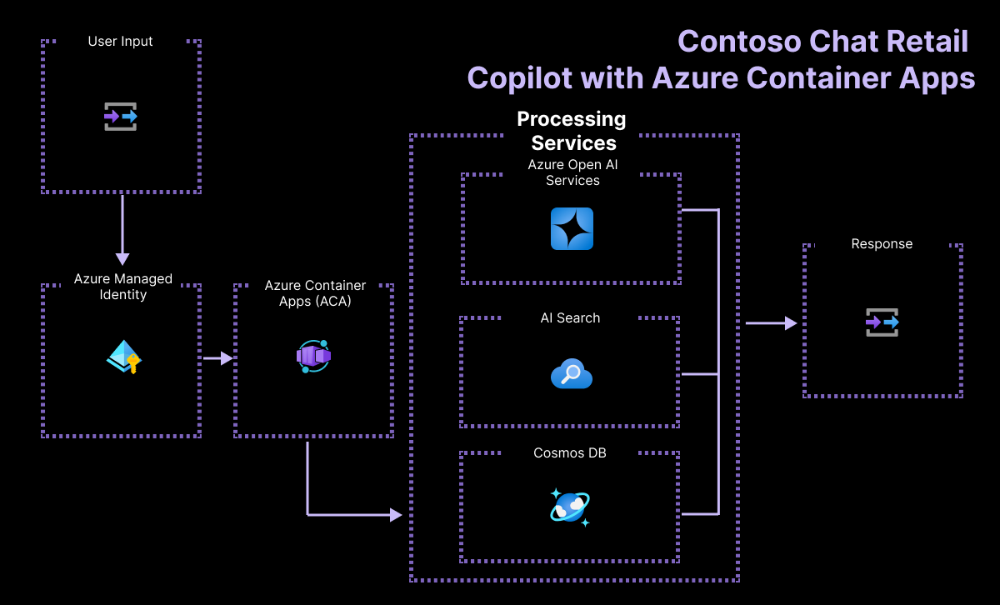

<!-- YAML front-matter schema: https://review.learn.microsoft.com/en-us/help/contribute/samples/process/onboarding?branch=main#supported-metadata-fields-for-readmemd -->

> [!WARNING]  
> **This sample is being actively updated at present and make have breaking changes**. We are refactoring the code to use new Azure AI platform features and moving deployment from Azure AI Studio to Azure Container Apps. We will remove this notice once the migration is complete. Till then, please pause on submitting new issues as codebase is changing.
>
> **Some of the features used in this repository are in preview.** Preview versions are provided without a service level agreement, and they are not recommended for production workloads. Certain features might not be supported or might have constrained capabilities. For more information, see [Supplemental Terms of Use for Microsoft Azure Previews](https://azure.microsoft.com/en-us/support/legal/preview-supplemental-terms/).**


# Contoso Chat: Retail RAG Copilot with Azure AI Studio and Prompty

This sample creates a customer support chat agent for an online retailer called Contoso Outdoors. The solution uses a _retrieval-augmented generation pattern_ to ground responses in the company's product and customer data. Customers can ask questions about the retailer's product catalog, and also get recommendations based on their prior purchases.

This sample illustrates the complete end-to-end process for creating a RAG-based copilot **code-first** with Azure AI Studio and Prompty. It includes application code for all three stages of the GenAIOps application lifecycle:
- Ideation using Prompty assets and Azure OpenAI model deployments.
- Evaluation using Prompty assets with custom evaluators and quality metrics.
- Deployment using Azure Developer CLI with Azure Container Apps hosting.

It also showcases observability (with tracing, monitoring and app insights) and automation with GitHub Actions (for evaluation and deployment) and responsible AI practices in the context of a real-world user scenario.


[](https://github.com/codespaces/new?hide_repo_select=true&machine=basicLinux32gb&repo=725257907&ref=main&devcontainer_path=.devcontainer%2Fdevcontainer.json&geo=UsEast)
[](https://vscode.dev/redirect?url=vscode://ms-vscode-remote.remote-containers/cloneInVolume?url=https://github.com/azure-samples/contoso-chat)

---

# About This Sample

## Table of Contents

1. [Features](#features)
    * [Architecture Diagram](#architecture-diagram)
    * [Demo Video](#demo-video-optional)
    * [Versions](#versions)
1. [Getting Started](#getting-started)
    * [Pre-Requisites](#pre-requisites)
    * [GitHub Codespaces](#1-github-codespaces)
    * [VS Code Dev Containers](#2-vs-code-dev-containers)
    * [Manual Setup (Local)](#3-manual-setup-local)
1. [Azure Deployment](#azure-deployment)
1. [Local Development](#local-development)
    * [Exploring the Prompty Asset](#exploring-the-prompty-asset)
    * [Testing the Application Flow](#testing-the-application-flow)
1. [Guidance](#guidance)
    * [Region Availability](#region-availability)
    * [Costs](#costs)
    * [Security](#security)
1. [Troubleshooting](#troubleshooting)
1. [Resources](#resources)
1. [Contributing](#contributing)
1. [Trademarks](#trademarks)


By exploring and deploying this sample, you will learn to:
- Build a retail copilot application using the [_RAG pattern_](https://learn.microsoft.com/azure/ai-studio/concepts/retrieval-augmented-generation).
- Define and engineer prompts using the Prompty
- Design, run & evaluate a copilot
- Provision and deploy the solution to Azure using the [_Azure Developer CLI_](https://learn.microsoft.com/azure/developer/azure-developer-cli/).
- Understand and apply Responsible AI practices like [_evaluation and content safety_](https://learn.microsoft.com/en-us/azure/ai-services/responsible-use-of-ai-overview?context=%2Fazure%2Fai-studio%2Fcontext%2Fcontext).


## Features

The project comes with:
* **Sample model configurations, chat and evaluation prompts** for a RAG-based copilot app.
* **Prompty assets** to simplify prompt creation & iteration for this copilot scenario.
* Sample **product and customer data** for the retail copilot scenario.
* Sample **application code** for copilot chat and evaluation workflows.
* Sample **azd-template configuration** for managing the application on Azure.
* **Managed Identity** configuration as a best practice for managing sensitive credentials.

This is also a **signature sample** for demonstrating new capabilities in the Azure AI platform. Expect regular updates to showcase cutting-edge features and best practices for generative AI development. 

### Architecture Diagram

The Contoso Chat application implements a _retrieval augmented generation_ pattern to ground the model responses in your data. The architecture diagram below illustrates the key components and services used for implementation and highlights the use of [Azure Managed Identity](https://learn.microsoft.com/entra/identity/managed-identities-azure-resources/) to reduce developer complexity in managing sensitive credentials.



### Demo Video

🌟 | Watch for a video update showing how easy it is to go from code to cloud using this template and the Azure Developer CLI for deploying your copilot application.

### Versions

This has been the signature sample used to showcase end-to-end development of a copilot application **code-first** on the Azure AI platform. It has been actively used for training developer audiences and industry partners at key events including [Microsoft AI Tour](https://aka.ms/msaitour) and [Microsoft Build](https://aka.ms/msbuild). Use the links below to reference specific versions of the sample corresponding to a related workshop or event session.

> | Version | Description |
> |:---|:---|
> | v0 : [#cc2e808](https://github.com/Azure-Samples/contoso-chat/tree/cc2e808eee29768093866cf77a16e8867adbaa9c) | Microsoft AI Tour 2023-24 (dag-flow, jnja template) - Skillable Lab |
> | v1 : [msbuild-lab322](https://github.com/Azure-Samples/contoso-chat/tree/msbuild-lab322) | Microsoft Build 2024 (dag-flow, jnja template) - Skillable Lab |
> | v2 : [main](https://github.com/Azure-Samples/contoso-chat) | Latest version (flex-flow, prompty asset)- Azure AI Template |
> | | |

## Getting Started

### Pre-Requisites

* [Docker Desktop](https://www.docker.com/products/docker-desktop/) - (optional) to use dev containers locally.
* [Visual Studio Code](https://code.visualstudio.com) - recommended IDE for local development.
* [Azure Developer CLI (azd)](https://aka.ms/install-azd) - to manage Azure deployment.
* [Python 3.10+](https://www.python.org/downloads/) - to run, test & evaluate application.

You will also need:
* [Azure Subscription](https://azure.microsoft.com/free/) - sign up for a free account.
* [GitHub Account](https://github.com/signup) - sign up for a free account.
* [Access to Azure OpenAI](https://learn.microsoft.com/legal/cognitive-services/openai/limited-access) - submit form to request access.

### Setup Environment

You have three options for getting started with this template:
 - **GitHub Codespaces** - Cloud-hosted dev container (pre-built environment)
 - **VS Code Dev Containers** - Locally-hosted dev container (pre-built environment)
 - **Manual Setup** - Local environment setup (for advanced users)

We recommend using GitHub Codespaces for the fastest start with least effort. However, we have provided instructions for all three options below.

### 1. GitHub Codespaces

 1. Click the button to launch this repository in GitHub Codespaces.
  
    [](https://github.com/codespaces/new?hide_repo_select=true&machine=basicLinux32gb&repo=725257907&ref=main&devcontainer_path=.devcontainer%2Fdevcontainer.json&geo=UsEast)

 1. This opens a new browser tab with setup taking a few minutes to complete. Once ready, you should see a Visual Studio Code editor in your browser tab, with a terminal open.
 1. Sign into your Azure account from the VS Code terminal
    ```bash
    azd auth login --use-device-code
    ```

### 2. VS Code Dev Containers

This is a related option that opens the project in your local VS Code using the [Dev Containers extension](https://marketplace.visualstudio.com/items?itemName=ms-vscode-remote.remote-containers) instead. This is a useful alternative if your GitHub Codespaces quota is low, or you need to work offline.

1. Start Docker Desktop (install it if not already installed)
1. Open the project by clickjing the button below:

    [](https://vscode.dev/redirect?url=vscode://ms-vscode-remote.remote-containers/cloneInVolume?url=https://github.com/azure-samples/contoso-chat)

 1. Once ready, the tab will refresh to show a Visual Studio Code editor with a terminal open. 
 1. Sign into your Azure account from the VS Code terminal
    ```bash
    azd auth login
    ```

### 3. Manual Setup (Local)

* Verify you have Python3 installed on your machine.
* Install dependencies with `pip install -r requirements.txt`
* Install [Azure Developer CLI](https://aka.ms/install-azd)
  * Windows: `winget install microsoft.azd`
  * Linux: `curl -fsSL https://aka.ms/install-azd.sh | bash`
  * MacOS: `brew tap azure/azd && brew install azd`
* Sign into your Azure account from the VS Code terminal

    ```bash
    azd auth login
    ```

## Azure Deployment

1. Use the same terminal where you previously authenticated with Azure.
1. Provision and deploy your application to Azure. You will need to specify a valid subscription, deployment location, and environment name. 

    ```bash
    azd up
    ```
 1. You will be asked a couple of questions.
    - For Environment Name, enter: CONTOSOCHAT
      - (You are free to choose a different name, for example if you already have resources with that name.)
    - For Subscription, select the default (your logged-in Azure subscription)    
    - For Azure Region we recommend: France Central (francecentral)
 1. This step will take some time to complete. 
    - Visit the [Azure Portal](https://portal.azure.com) to monitor progress.
    - Look for a new resource group matching the environment name
    - Click `Deployments` to track the status of the provisioning process
 1. Once provisioning completes, monitor progress for app deployment.
    - Visit [Azure AI Studio](https://ai.azure.com/build), and click "Sign in"
    - Click "View all projects"
    - Look for an AI Project associated with the above resource group
    - Click `Deployments` to track the status of the application deployment
 1. Once deployment completes, test the deployed endpoint from Azure AI Studio
    - Click the newly-created `chat-deployment-xx` endpoint listed
    - In the details page, click the `Test` tab for a built-in testing sandbox
    - In the `Input` box, enter a new query in this format and submit it:
        ```
        {"question": "Tell me about hiking shoes", "customerId": "2", "chat_history": []}
        ```
    - If successful, the response will be printed in the area below this prompt.

You can find your deployed retail copilot's _Endpoint_ and _Primary Key_ information on the deployment details page in the last step. Use them to configure your preferred front-end application (e.g., web app) to support a customer support chat UI capability that interacts with the deployed copilot in real time.  

## Local Development

With the necessary dependencies installed, you can use your local machine to interact with the deployed endpoint. Or, you can use Codespaces or a devcontainer on this repository, which will work out of the box.

### Exploring the Prompty Asset

The [contoso_chat](./contoso_chat) sample contains an example [chat.prompty](./contoso_chat/chat.prompty) asset that you can explore, to understand this new capability. The file has the following components:

1. A frontmatter section that defines the following attributes:
    - `name` of the application
    - `description` of the application functionality
    - `authors` of the application (one per line)
    - `model` description (with these parameters)
        - `api` type of endpoint (can be chat or completion)
        - `configuration` parameters including
            - `type` of connection (azure_openai or openai)
            -  environment variables (e.g., azure_deployment for chat model)
        - `parameters` (max_tokens, temperature, response_format)
    - `inputs` - each with type and optional default value
    - `outputs` - specifying a type (e.g., string)
    - `sample` - an example of the inputs (e.g., for testing)
1. A `system` context (defining the agent persona and behavior)
    - `#Safety` section enforcing responsible AI requirements
    - `#Documentation` section with template for filling product documentation
    - `#Previous Orders` section with template for filling relevant history
    - `#Customer Context` section with template for filling customer details
    - `question` section to embed user query
    - `Instructions` section to reference related product recommendations

This specific prompty takes 3 inputs: a `customer` object, a `documentation` object (that could be chat history) and a `question` string that represents the user query. You can now _load_, _execute_, and _trace_ individual prompty assets for a more granular prompt 

### Region Availability

This template uses `gpt-35-turbo` for chat completion, `gpt-4` for chat evaluation and `text-embedding-ada-002` for vectorization. These models may not be available in all Azure regions. Check for [up-to-date region availability](https://learn.microsoft.com/azure/ai-services/openai/concepts/models#standard-deployment-model-availability) and select a region accordingly.

This template uses the `Semantic Ranker` feature of Azure AI Search which may be available only in certain regions. Check for [up-to-date region availability](https://azure.microsoft.com/en-us/explore/global-infrastructure/products-by-region/?products=search) and select a region accordingly.

  * We recommend using `francecentral` for the OpenAI Models
  * We recommend using `eastus` for the Azure AI Search Resource

> [!NOTE]
> The default _azd deploy_ takes a single `location` for deploying all resources within the resource group for that application. We set the default Azure AI Search location to `eastus` (in `infra/` configuration), allowing you to now use the default _location_ setting to optimize for model availability and capacity in region.
  

### Costs

Pricing for services may vary by region and usage and exact costs cannot be estimated. You can estimate the cost of this project's architecture with [Azure's pricing calculator](https://azure.microsoft.com/pricing/calculator/) with these services:

- Azure OpenAI - Standard tier, GPT-4, GPT-35-turbo and Ada models.  [See Pricing](https://azure.microsoft.com/pricing/details/cognitive-services/openai-service/)
- Azure AI Search - Basic tier, Semantic Ranker enabled [See Pricing](https://azure.microsoft.com/en-us/pricing/details/search/)
- Azure Cosmos DB for NoSQL - Serverless, Free Tier [See Pricing](https://azure.microsoft.com/en-us/pricing/details/cosmos-db/autoscale-provisioned/#pricing)

### Security

This template uses [Managed Identity](https://learn.microsoft.com/entra/identity/managed-identities-azure-resources/overview) for authentication with key Azure services including Azure OpenAI, Azure AI Search, and Azure Cosmos DB. Applications can use managed identities to obtain Microsoft Entra tokens without having to manage any credentials. This also removes the need for developers to manage these credentials themselves and reduces their complexity.

Additionally, we have added a [GitHub Action tool](https://github.com/microsoft/security-devops-action) that scans the infrastructure-as-code files and generates a report containing any detected issues. To ensure best practices we recommend anyone creating solutions based on our templates ensure that the [Github secret scanning](https://docs.github.com/code-security/secret-scanning/about-secret-scanning) setting is enabled in your repo.

## Troubleshooting

Have questions or issues to report? Please [open a new issue](https://github.com/Azure-Samples/contoso-chat/issues) after first verifying that the same question or issue has not already been reported. In the latter case, please add any additional comments you may have, to the existing issue.


## Contributing

This project welcomes contributions and suggestions.  Most contributions require you to agree to a
Contributor License Agreement (CLA) declaring that you have the right to, and actually do, grant us
the rights to use your contribution. For details, visit https://cla.opensource.microsoft.com.

When you submit a pull request, a CLA bot will automatically determine whether you need to provide
a CLA and decorate the PR appropriately (e.g., status check, comment). Simply follow the instructions
provided by the bot. You will only need to do this once across all repos using our CLA.

This project has adopted the [Microsoft Open Source Code of Conduct](https://opensource.microsoft.com/codeofconduct/).
For more information see the [Code of Conduct FAQ](https://opensource.microsoft.com/codeofconduct/faq/) or
contact [opencode@microsoft.com](mailto:opencode@microsoft.com) with any additional questions or comments.

## Trademarks

This project may contain trademarks or logos for projects, products, or services. Authorized use of Microsoft 
trademarks or logos is subject to and must follow 
[Microsoft's Trademark & Brand Guidelines](https://www.microsoft.com/en-us/legal/intellectualproperty/trademarks/usage/general).
Use of Microsoft trademarks or logos in modified versions of this project must not cause confusion or imply Microsoft sponsorship.
Any use of third-party trademarks or logos are subject to those third-party's policies.
