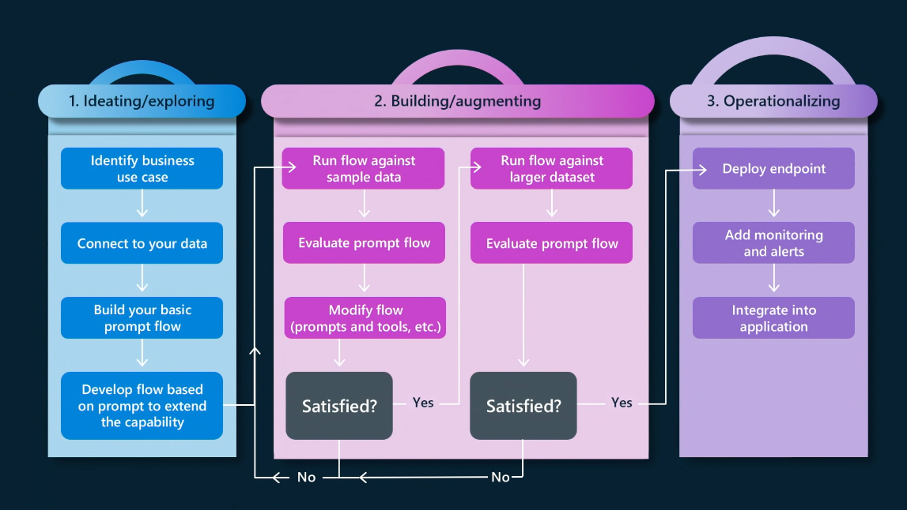

# 01 | The Paradigm Shift 

Streamlining the end-to-end development workflow for modern "AI apps" requires a paradigm shift from **MLOps** to **LLMOps** that acknowledges the common roots while being mindful of the growing differences. We can view this shift in terms of how it causes us to rethink three things (_mindset_, _workflows_, _tools_) to be more effective in developing generative AI applications.

---

## Rethink Mindset

Traditional "AI apps" can be viewed as "ML apps". They took data inputs and used custom-trained models to return relevant predictions as output. Modern "AI apps" tend to refer to generative AI apps that take natural language inputs (prompts), use pre-trained large language models (LLM), and return original content to users as the response. This shift is reflected in many ways.

 - **The target audience is different** ➡ App developers, not data scientists.
 - **The generated assets are different** ➡ Emphasize integrations, not predictions.
 - **The evaluation metrics are different** ➡ Focus on fairness, groundedness, token usage.
 - **The underlying ML models are different.** Pre-trained "Models-as-a-Service" vs. build.

---

## Rethink Workflow

**With MLOps**, end-to-end application development involved a [complex data science lifecycle](https://learn.microsoft.com/azure/architecture/ai-ml/guide/_images/data-science-lifecycle-diag.png). To "fit" into software development processes, this was mapped to [a higher-level workflow](https://learn.microsoft.com/azure/architecture/ai-ml/guide/mlops-technical-paper#machine-learning-model-solution) visualized as shown below. The complex data science lifecycle steps (data preparation, model engineering & model evaluation) are now encapsulated into the _experimentation_ phase. 

**With LLMOps**, those steps need to be rethought in the context of new requirements like using natural langauge inputs (prompts), new techniques for improving quality (RAG, Fine-Tuning), new metrics for evaluation (groundedness, coherence, fluency) and responsible AI (assessment). This leads us to a revised versio of the 3-phase application development lifecycle as shown:

We can unpack each phase to get a sense of individual steps in workflows that are now designed around prompt-based inputs, token-based pricing, and region-based availability of large language models and Azure AI services for provisioning.

!!!example "Building LLM Apps: From Prompt Engineering to LLM Ops"

    In the accompanying workshop, we'll walk through the end-to-end development process for our RAG-based LLM App from _prompt engineering_ (ideation, augmentation) to _LLM Ops_ (operationalization). We hope that helps make some of these abstract concepts feel more concrete when viewed in action.

---

## Rethink Tools

We can immediately see how this new application development lifecycle requires corresponding _innovation in tooling_ to streamline the end-to-end development process from ideation to operationalization. The [Azure AI platform](https://learn.microsoft.com/ai) has been retooled with exactly these requirements in mind. It is centered around [Azure AI Studio](https://ai.azure.comx), a unified web portal that:

 - lets you "Explore" models, capabilities, samples & responsible AI tools
 - gives you _single pane of glass_ visibility to "Manage" Azure AI resources
 - provides UI-based development flows to "Build" your Azure AI projects
 - has Azure AI SDK and Azure AI CLI options for "Code-first" development

The Azure AI platform is enhanced by other developer tools and resources including [PromptFlow](https://github.com/microsoft/promptflow), [Visual Studio Code Extensions](https://marketplace.visualstudio.com/VSCode) and [Responsible AI guidance](https://learn.microsoft.com/azure/ai-services/responsible-use-of-ai-overview) with  built-in support for [content-filtering](https://learn.microsoft.com/azure/ai-studio/concepts/content-filtering). We'll cover some of these in the Concepts and Tooling sections of this guide.

!!!abstract "Using The Azure AI Platform"
    The abstract workflow will feel more concrete when we apply the concepts to a real use case. In the Workshop section, you'll get hands-on experience with these tools to give you a sense of their roles in streamlining your end-to-end developer experience.

    - **Azure AI Studio**: Build & Manage Azure AI project and resources.
    - **Prompt Flow**: Build, Evaluate & Deploy a RAG-based LLM App.
    - **Visual Studio Code**: Use Azure, PromptFlow, GitHub Copilot, Jupyter Notebook extensions.
    - **Responsible AI**: Content filtering, guidance for responsible prompts usage.

