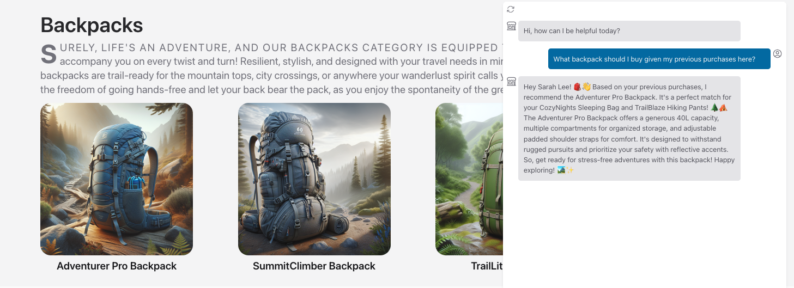

# 02 | The App Scenario 
!!!example "Consider this familiar enterprise scenario!"

    You're a new hire in the Contoso Outdoors organization. They are an e-commerce company with a successful product catalog and loyal customer base focused on outdoor activities like camping and hiking. Their website is hugely popular but their customer service agents are being overwhelmed by calls that could be answered by information currently on the site. 
    
    For every call they fail to answer, they are potentially losing not just revenue, but customer loyalty. **You are part of the developer team tasked to build a Customer Support AI into the website** to meet that demand. The objective is to build and deploy a customer service agent that is _friendly, helpful, responsible, and relevant_ in its support interactions.

Let's walk through how you can make this happen in your organization, using the Azure AI Platform. Well start with the _ideation_ phase which involves identifying the business case, connecting to your data, building the basic prompt flow (LLM App), then iterating locally to extend it for your app requirements. Let's understand how this maps to our workshop.

## Contoso Outdoors (Website)

The Contoso Chat (LLM App) is being designed for integration into the Contoso Outdoors site (Web App) via the _chat icon_ seen at the bottom right. The website landing page features the Contoso Outdoors _product catalog_ organized neatly into categories like _Tents_ and _Backpacks_ to simplify discovery by customers.

When a customer clicks an item, they are taken to the _product details_ page with extensive information that they can use to guide their decisions towards a purchase.

!!!info "Step 1: Identify Business Case"

The Contoso Chat AI should meet two business objectives. It should _reduce customer support calls_ (to manual operator) by proactively answering customer questions onsite. It should _increase customer product purchases_ by providing timely and contextual information to help them finalize the purchase decision. 

## Chat Completion (Basic)

Let's move to the next step - designing our Contoso Chat AI using the relevant Large Language Model (LLM). Based on our manual customer service calls, we know questions can broadly fall into two categories:

 - **Product** focus ➡ _"What should I buy for my hiking trip to Andalusia?"_
 - **Customer** focus ➡ _"What backpack should I buy given my previous purchases here?"_

We know that Azure OpenAI provides a number of pre-trained models for _chat completion_ so let's see how the baseline model works for our requirements, by using the [Azure AI Studio](https://ai.azure.com) **Playground** capability with a [`gpt-3.5-turbo`](https://learn.microsoft.com/azure/ai-services/openai/concepts/models) model deployment. This model can understand inputs (and generate responses) using natural language. 

Let's see how it responds to the two questions above.

 - **1. No Product Context**. The pre-trained model provides a perfectly valid response to the question _but it lacks the product catalog context for Contoso Outdoors!_. We need to refine this model to use our data!
    

 - **2. No Customer History**. The pre-trained model makes it clear that it has no access to customer history _and consequently makes general recommendations that may be irrelevant to customer query_. We need to refine this model to understand customer identity and access their purchase history.
    

!!!info "Step 2: Connect To Your Data"

We need a way to _fine-tune_ the model to take our product catalog and customer history into account as relevant context for the query. The first step is to make the data sources available to our workflow. [Azure AI Studio](https://ai.azure.com) makes this easy by helping you setup and manage _connections_ to relevant Azure search and database resources.

## Chat Augmentation (RAG)

That brings us to the next step - _prompt engineering_. We need to **augment** the user question (default prompt) with additional query context that ensures Contoso Outdoor product data is prioritized in responses. We use a popular technique know as [Retrieval Augmented Generation (RAG)](https://learn.microsoft.com/azure/ai-studio/concepts/retrieval-augmented-generation) that works as shown below, to _generate responses that are specific to your data_. 

We can now get a more _grounded response_ in our Contoso Chat AI, as shown.

!!!info "Step 3: Build Basic PromptFlow"

We now need to add in a step that also takes _customer history_ into account. To implement this, we need a tool that helps us _orchestrate_ these various steps in a more intuitive way, allowing user query and data to "flow" through the processing pipeline to generate the final response. 

## Chat Orchestration (Flow)

The previous step gives us a basic flow that augments predefined model behaviors to add product context. Now, we want to add _another tool_ (or processing function) that looks up customer details for additional prompt engineering. The end result should be a user experience that looks something like this, helping move the user closer to a purchase decision.

!!!info "Step 4: Develop & Extend Flow"

Flow orchestration is hard. This is where [PromptFlow](https://aka.ms/promptflow) helps, allowing us to insert a _customer lookup function_ seamlessly into the flow graph, to extend it. With the Azure AI platform, you get PromptFlow capabilities integrated seamlessly into both development (VS Code) and deployment (Azure AI Studio) environments for a streamlined end-to-end developer experience.

## Evaluate & Deploy (E2E)

This ends the _ideation_ phase of the application lifecycle we saw earlier. PromptFlow works seamlessly with Azure AI Studio to streamline the next two steps of the lifecycle (_evaluate_ and _deploy_), helping get deliver the final Contoso Chat Support Agent AI experience on the Contoso Outdoors website. Here is what a multi-turn conversation with customers might look like now:

Your customer support AI is a hit! 

Not only can it answer questions grounded in your product catalog, but it can refine or recommend responses based on the customer's purchase history. The conversational experience feels more natural to your customers and reduces their effort in finding relevant products in information-dense websites.

You find customers are spending more time in chat conversations with your support agent AI, and finding new reasons to purchase your products.

!!!example "Workshop: Build a production RAG with PromptFlow & Azure AI Studio"
    In the next section, we'll look at how we can bring this story to life, step-by-step, using Visual Studio Code, Azure AI Studio and Prompt Flow. You'll learn how to provision Azure AI Services, engineer prompts with Retrieval-Augmented Generation to use your product data, then extend the PromptFlow to include customer lookup before evaluating and deploying the Chat AI application to Azure for real-world use.