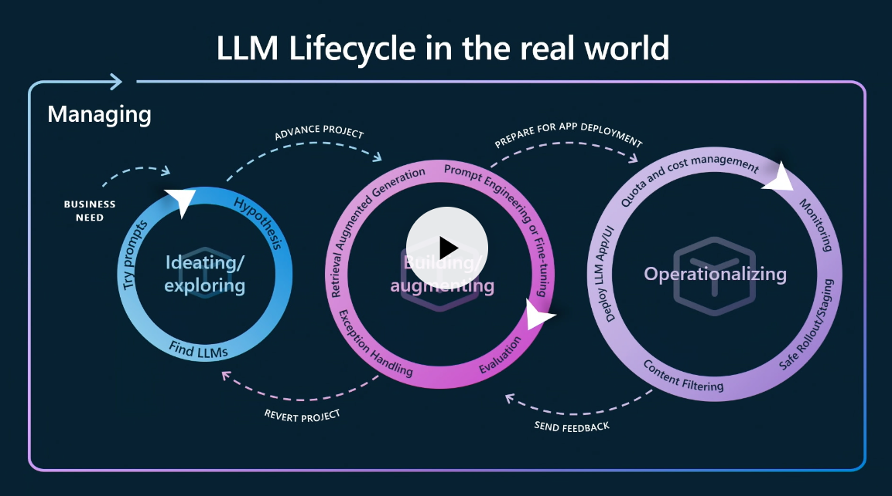

# Index

In an LLMOps context, the application lifecycle  consists of three core phases:

 - **ideation** - define app for a given business need
 - **augmentation** - fine-tune app for desired performance.
 - **operationalization** - deploy app for real-world usage.

In phase 1, we define the basic prompt flow and customize it with our data, to validate that it can meet the business need. In phase 2, we focus on evaluating application response quality and iterating till it meets our requirements. In phase 3, we deploy it for use by real-world applications.
The figure below provides a slightly more detailed view of the steps that are involved in the end-to-end development workflow for such applications.

**Let's define a real use case and walk through the process of developing an application end-to-end using this workflow**. In this workshop, we'll show you how we can streamline and simplify the process by using two key tools: **Prompt Flow** and **Azure AI Studio**.

