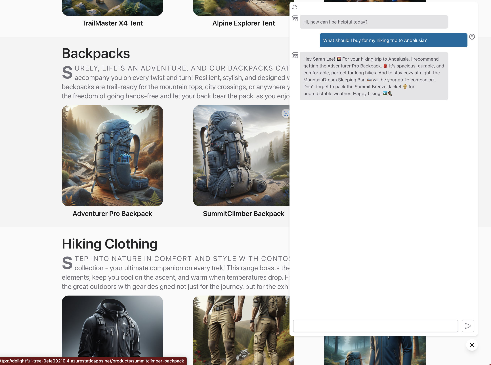

# 1.2 Application Scenario

Let's define a real use case that showcases the various steps of this workflow. Consider the following scenario familiar to most startups and enterprise organizations.

## Hello, Contoso Outdoors!

You're the founder at _Contoso Outdoors_, a small startup that sells hiking and camping gear to outdoor enthusiasts. You have a loyal customer base that is growing rapidly - and you realize you need a _custom support service_ to deal with the increasing number of customer questions and requests related to your products.

Your business is growing fast and you can't keep up with customer support requests. You hear about new _generative AI_ applications that users can interact with using natural language. You decide to build your own **customer support chat AI** application.

## Contoso Chat AI

You decide to explore a basic OpenAI solution as a starting point to validate your application scenario. You learn about the Azure AI Platform and its support for an enterprise-grade Azure OpenAI Service as well as new tools like Azure AI Studio and Prompt Flow.

You quickly prototype and deploy a basic chat AI using Azure AI Studio and Prompt Flow. You have a good sense for the kinds of popular questions and responses that your customer support AI needs to handle, so you decide to start by testing this out with a small sample dataset.

## Evaluate & Fine-Tune

You evaluate the app against a sample set of customer questions and realize that responses are coming from pre-defined foundation models that are not trained on your data. In other words, your customer chats with your AI but does not see _your_ products prioritized in responses.

You learn about options like Retrieval-Augmented Generation (RAG) that can help you ground your responses in your data. You decide to iterate on your application, evaluating responses against both sample and larger datasets, and fine-tuning the application till the quality matches your expectations. You deploy the support chat AI to your production site, for real users to try out!

## Deployed Experience

Your customer support AI is a hit! Not only can it answer questions grounded in your product catalog, but it can refine or recommend responses based on the customer's purchase history. The conversational experience feels more natural to your customers and reduces their effort in finding relevant products in information-dense websites.

You find customers are spending more time in chat conversations with your support agent AI, and finding new reasons to purchase your products.

!!!abstract
    In this workshop, we'll look at how we can bring this story to life, step-by-step, using Azure AI Studio and Prompt Flow. We'll learn about the features and benefits of the Azure AI Studio and Prompt Flow tools, and explore how they help us with both local development and cloud deployment of our application.