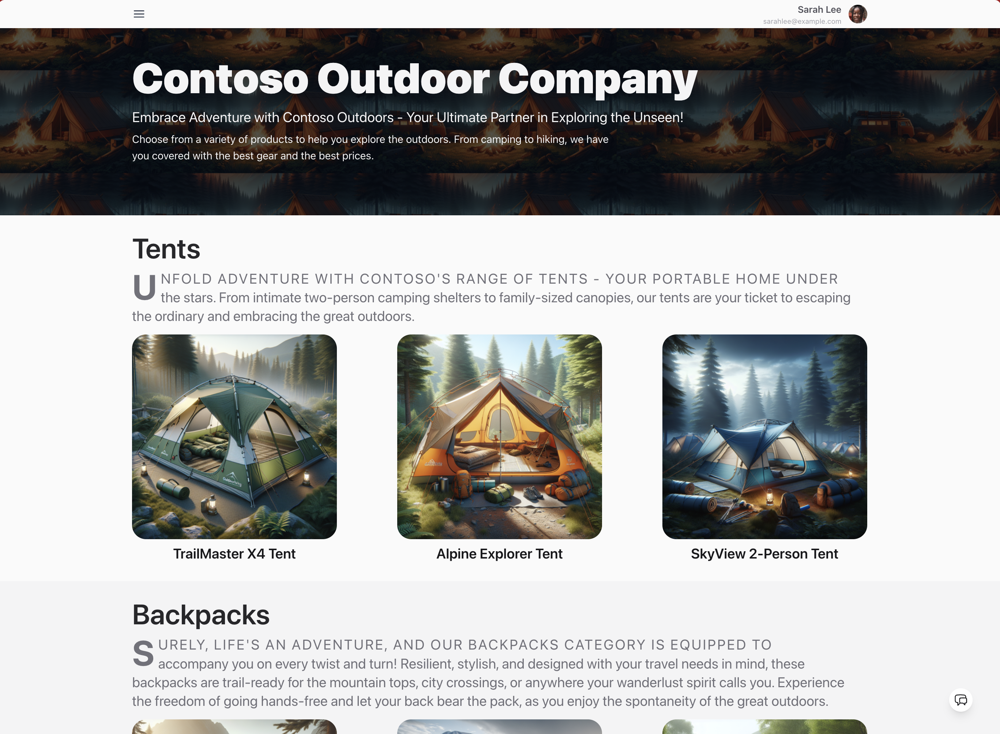
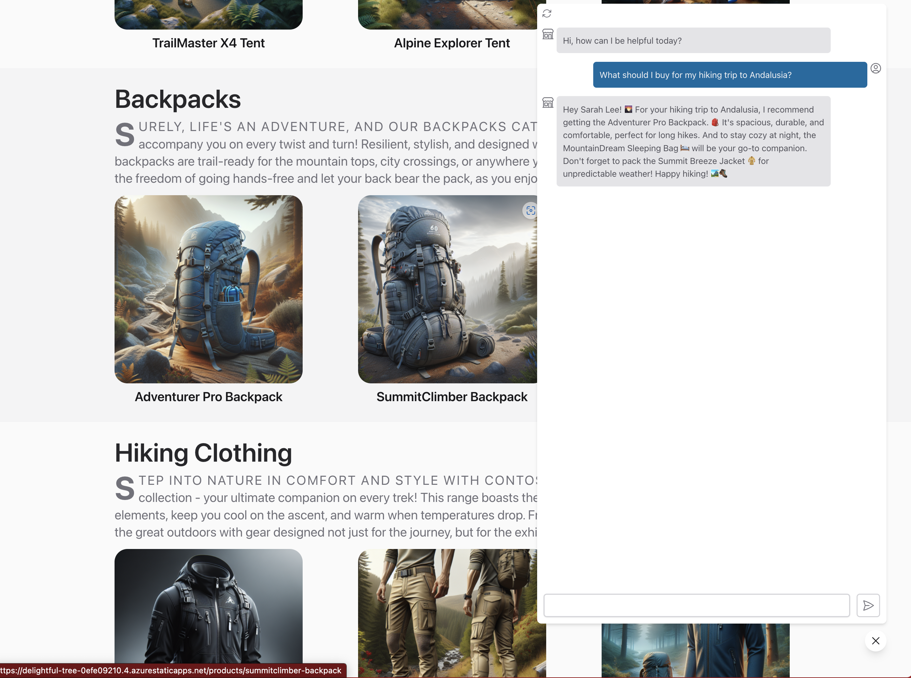

# 1. Application Scenario

## 1. Identify Business Case

You're the founder and core developer at _Contoso Outdoors_, a small startup that sells products to outdoor enthusiasts. Your business is growing fast and you can't keep up with customer support requests. You hear about new _generative AI_ applications that users can interact with using natural language. You decide to build your own **customer support chat AI** application.

## 2. Connect To Your Data

You have a rich product catalog with categories like tents, backpacks, hiking boots and more. Each item has detailed information (including images) that can be used to provide contextual responses to your customers. You have a _Contoso Outdoors_ website that lists the products, allowing users to click on an item to get extensive details.

You want a _customer support chat AI_  that customers to ask questions (in natural language) and get faster, more efficient responses with less effort (compared to manual search).

## 3. Iterate Based On Prompt

You also have _customer data_ that gives you insights into what the customer has ordered before, and helps you make connections to that purchase history, to deliver more relevant recommendations in the context of that question. You want to support this kind of _multi-turn conversation_ experience for your customer support chat AI.

## 4. Streamline App Dev

You've heard about the Azure AI Platform and the Prompt Flow open-source tooling for streamlining your end-to-end development. It's time to build that app on Azure! 