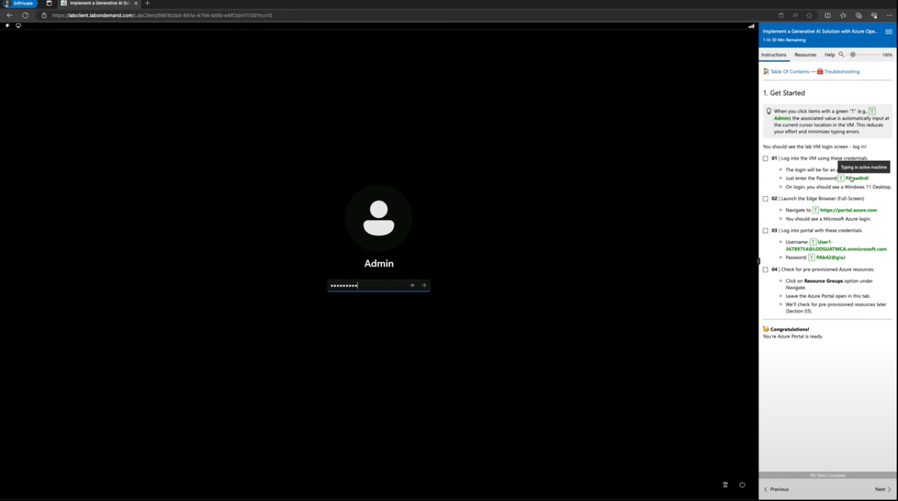

# 2.1 | Get Started

!!!warning "These instructions are for self-guided learners only."

You must have an active Azure subscription with access to the Azure OpenAI services used in this lab. You should also have your own laptop with a charger (or sufficient battery to power a 75-minute session). Complete these steps to get started:

 - [ ] **01** | Launch the Edge Browser (Full-Screen)
 - [ ] **02** | Navigate to [https://portal.azure.com](https://portal.azure.com)
 - [ ] **03** | Login with **your** Azure credentials
 - [ ] **04** | Click on **Resource Groups** option under _Navigate_
 - [ ] **05** | Leave this browser tab open to this Azure Portal page.

You can now move to the [**2.2 | Launch Codespaces**](./02-launch-codespaces.md) step.

!!!success "Congratulations! You're authenticated on Azure. Move to step [02 | Launch Codespaces](02-launch-codespaces.md)."

!!!example "Click [**here**](https://youtu.be/1Z4sgjXTKkU?t=94) for a timestamped video walkthrough of a Skillable session, for quick reference."

---

  

!!!warning "These instructions are for Skillable platform learners only."

**You will be given a link to launch the Skillable Lab**. When launched, it will show you a screen (see below) with a built-in instruction manual on the right and a login screen on the left. Read the tips below, then switch over to that manual and continue following instructions there.

The Skillable Platform comes with:

- [X] **a built-in instruction manual**. See screen at right for inline instructions.
- [X] **a pre-assigned Azure subscription**. Look for the (_username_, _password_) details.
- [X] **handy one-click text entry cues**. See green elements with "T" prefix.

Here are a few tips to keep in mind:

 - The _text entry cues_ in the manual will auto-enter the associated text into the screen at left, at the current cursor location. Use this to reduce manual effort and ensure you use consistent and correct values for the many variables and literals in the lab.
 - The _Azure subscription provided_ is recycled at the end of each lab. You don't need to worry about deleting resources or taking any cleanup actions on Azure. That will be done for you.
 - You will still use _your personal GitHub login_ to launch GitHub Codespaces for the session. The lab can be completed within the generous "free quota" provided by GitHub Codespaces for personal accounts. If you have already used by that quota, you will either need a paid account - or need to setup a new account to get a fresh quota allocation.
 - To prevent unnecessary depletion of that free quota, **please remember to delete the Codespaces session** at the end of this workshop.
