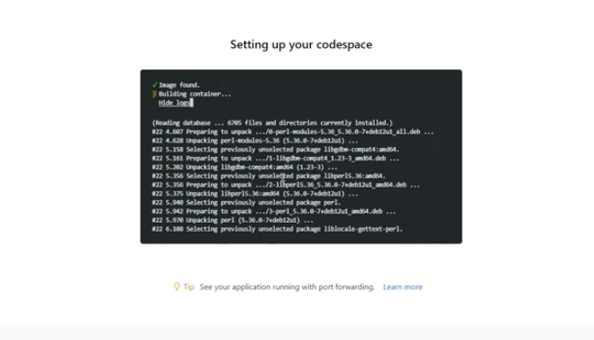

# 2.2 | Launch Codespaces 

!!!warning "These instructions are for self-guided learners only."

Instructor-led sessions will use the built-in Skillable manual. However, the outcomes for each step will be the same, so we will reproduce screenshots (and link to video walkthroughs) from a Skillable session for a convenient reference.

!!!info "We'll use GitHub Codespaces as our development environment."

The [contoso-chat](https://aka.ms/aitour/contoso-chat) application sample comes with a _devcontainer.json_ configuration file that provides a pre-built development environment with minimal manual effort required in setup. Let's get that running.

 - [ ] **01** | Log into GitHub with _your_ personal account.
 - [ ] **02** | Navigate to this repo: [Azure-Samples/contoso-chat](https://aka.ms/aitour/contoso-chat)
 - [ ] **03** | Fork the repo into your GitHub profile
 - [ ] **04** | Click "Code" dropdown, select "Codespaces" tab
 - [ ] **05** | Click "+" to create new codespace
 - [ ] **06** | Verify you see 'Setting up your codespace' in new tab
 - [ ] **07** | Click "View Logs" to track progress

This step takes a few minutes to complete. It is configuring a Docker container (with a defined base image), installing the dependencies we've specified, and launching it with a built-in Visual Studio Code editor that is configured with required extensions.

While we wait for setup to complete, let's move to the next step: [**3 | Provision Azure**](./../3%20|%20Provision%20Azure/03-create-airesource.md)

---

!!!success "Congratulations! Your development environment is being setup for you..."

!!!example "Click [**here**](https://youtu.be/1Z4sgjXTKkU?t=165) for a video walkthrough of _this step_ in a Skillable session, for reference."

