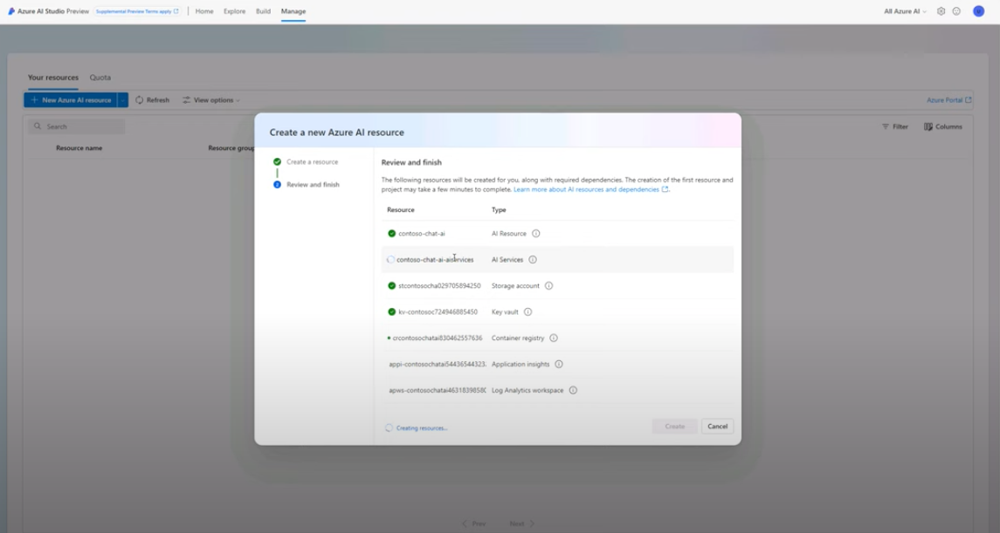

# 3.1 | Azure AI Resource

!!!warning "These instructions are for self-guided learners only."

In this section, we will _manually_ provision all the necessary Azure resources for this lab. We may later document a _scripted_ way to auto-provision them for efficiency. However, for now, we think manual setup will give you better insights into purpose & configuration of each resource, and contribute to your learning journey.

!!!info "The Azure AI resource provides the hosting environment for your Azure AI application."

Let's provision this resource manually.

- [ ] **01** | Navigate to [https://ai.azure.com](https://ai.azure.com) in a new tab.
- [ ] **02** | Click login. It should auto-login using prior Azure authentication.
- [ ] **03** | Click **Manage** in navbar.
- [ ] **04** | Click **"+ New Azure AI resource"** in page.
- [ ] **05** | Complete the pop-up dialog with these details:
    - **Resource name:** _contoso-chat-ai_
    - **Azure subscription:** (leave default)
    - Click **"Create new resource group"**
        - **Resource group**: _contoso-chat-rg_
        - **Location**: _Sweden Central_
- [ ] **06** | Click "Next: in pop-up dialog
    - Click **Create** to confirm resource creation.
    - This takes a few minutes (see below). Wait for completion. 
* [ ] **07** | Return to "Manage" page & Refresh.
    - Verify this Azure AI resource is listed. 

---

!!!success "Congratulations! Your Azure AI Resource was created successfully."

!!!example "Click [**here**](https://youtu.be/1Z4sgjXTKkU?t=324) for a video walkthrough of _this step_ in a Skillable session, for reference."

