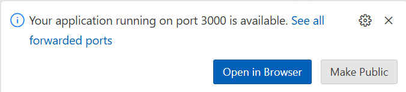

# Part 2: Workshop Instructions (Deconstructing Contoso Chat - An Interactive Workshop)

If you've gotten this far, you have already:

* Reviewed pre-requisites for this workshop
* Forked the repository for this workshop
* Launched GitHub Codespaces
* Opened this file in VS Code Online

Let's continue.

**Table of Contents**

- [Lab Instructions: Build a Retail Copilot Code-First on Azure AI](#lab-instructions-build-a-retail-copilot-code-first-on-azure-ai)
  - [resources](#resources)
  - [1. Learning Objectives](#1-learning-objectives)
  - [2. Log into your Azure account from the terminal](#2-log-into-your-azure-account-from-the-terminal)
  - [3. Our goal: build a retail website with an AI-powered chat assistant](#3-our-goal-build-a-retail-website-with-an-ai-powered-chat-assistant)
  - [3. Explore the resources](#3-explore-the-resources)
    - [3.1 Visit Azure Portal](#31-visit-azure-portal)
    - [Customer data: CosmosDB](#customer-data-cosmosdb)
    - [Product purchase history: CosmosDB](#product-purchase-history-cosmosdb)
    - [Product information: Azure AI Search](#product-information-azure-ai-search)
    - [Model endpoints: Azure AI Studio](#model-endpoints-azure-ai-studio)
  - [4. Build a basic chat endpoint](#4-build-a-basic-chat-endpoint)
  - [5. Build A Custom Copilot](#5-build-a-custom-copilot)
    - [5.1 Install VS Code Extensions](#51-install-vs-code-extensions)
    - [5.2 Create `chat.prompty` (v1)](#52-create-chatprompty-v1)
    - [5.3 Create `chat_request.py` (v1)](#53-create-chat_requestpy-v1)
    - [5.4 Create `flex.flow.yaml` (app)](#54-create-flexflowyaml-app)
    - [5.5 Run your copilot app](#55-run-your-copilot-app)
  - [6. Evaluate A Custom Copilot](#6-evaluate-a-custom-copilot)
    - [6.1 Understand the metrics](#61-understand-the-metrics)
    - [6.2 Understand the tools](#62-understand-the-tools)
    - [6.3 Create evaluation dataset](#63-create-evaluation-dataset)
    - [6.4 Create evaluation flow](#64-create-evaluation-flow)
    - [6.5 Evaluate your copilot (v1)](#65-evaluate-your-copilot-v1)
  - [7. Chat with your data (RAG)](#7-chat-with-your-data-rag)
    - [7.1 Understand RAG Pattern](#71-understand-rag-pattern)
    - [7.2 Setup AI Search Index](#72-setup-ai-search-index)
    - [7.3 Setup Azure CosmosDB](#73-setup-azure-cosmosdb)
    - [7.4 Update `chat.prompty` (v2)](#74-update-chatprompty-v2)
    - [7.5 Update `chat_request.py` (v2)](#75-update-chat_requestpy-v2)
    - [7.6 Run your copilot application](#76-run-your-copilot-application)
    - [7.7 Evaluate your copilot (v2)](#77-evaluate-your-copilot-v2)
  - [8. Deploy \& Test the Copilot](#8-deploy--test-the-copilot)
    - [8.1 Understand Azure AI Studio](#81-understand-azure-ai-studio)
    - [8.2 View Copilot Deployment](#82-view-copilot-deployment)
    - [8.3 Test Copilot Deployment](#83-test-copilot-deployment)
  - [9. Integrate with Contoso Web](#9-integrate-with-contoso-web)
    - [9.1 Fork Contoso-Web Repo](#91-fork-contoso-web-repo)
    - [9.2 Launch GitHub Codespaces](#92-launch-github-codespaces)
    - [9.3 Set Environment Variables](#93-set-environment-variables)
    - [9.4 Preview Contoso Web](#94-preview-contoso-web)
    - [9.5 Test Contoso Web UI](#95-test-contoso-web-ui)
  - [10. Wrap-Up](#10-wrap-up)
    - [10.1 Cleanup Resource](#101-cleanup-resource)
    - [10.2 Star or Watch Repo](#102-star-or-watch-repo)
    - [10.3 Browse Resources](#103-browse-resources)

_If you find this sample useful, consider giving us a star on GitHub! If you have any questions or comments, consider filing an Issue on the [source repo](https://github.com/Azure-Samples/contoso-chat)_.


### 1. Log into your Azure account from the terminal

We have provided you with a temporary Azure subscription for you to use with this workshop. It is pre-deployed with all the resources you will need. Let's get you logged in.

* **Find your username and password** at the bottom of the Lab Instructions window titled "Build a Retail Copilot Code-First on Azure AI".

* Click to **activate the Terminal Pane** in the VS Code online window.

    * It's just below these instructions, in the bottom-right corner of your browser.

* **Copy** the command below and **paste it into the command line**, and hit **ENTER**:
```
azd auth login --use-device-code
```

* **Copy** the code show to your clipboard, and then click **ENTER**. 

    * A new browser window will open.

* If you are prompted to select an account, click "Use another account".

    * This can happen if you have previously used this browser to log Azure using your own account, for example.

* **Copy your username** from the Lab Instructions window, **paste** it in, and click **Next**.

* **Copy your password** from the Lab Instructions window, **paste** it in, and click **Sign In**.

* At the prompt "Are you trying to sign in to Microsoft Azure CLI?", click **Continue**.

* **Close the tab** called "Microsoft Azure Cross-platform Command Line Interface".

**Tip:** if you take a break, you may be automatically logged out of Azure from the terminal. If later you get unexpected errors related to authentication or "Azure AD", repeat the process in this section.

### 2. See information about your Azure environment

We have stored key values you will need in the environment for you. Run this command from the [Azure Developer CLI](https://learn.microsoft.com/azure/developer/azure-developer-cli/) to take a look:

```
azd env get-values
```

Here you will find endpoint URLs, identifiers, and other information about your deployed resources that will be needed later. One thing you won't find here are any keys or passwords -- those are stored for you in Azure Key Vault and retrieved for you as needed. In line with best security practices, you won't need to handle any secrets yourself.

## 2. Our goal: build a retail website with an AI-powered chat assistant

Your instructor showed you your goal for this workshop: create a Copilot (a chatbot) for a retail website. Let's install the content for the website to your Codespace now. To do this we will:

 - Copy the contents of https://github.com/Azure-Samples/contoso-web to the Codespace
 - Install Next.js into the app (this is a Next app)
 - Launch the web app in your Codespace

 ### 1. Downoad and install the website content

1. Click to activate the VS Code Terminal pane (below these intructions).
1. Enter these commands in turn.
```
git clone https://github.com/Azure-Samples/contoso-web
```
```
cd contoso-web
```
```
npm install 
```

### 1. Launch the webserver in your Codespace

3. Launch the website as follows:

```bash
npm run dev
```

**Note:** This command takes over your VS code terminal and renames it "npm". Don't worry, we'll create a new one shortly.




You now have the content deployed to the website, and it's running. Let's explore it now. Click **Open in Browser** in the VS Code popup as shown above to launch te a new tab called "Contoso Outdoor Company".

### Explore the Contoso Outdoor Company Website

**Scroll through the homepage** to explore the product catalog.

* Contoso Outdoor Company sells tents, backpacks, hiking clothing, hiking footwear, camping tables, camping stoves, and sleeping bags.

* **Tip**: return to the home page at any time by clicking the "hamburger" control in the top left corner.

**Click on one of the product images** (for example: RainGuard Hiking Jacket) to get more information about the product.

* Product details include: description, features, reviews, FAQ, return policy, cautions, user guide, warranty, and technical specifications.

* **Fun Fact:** Since Contoso Outdoor is a fictitious company, the product images and all of the detailed product information on this page were created using by Generative AI (specifically, Dall-E 3 and GPT-4).

**Click the  "hamburger" control** in the top left to return to the home page.

Take a look at the top-left corner of this page, and notice that a user is logged into the page.

* The back-end database includes 12 users, but you can't switch users from this page.

This website features a copilot to assist customers -- see the **chat bubble** in the lower-right corner. This feature isn't working yet. We'll fix that later by creating an endpoint that accepts the user's latest chat and the chat history as input, and generates the chatbot's response as output. For now, let's take a look at the resources we have deployed so you can implement the endpoint.

## 3. Explore your Azure resources

We have deployed several resources to your Azure Subscription that will be used in the Retrieval Augmented Generation (RAG) architecture described by your lab instructor. First, lets take a look at the resources as they appear in the Azure Portal. Then, we'll use the Codespaces terminal to take a look at some of them in a little more detail.

### 1. Visit Azure Portal

* Open a new browser tab for the Azure Portal 
    - **Navigate to** https://portal.azure.com **in a new tab**.
    - You should be prompted to **log in**. Use the Username and Password provided in the Skillable Lab window.
    - If you're not prompted to log in, you may have been automatically logged in under your own Azure subscription. In that case, log out or use a incognito browser window instead, and try again.
 
* Launch the "Resource Groups" tool
    - **Click the hamburger menu** (in the top-left corner)
    - Select **Resource Groups**

* Explore the contents of the resource group
    - **Click** the name of the resource group: **rg-AITOUR**
    - You will see: Overview page with 14 resources listed.
    - Look at the Type column and see that you have the following resources deployed:
        - **Search service**: (Azure AI Search, a vector database to store product information)
        - **Azure Cosmos DB account**(Azure CosmosDB, a relational database to store customer data and orders)    
        - **Azure AI services** (endpoints for OpenAI models used in the application)
        - **Azure AI hub** (a hub in Azure AI Studio collecting the shared resources used in the app)
        - **Azure AI project** (the project in Azure AI Studio containing the assets for the RAG application)

### 2. Customer data: CosmosDB

Customer data is sourced from a collection of JSON files and then loaded into Cosmos DB.

* **Explore** the JSON files in [../data/customer_info](../data/customer_info), for example [customer_info_1.json](../data/customer_info/customer_info_1.json)
    * Customer id, name, age, contact info, membership tier
    * Product Purchase history
        * Product info, purchase date, price
* The script used to load the data into Cosmos DB has already been run for you. Take a look at the Notebook version [../data/customer_info/create-cosmos-db.ipynb](../data/customer_info/create-cosmos-db.ipynb), but **don't run** any cells
* **Open the notebook** [../data/customer_info/investigate-cosmos-db.ipynb](../data/customer_info/investigate-cosmos-db.ipynb)
* **Run each of the cells** to take a look at the data in Cosmos DB
  * Click the "Run" button next to each code cell to run it.
  * If you are prompted to choose a Python kernel, choose **Python 3.11**.


### 3. Product purchase history: CosmosDB

The product data you see in CosmosD was sourced from a CSV file:

* **Open** [../data/product_info/products.csv](../data/product_info/products.csv)
  * Product id
  * Name
  * Price
  * Category
  * Brand
  * Description

Observe that these details match those in the customer order history stored in Cosmos DB.

### 4. Product information: Azure AI Search

TODO: Have the user use the CLI to do some test searches on the Azure AI Search.

### 5. Deployed model endpoint: Azure AI Studio

We have deployed for you a complete version of the chat endpoint, that uses RAG to provide context to the copilot to answer customer questions. Specifically, it provides:

* Chat personality instructions
* Safety instructions
* Customer data
* Customer purchase history
* Product information relevant to the customer query

Let's find that deployed endpoint in Azure AI Studio now.

#### 1. Log into Azure AI Studio
  * Open a **new browser tab**
  * **Browse to** [https://ai.azure.com](https://ai.azure.com)
  * Click the **Sign In** link in the top right
  * You won't need to re-enter your credentials, since you've already logged into the Azure Portal.

#### 2. Find your deployed project
  * Click the **View all projects** link (top right).
  * You will have one project linked. **Click the name** under "Resource Name" (it will begin with `ai-project-`). This displays the Project Overview page.
  * Click **Deployments** in the left navigation pane to see the deployments associated with this project.
  * In the section "Endpoints" you will see one deployment with a name starting with `chat-deployment`. **Click its name** to inspect the deployed endpoint.

#### 3. Test the deployed endpoint
  * Click the **Test** tab for a built-in testing sandbox
  * In the **Input** box, enter the JSON string below, and click **Test**.
```
{"question": "Tell me about hiking shoes", "customerId": "2", "chat_history": []}
```
  * The response will be printed in the area below this prompt.

The JSON input to the endpoint has three keys:
  * **question**: the customer's most recent chat prompt. Here: "Tell me about hiking shoes"
  * **customerId**: the Customer ID of the logged in customer (for lookup in the CosmosDB customer database). Here, Customer 2.
  * **chat_history**: The prior customer prompts and chatbot responses in the conversation. Here, no history is provided (as if this were the first interaction of the conversation).

The JSON repsonse includes two keys:
  * **answer**: The chatbot's response. Here, it provides information about TrailWalker Hiking Shoes.
  * **context**: Various information provided via the RAG process, that the AI model used as context to create its response. This includes customer information and summarized information about products relevant to the customer query.

Try editing the **question** field or the **customerId** field (valid values are 1 to 12) and observe:
  * How did the response change?
  * What context was used to create the response? Was it relevant to the customer's query?

#### 4. (optional) Test the endpoint from a Python script

TODO: This uses a key -- can we use Managed Identity?

Now let's try calling the endpoint from a Python script.

1. Click the Consume tab
1. Under "Consumption types", choose Python
1. Copy the contents of the sample file provided to a file called "test-endpoint.py" in the /workspaces/contoso-chat folder
1. Replace Line 18 with the following:
```
data = {"question": "What is a good sleeping bag?", "customerId": "2", "chat_history": []}
```
5. Replace Line 24 with text like the following, but replace the text between the quotes with Primary Key shown in AI Studio between the quotes
```
api_key = 'PRIMARY-KEY-GOES-HERE'
```
6. Run your test script with the command
```
python test-endpoint.py
```
## 4. Build a basic chat experience

Let's use Prompty and VS Code to start building our own copilot. We have already installed the [Prompty extension](https://marketplace.visualstudio.com/items?itemName=ms-toolsai.prompty) for VS Code to help us. 

We'll need a new Terminal in VS Code, so let's create that first.
* **Click the New Terminal button** (+) in the VS Code terminal pane

### 1. Create your first prompty file

First, let's create a new folder for our new Prompty using the terminal.

```
mkdir mychat
```

In the Explorer pane (on the left side of VS Code) you can see a filesystem tree including the just-added `mychat` folder.

* **Right-click** on the `mychat` folder and choose **New Prompty**.

A new file `basic.prompty` in your `mychat` folder was created. The [prompty file spec](https://prompty.ai/docs/prompty-file-spec) allows you to define everything you need for a RAG-based copilot. 

Let's edit the file my changing the some of the attributes:

#### 1.Basic information

* **name**: Call this prompty `ContosoCopilot`
* **description**: Use:
```
A prompt to respond to a customer question grounded in product and customer data.
```
* **authors**: Replace the provided name with your own.

#### 2. The "sample" section

The **sample** section specifies the inputs to the prompty, and supplies default values to use if the inputs are not provided. Let's edit that section as well.

* **firstName**: Choose any name other than your own (for example, `Sara`).

* **context**: Replace the provided text with the below:
```
   Contoso Outdoor Company is your ultimate partner in exploring the unseen!
   Choose from a variety of products to help you explore the outdoors. 
   From camping to hiking, we have you covered with the best gear and the best prices.
```

* **question**: Replace the provided text with:
```
Tell me about this company.
```
#### 3. The "system" section

The **sytem** section specifies the meta-prompt added to the user's actual question to provide the context necessary to answer accurately. With some AI models like the GPT family, this is passed to the "system prompt", which guides the AI model in its response to the but does not generate a model directly. You can use this section to provide direct instructions to the model, and to provide information the model can use as context.

Prompty files construct the meta-prompt from the inputs before passing it to the model. Parameters like ``{{firstName}}`` are replaced by the corresponsding input.

Update the system section of `basic.prompty` with the text below. Note that the commented lines (like "`# Customer`") are not part of the Prompty file specification -- that text is passed directly to the Generative AI model. (Experience suggests AI models perform more reliably if you organize the meta-prompt with Markdown-style headers.)

```
system:
You are the copilot for the Contoso Outdoors Company website. 
You provide helpful information to customers, reply in a friendly tone, and use 
language appropriate for an outdoors enthusiast customer base.
 
# Customer
You are helping {{firstName}} to find answers to their questions.
Use their name to address them in your responses.

# Context
Use the following context to provide a more personalized response to {{firstName}}:
{{context}}
```

We didn't change the Customer and Context section, but observe how the parameters will insert the input customer name and context into the meta-prompt.

#### 4. The "user" section
This section describes the input to the Generative AI model prompt. Don't change this section, which provide the user's entered chat, unmodified.

### 2. Test your prompty

The Prompty extension for VS Code provides a convenient "Run" button to test the behavior of your prompty file.

**Tip**: If you're short on time, you can copy the file `../answers/basic.prompty` to the current directory to make some suggested changes to your file without making manual edits.

#### 1. Run your prompty in VS Code

With the **basic.prompty** window active in VS Code, click the "Run" button in the tab row (the leftmost button here):


The first time you run a Prompty you will be prompted to log into your temporary Azure account. Click **Allow** in the popup that appears.


Once logged in your prompty will execute. Specifically the Prompty extension will:

* Call the AI model you specified (gpt-35-turbo, an Azure OpenAI model),
* at the endpoint URL you provided (here, our endpoing in Azure OpenAI, taken from the environment we looked at earlier),
* with a System Prompt assembled from the `firstName` and `context` default values provided, and
* with a prompt matching the `question` default value provided.

The output will appear in the **OUTPUT** tab in the VS Code terminal pane.

Click Run again. Do you get the same output?

* **Remember**: Generative AI models are non-deterministic. Responses are generated randomly so you will likely get a different response each time.

#### 2. Try changing the name

Change the `firstName` field in `basic.prompty` as follows:
```
  firstName: Bluey
```
Run the prompt again. How does the response addresss the customer?

* The customer's name is inserted into the system prompt, which is provided to the model. Even though the customer doesn't provide their name in the question, it's available to the model to craft the response.

* In the RAG application, we will provide the customer's actual first name as an input.

#### 3. Try changing the question

Change the `question` field as follows:
```  
  question: How much is the ATV, and how many people can ride it?
```
Try running it a few times. Are the responses appropriate? (Hint: Contoso Outdoor does not sell all-terrain vehicles.)

* There's no context provided to the model to answer this question so it just ... confabulates an answer. That's why it's important to provide relevant context to the model -- that's what the RAG process is for. It's also a good idea to provide instuctions to the AI model in the `system` section giving guidance about how to handle inappropriate inputs.

* In the RAG application, we will provide the customer's chat message as an input.

#### 4. Try setting the temperature parameter

We just observed that Generative AI models are nondeterministic -- most of the time, they give a *different* response for the *same* input each time they are run.

You can set "Temperature" parameter of the model to control the degree of randomness. Setting the temperature to zero will (in most cases) mean you get the same response each time. This isn't recommended, however, bacause the response can seem more robotic than human, and if the response it gives to a certain prompt is inappropriate then it will be inappropriate *every* time.

To set the temperature parameter in your prompty file, modify the `parameters:` element of the `model:` section as follows:
```
  parameters:
    max_tokens: 3000
    temperature: 0
```

Run the prompty a few times and observe that it now gives the same response each time. What do you think about the quality of the response?

* In the RAG application we will use a Temperature value of 0.7. TODO - test in evals?

## 5. Build A Custom Copilot

Editing a prompty file in VS Code and clicking the Run button to try it out is a great way to iterate. You can experiment with different models, model parameters and meta-prompts until you're confident your application will behave in the way you intend. 

The next step is to convert your prompty into an endpoint that can be called from the RAG application. In this lab we will use Python to script the endpoint.

### 0. Clone the ACA repository

TODO: Remove

```
git clone https://github.com/revodavid/contoso-chat-rag-aca
```

### TODO Delete 1. Create the python script

```
mkdir mychat
cd mychat
cp ../contoso-chat-rag-aca/src/contoso_chat/chat.prompty .
```

### Deploy the Python script as an endpoint

TLDR: Follow the directions in https://learn.microsoft.com/en-us/azure/container-apps/quickstart-code-to-cloud?tabs=bash%2Cpython&pivots=with-dockerfile

```
cd contoso-chat-rag-aca
az login --use-device-code
AZURE_SUBSCRIPTION_ID=$(azd env get-value AZURE_SUBSCRIPTION_ID)


Use these commands:
```
az acr build --subscription $env:AZURE_SUBSCRIPTION_ID --registry $env:AZURE_CONTAINER_REGISTRY_NAME --image creativeagentapi:latest ./src/
$image_name = $env:AZURE_CONTAINER_REGISTRY_NAME + '.azurecr.io/creativeagentapi:latest'
az containerapp update --subscription $env:AZURE_SUBSCRIPTION_ID --name $env:SERVICE_ACA_NAME --resource-group $env:AZURE_RESOURCE_GROUP --image $image_name
az containerapp ingress update --subscription $env:AZURE_SUBSCRIPTION_ID --name $env:SERVICE_ACA_NAME --resource-group $env:AZURE_RESOURCE_GROUP --target-port 5000
```


### X. TODO:DELETE


First, let's create a new prompty file based on the basic one we just created.

In the Terminal, **run the command below**.

```
cd mychat; cp basic.prompty contoso.prompty
```

TODO: Or copy answers/basic.prompty

TODO: minimal python file?
```
from dotenv import load_dotenv
## load environmenmt from .env
load_dotenv()

## interface with command line arguments
from sys import argv

import prompty
# import invoker
import prompty.azure

# execute the prompt
response = prompty.execute("./contoso.prompty")

print(response)
```


In the Explorer pane, **right-click** the new `contoso.prompty` file, and choose **Add Prompt flow Code". 

* This creates and opens a new Python file, `contoso_promptflow.py`.

Click Run in the tab bar of `contoso_promptflow.py`.

When you see this popup, choose **Don't show again**. 


* Side note: If you're an experienced Python developer doing this at home, you would most likely choose Create. Since we're using a temporary account, not using a virtual environment is simpler.

**Add these two lines** to the top of `contoso.prompty`.

```python
from dotenv import load_dotenv
load_dotenv()
```

* These lines load in the environment variables from the `.env` file, which provide the endpoint URLs and other details about resources needed to run the Python file.


Edit mychat_promptflow.py

Delete everything below @tool and replace with

```python
@tool
def get_response(customerId, question, chat_history):
    print("inputs:", customerId, question)
    #customer = get_customer(customerId)
    #embedding = get_embedding(question)
    #context = get_context(question, embedding)
    #print("context:", context)
    #print("getting result...")

    configuration = AzureOpenAIModelConfiguration(
        #azure_deployment=os.environ["AZURE_DEPLOYMENT_NAME"],
        azure_deployment="gpt-35-turbo",
        api_version=os.environ["AZURE_OPENAI_API_VERSION"],
        azure_endpoint=os.environ["AZURE_OPENAI_ENDPOINT"]
    )
    override_model = {
        "configuration": configuration,
        "parameters": {"max_tokens": 512}
    }
    # get cwd
    data_path = os.path.join(pathlib.Path(__file__).parent.resolve(), "./chat.prompty")
    prompty_obj = Prompty.load(data_path, model=override_model)

    result = prompty_obj(question = question, customer = customer, documentation = context)

    print("result: ", result)

    return {"answer": result, "context": context}

# if __name__ == "__main__":
#     get_response(4, "What hiking jackets would you recommend?", [])
#     #get_response(argv[1], argv[2], argv[3])
```

* Questions to ask:

```
What can you do?
```
```
What is a good sleeping bag for winter use?
```
```
How much is the Cozy Nights Sleeping bag?
```
```
How should I take care of it?
```
```
What did I order last time?
```


### 5.4 Create `flex.flow.yaml` (app)

<details> 
<summary> Click to view instructions </summary>
</details>

### 5.5 Run your copilot app

<details> 
<summary> Click to view instructions </summary>
</details>


## 6. Evaluate A Custom Copilot

### 6.1 Understand the metrics

<details> 
<summary> Click to view instructions </summary>
</details>

### 6.2 Understand the tools

<details> 
<summary> Click to view instructions </summary>
</details>

### 6.3 Create evaluation dataset

<details> 
<summary> Click to view instructions </summary>
</details>

### 6.4 Create evaluation flow 

<details> 
<summary> Click to view instructions </summary>
</details>

### 6.5 Evaluate your copilot (v1)

<details> 
<summary> Click to view instructions </summary>
</details>


## 7. Chat with your data (RAG)

### 7.1 Understand RAG Pattern

<details> 
<summary> Click to view instructions </summary>
</details>

### 7.2 Setup AI Search Index

<details> 
<summary> Click to view instructions </summary>
</details>

### 7.3 Setup Azure CosmosDB

<details> 
<summary> Click to view instructions </summary>
</details>

### 7.4 Update `chat.prompty` (v2)

<details> 
<summary> Click to view instructions </summary>
</details>

### 7.5 Update `chat_request.py` (v2)

<details> 
<summary> Click to view instructions </summary>
</details>

### 7.6 Run your copilot application

<details> 
<summary> Click to view instructions </summary>
</details>

### 7.7 Evaluate your copilot (v2)

<details> 
<summary> Click to view instructions </summary>
</details>


## 8. Deploy & Test the Copilot

### 8.1 Understand Azure AI Studio 

<details> 
<summary> Click to view instructions </summary>
</details>

### 8.2 View Copilot Deployment

<details> 
<summary> Click to view instructions </summary>
</details>

### 8.3 Test Copilot Deployment

<details> 
<summary> Click to view instructions </summary>
</details>


## 9. Integrate with Contoso Web

TODO. Test out the working application

TODO: We have already deployed an endpoint...

3. Now, create a file called `.env` in the current (contoso-web) folder with the following contents:

```
PROMPTFLOW_ENDPOINT=https://ACTUAL-ENDPOINT-GOES-HERE.francecentral.inference.ml.azure.com/score
PROMPTFLOW_KEY=ACTUAL-KEY-GOES-HERE
```

TODO: Can we use managed auth?

4. Edit the `.env` file with the REST Endpoint and Primary Key found in the Consume tab of AI Studio. (TODO: Check sequencing.)

## 10. Wrap-Up

### 1. Cleanup Resources

Once you've finished, you can decommission your resources with

```
azd down --purge
```

* The `--purge` option ensures that quota is released for resources you delete. This can be an issue with quota-restricted resources like AI model endopoints and GPU-based VMs.

You don't need to wait for this to complete (it will take some time). Your temporary Azure subscription will be deleted shortly in any case.

### 2. Star GitHub repositories for future reference

You already have a copy of the `contoso-chat` repository as a fork in your own GitHub repository, and that won't be deleted or change. To find resources about this workshop in the future, we suggest you click the "Star" button on the repositories below:

* https://github.com/microsoft/aitour-build-a-copilot-on-azure-ai : links, lab materials (including this PPT), useful links (including those listed below), and other information about this workshop
* https://github.com/Azure-Samples/contoso-chat : for the latest version of the RAG application code
* https://github.com/Azure-Samples/contoso-web : for the front-end Constoso Outdoor website


### 3. Browse Resources

If you still have time, here are some links to resources you might want to take a look at now. These resources are also linked at https://github.com/microsoft/aitour-build-a-copilot-on-azure-ai . 

Version of contoso-chat application that deploys with Azure Container Service instead of AI Studio: https://github.com/Azure-Samples/contoso-chat-rag-aca

Tutorial: Deploy your first container app https://learn.microsoft.com/azure/container-apps/tutorial-deploy-first-app-cli?tabs=bash

https://learn.microsoft.com/en-us/azure/container-apps/containerapp-up

azd documentation: https://learn.microsoft.com/en-us/azure/developer/azure-developer-cli/

Prompty documentation: https://prompty.ai/docs 

### 4. Thank you for attending! Please rate your lab experience

Thank you for attending the AI Tour Lab **Build a Retail Copilot Code-First on Azure AI**. We hope you enjoyed the experience and learned useful information about building RAG applications.

We'd really appreciate it if you would take time today to provide feedback about your lab experience. We use this feedback to improve future deliveries of this lab.