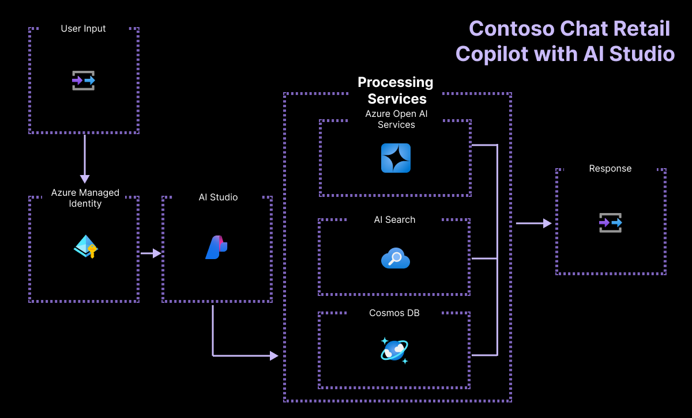

# Build a Retail Copilot Code-First on Azure AI 

| Event | Microsoft AI Tour (2024-2025) |
|:---|:---|
| Track | Protoype to Production |
| Session | WRK550 (Workshop) |
| Abstract | Use Azure AI Studio to build, evaluate, and deploy a customer support chat app. This custom copilot uses a RAG architecture built with Azure AI Search, Azure CosmosDB and Azure OpenAI to return responses grounded in the product and customer data. |
| Delivery Format A | **Instructor-Led.** 👉🏽 This is in-venue at MSAITour stops. In this format, the infrastructure is pre-provisioned for you and you will only need to run _postprovisioning scripts_ to setup your local environment. |
| Delivery Format B| **Partner-Led.** 👉🏽 This may be in-venue at other 1P/3P events run by field or community partners around MSAITour stops. In this format, the learner must self-deploy infrastructure (see instructor guide) |
| Delivery Format C | **Self-Guided.** 👉🏽 This is for individual learners who are exploring this sample on their own, at home. You must self-deploy infrastructure (see pre-requisites and process below) |
| | |

_Note:_ The `docs/README.md` file reflects requirements for the Azure Samples Gallery and cannot be customized. This `docs/README-tutorial.md` should be viewed as the **Workshop Instruction Manual** for this repository.

**1️⃣ | Infrastructure As Code**

This repository is configured as an `azd-template` that can be deployed with the Azure Developer CLI in one command (`azd up`). This command is run ahead of time (pre-provisioning) in instructure-led delivery sessions (Format A) but needs to be run manually for self-deployment formats (B and C).
 - Format A will take **75 minutes** to complete the lab.
 - Format B and C will take **an additional 35-45 minutes** to also complete provisioning.

**2️⃣ | Configuration As Code**

This workshop is configured with a `devcontainer` that provides a preconfigured development environment that you can launch in the cloud (with GitHub Codespaces) or in your local device (with Docker Desktop). This sample _recommends_ using the devcontainer for a fast and consistent setup and has not provided _manual setup_ guidance for the present.

--- 