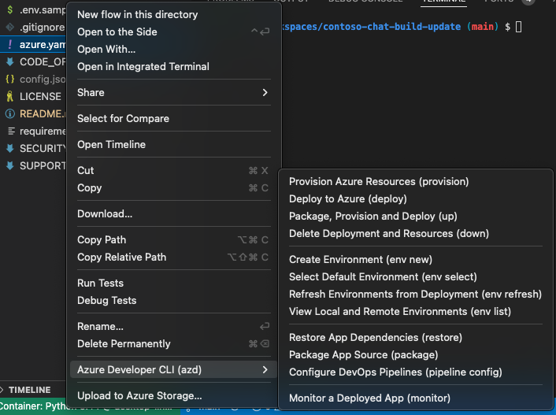
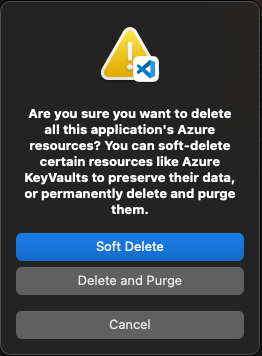

# Contoso Chat (v2)

> This documentation reflects the version of Contoso Chat released at Microsoft Build 2024 with support for [_prompty_](https://microsoft.github.io/promptflow/tutorials/prompty-quickstart.html) for templating, [_flex-flow_](https://microsoft.github.io/promptflow/tutorials/flex-flow-quickstart.html) for development, and [_azd_](https://learn.microsoft.com/en-us/azure/developer/azure-developer-cli/) for deployment. Refer to the [Contoso Chat v1](./README-v1.md) docs for the pre-Build version that used _dag-flow_ for development with _jnja_ templates.

## 1. Quickstart: Provision & Deploy

### 1.1 Setup Dev Environment
1. Fork the repo and clone it to local device
1. Install & start Docker Desktop 
1. Open cloned repo in Visual Studio Code
1. "Reopen folder in dev container" 

_This will get you a pre-defined runtime with all dependencies installed_

### 1.2 Use `azd` to provision & deploy app
1. `azd auth login` to authenticate with Azure
1. `azd env new` to set up `.azure/` with desired resource group name
1. `azd up` to provision Azure & complete postprovisioning actions
    - Select the Azure subscription to use
    - Select an Azure location to use (`swedencentral`)
    - You will be prompted to login again for _postprovision_ hooks
    - If successful, you should see `.env` and `config.json` locally.
1. `azd deploy` may need to be called again to complete deployment.
1. `azd down` to deprovision Azure resources. Pick the "purge" option in prompt!

_The `azd up` should complete both provision and deploy but it may exit after the provisioning step. In this event, the "mloe..." endpoint resource will be created but the application will not be deployed against it_.

### 1.3 View azd progress and status
To view the status of the deployment process:
1. Visit the Azure Portal - check `Deployments` under the resource group (named in step 2)
1. Visit Azure AI Studio - look under `Deployments` in that project (model name "chat-model")
1. Visit Azure ML Studio - look under `Workspaces` for this project, then click "Notifications"

<details>
<summary> 🌟 | (click to expand for more details) </summary>
The first item will give you status of _Resource_ deployments - you should get all greens to show that the **provisioning** phase completed successfully.

The second item should give you status of the new AI  Endpoint resource deployment. During the provisioning phase, this should get created in `Deployments` panel as a new Endpoint with model name "chat-model". During deploy phase, this should show `Updating` status while model is being deployed, followed by `Succeeded` status when model endpoint is ready for client use.

The third item provides real-time status updates - look for 4 alerts in this sequence.
1. Endpoint "mloe-xxxxxxx" deployment creation completed
1. Command job "yyyyyy" in experiment "prepare_image" Completed
1. Endpoint "mloe-xxxxxxx" update completed
1. Endpoint "chat-deployment-zzzzz" deployment creation completed
</details>

See the [Sample Run](#5-sample-run) section for a look at a sample response

### 1.4 Validate Deployment

Once completed, you can click the deployment in Azure AI Studio to get the details page. Look for the `Test` tab and run a simple test with a Input like this:
```
{ "customerId": "4", "question": "tell me about your hiking jackets", "chat_history": []}
```
### 1.5 Teardown: Deprovision Resources, Cleanup Config

See the [Sample Run](#5-sample-run) section for step by step instructions on how to deprovision resources and cleanup the environment. The main things to note are:
 1. Use `azd down` to deprovision Azure resources
 1. When asked, say "yes" to purging resources to reclaim model quota
 1. Manually delete the `.azure/` folder (gets recreated for new env)
 1. Manually delete `config.json` and `.env` files in root folder (relate to old run)


<br/>

## 2. Application: Contoso Chat (v2)

The Contoso Chat v2 implementation does the following:
 - uses the Azure Developer CLI (with ai.endpoint) host type
 - uses the `prompty` asset for prompt templates
 - uses the `flex-flow` format for flow definition
 - uses the `@tracking` directive for observability

 Use these steps to build, evaluate and test the application from scratch.

 ### 2.1 Using: 

<br/>

 ## 3. Tooling: Azure Developer CLI (`azd`) 

 Azure Developer CLI is a unified command-line tool for managing your Azure resources for an application deployment. It enables an _infrastructure as code_ approach that can take advantage of version control, code review, and continuous integration and deployment for your infrastructure. This also allows you to manage your infrastructure in a more predictable and repeatable manner across teams and releases.

 The tool has introduced a new service resource `ai.endpoint` specifically to support the provisioning and deployment of an Azure AI copilot application like Contoso Chat. These are the configuration files to look at, to learn more about this process.

<details>
<summary> 🌟 | (click to expand for more details on config) </summary>

| File | Description |
| ---- | ----------- |
| `azure.yaml` | See [azure.yaml schema doc](√) for details |
| | 👉🏽 Explore `infra/` files |
| `infra/abbreviations.json` | See [abbreviation recommendations](https://learn.microsoft.com/azure/cloud-adoption-framework/ready/azure-best-practices/resource-abbreviations) |
| `infra/ai.yaml` | |
| `infra/ai.yaml.json` | |
| `infra/main.bicep` | See [azd-aistudio-starter](https://github.com/Azure-Samples/azd-aistudio-starter) for explainers |
| `infra/main.bicepparam` | See [.bicepparam doc](https://learn.microsoft.com/azure/azure-resource-manager/bicep/parameter-files?tabs=Bicep) for details|
| | 👉🏽 Explore `infra/` folders |
| `infra/app` | |
| `infra/core` | |
| `infra/hooks` | |
| | 👉🏽 Explore `infra/core` |
| | |
| | |
| | |
| | 👉🏽 Explore `infra/hooks` files |
| `postprovision.sh`| ☑️ Check if Azure CLI is authenticated <br/> ☑️ Check if Azure Subscription ID is set <br/> ☑️ Create `.env` locally <br/> ☑️ Create `config.json` locally <br/> ☑️ Install required Python packages <br/> ☑️ Populate search and cosmos data|
| | 👉🏽 Explore `infra/app` files|
| `cosmos-connection.bicep`| Defines `cosmosConnection` resource  |
| `workspace-connections.bicep`| Defines: `cosmosConnection` module |
| | |

</details>

<br/>

## 4. Sample Run

Here is a sample run of the `azd` commands to provision and deploy the Contoso Chat v2 application. Sensitive information has been replaced with XXXXXX.

<details>
<summary> 🌟 | Step 1: Run `azd auth login` </summary>
```bash
vscode ➜ /workspaces/contoso-chat-build-update (main) $ azd auth login
Logged in to Azure.
```
</details>


<details>
<summary> 🌟 | Step 2: Start `azd up` </summary>

```bash
vscode ➜ /workspaces/contoso-chat-build-update (main) $ azd up
? Enter a new environment name: msbuild-contosochat-may4
? Select an Azure Subscription to use: XXXXXX
? Select an Azure location to use: 29. (Europe) Sweden Central (swedencentral)
Note: Running custom 'up' workflow from azure.yaml

Provisioning Azure resources (azd provision)
Provisioning Azure resources can take some time.

Subscription: XXXXXX
Location: Sweden Central

  You can view detailed progress in the Azure Portal:
  https://portal.azure.com/#view/HubsExtension/DeploymentDetailsBlade/~/overview/id/XXXXXX

  (✓) Done: Resource group: rg-msbuild-contosochat-may4
  (✓) Done: Log Analytics workspace: log-tsefkzee35rmk
  (✓) Done: Container Registry: crtsefkzee35rmk
  (✓) Done: Cognitive Service: aoai-tsefkzee35rmk
  (✓) Done: Storage account: sttsefkzee35rmk
  (✓) Done: Key Vault: kv-tsefkzee35rmk
  (✓) Done: Application Insights: appi-tsefkzee35rmk
  (✓) Done: Search service: srch-tsefkzee35rmk
  (✓) Done: Machine Learning Workspace: ai-hub-tsefkzee35rmk
  (✓) Done: Machine Learning Workspace: ai-project-tsefkzee35rmk
```
</details>


<details>
<summary> 🌟 | Step 3: Postprovision hooks run .. </summary>

```bash
  ─────────────────── postprovision Hook Output ─────────────────────────────────────────────────────────────────────────────────────────────────────────────────────────────────────────────────────────────────────────────────

  ─────────────────── postprovision Hook Output ─────────────────────────────────────────────────────────────────────────────────────────────────────────────────────────────────────────────────────────────────────────────────


SUCCESS: Your application was provisioned in Azure in 14 minutes 7 seconds.
You can view the resources created under the resource group rg-msbuild-contosochat-may4 in Azure Portal:
https://portal.azure.com/#@/resource/subscriptions/XXXXXX/resourceGroups/rg-msbuild-contosochat-may4/overview

SUCCESS: Your up workflow to provision and deploy to Azure completed in 15 minutes 9 seconds.
```
</details>

<details>
<summary> 🌟 | Step 4: Run `azd deploy` manually if needed </summary>

If the previous `azd up` step did not show a `Deploying service chat` step (as is the case above) then call `azd deploy` explicitly to complete that step.

```bash
vscode ➜ /workspaces/contoso-chat-build-update (main) $ azd deploy

Deploying services (azd deploy)

  |===    | Deploying service chat (Deploying to AI Online Endpoint)
  |=====  | Deploying service chat (Deploying to AI Online Endpoint)
  |=======| Deploying service chat (Deploying to AI Online Endpoint)
  |  =====| Deploying service chat (Deploying to AI Online Endpoint)
  (✓) Done: Deploying service chat
  - Endpoint: Scoring: https://mloe-tsefkzee35rmk.swedencentral.inference.ml.azure.com/score
  - Endpoint: Swagger: https://mloe-tsefkzee35rmk.swedencentral.inference.ml.azure.com/swagger.json

SUCCESS: Your application was deployed to Azure in 17 minutes 2 seconds.
You can view the resources created under the resource group rg-msbuild-contosochat-may4 in Azure Portal:
https://portal.azure.com/#@/resource/subscriptions/XXXXXX/resourceGroups/rg-msbuild-contosochat-may4/overview
```
</details>

<details>
<summary> 🌟 | Step 5: Test out your deployment </summary>

Once completed, you can click the deployment in Azure AI Studio to get the details page. Look for the `Test` tab.

> Run a simple test with a Input like this:

```
{ "question" : "What hiking boots should I get for a trip to Spain?" }
```
> You should see output like this

```bash
{
  "answer": "Hey Jane! 🌟 Based on your previous purchase of the TrekReady Hiking Boots, I highly recommend sticking with them for your trip to Spain! 🥾 These boots are crafted from leather and offer durability, comfort, and excellent traction capabilities. They are perfect for all your hiking adventures! 🏔️🚶‍♀️ So go ahead and rock those TrekReady boots in Spain! Enjoy your trip! ✨🌞",
  "context": [
    {
      "content": "Introducing the TrekReady Hiking Boots - stepping up your hiking game, one footprint at a time! Crafted from leather, these stylistic Trailmates are made to last. TrekReady infuses durability with its reinforced stitching and toe protection, making sure your journey is never stopped short. Comfort? They have that covered too! The boots are a haven with their breathable materials, cushioned insole, with padded collar and tongue; all nestled neatly within their lightweight design. As they say, it's what's inside that counts - so inside you'll find a moisture-wicking lining that quarantines stank and keeps your feet fresh as that mountaintop breeze. Remember the fear of slippery surfaces? With these boots, you can finally tell it to 'take a hike'! Their shock-absorbing midsoles and excellent traction capabilities promise stability at your every step. Beautifully finished in a traditional lace-up system, every adventurer deserves a pair of TrekReady Hiking Boots. Hike more, worry less!",
      "id": "4",
      "title": "TrekReady Hiking Boots",
      "url": "/products/trekready-hiking-boots"
    },
    {
      "content": "Meet the TrekReady TrailWalker Hiking Shoes, the ideal companion for all your outdoor adventures. Constructed with synthetic leather and breathable mesh, these shoes are tough as nails yet surprisingly airy. Their cushioned insoles offer fabulous comfort for long hikes, while the supportive midsoles and traction outsoles with multidirectional lugs ensure stability and excellent grip. A quick-lace system, padded collar and tongue, and reflective accents make these shoes a dream to wear. From combating rough terrain with the reinforced toe cap and heel, to keeping off trail debris with the protective mudguard, the TrailWalker Hiking Shoes have you covered. These waterproof warriors are made to endure all weather conditions. But they're not just about being rugged, they're light as a feather too, minimizing fatigue during epic hikes. Each pair can be customized for a perfect fit with removable insoles and availability in multiple sizes and widths. Navigate hikes comfortably and confidently with the TrailWalker Hiking Shoes. Adventure, here you come!",
      "id": "11",
      "title": "TrailWalker Hiking Shoes",
      "url": "/products/trailwalker-hiking-shoes"
    },
    {
      "content": "Meet the TrailBlaze Hiking Pants from MountainStyle, the stylish khaki champions of the trails. These are not just pants; they're your passport to outdoor adventure. Crafted from high-quality nylon fabric, these dapper troopers are lightweight and fast-drying, with a water-resistant armor that laughs off light rain. Their breathable design whisks away sweat while their articulated knees grant you the flexibility of a mountain goat. Zippered pockets guard your essentials, making them a hiker's best ally. Designed with durability for all your trekking trials, these pants come with a comfortable, ergonomic fit that will make you forget you're wearing them. Sneak a peek, and you are sure to be tempted by the sleek allure that is the TrailBlaze Hiking Pants. Your outdoors wardrobe wouldn't be quite complete without them.",
      "id": "10",
      "title": "TrailBlaze Hiking Pants",
      "url": "/products/trailblaze-hiking-pants"
    }
  ]
}
```
</details>

<details>
<summary> 🌟 | Step 6: Deprovision resources & shutdown </summary>

```bash
vscode ➜ /workspaces/contoso-chat-build-update (main) $ azd down

Deleting all resources and deployed code on Azure (azd down)
Local application code is not deleted when running 'azd down'.

  Resource group(s) to be deleted:

    • rg-msbuild-contosochat-may4: https://portal.azure.com/#@/resource/subscriptions/XXXXXX/resourceGroups/rg-msbuild-contosochat-may4/overview

? Total resources to delete: 13, are you sure you want to continue? Yes
Deleting your resources can take some time.

  (✓) Done: Deleting resource group: rg-msbuild-contosochat-may4

  Warning: The following operation will delete 1 Key Vault and 1 AIServices.
These resources have soft delete enabled allowing them to be recovered for a period or time after deletion. During this period, their names may not be reused. In the future, you can use the argument --purge to skip this confirmation.

? Would you like to permanently delete these resources instead, allowing their names to be reused? (y/N) Yes

  (✓) Done: Purging Key Vault: kv-tsefkzee35rmk
  (✓) Done: Purging Cognitive Account: aoai-tsefkzee35rmk

SUCCESS: Your application was removed from Azure in 20 minutes 20 seconds.
```
</details>

<details>
<summary> 🌟 | Step 7: Cleanup environment </summary>


1. The dev container is configured to also contain the Azure Developer CLI VS Code Extension. You can use this as an alternative to CLI commands as shown below.

    

1. To delete the deployment and resources (and reclaim quota), choose the relevant option in the Azure Developer CLI extension or run `azd down` from commandline. Both options will prompt you for a decision on whether to **soft delete** or **purge** resources. **Always elect to purge resources** for now so that your model quota is not consumed by soft-deleted resources, limiting your ability to run new deployments or other applications in that region.
    - In the extension, you will see a popup like this. **Choose Delete and Purge** instead of the default "Soft Delete" option.

      

    - If you use the CLI, you will get the same option as a `y/N` prompt where the default is "N". **Choose Y to purge resources instead**.
1. This completes resources cleanup but you may need to do a couple of manual clean up steps after, to get the repo back to its initial state:
    - **Delete `.azure/` manually.** It will contain the last environment you provisioned along with files that were created in postprovisioning. Deleting this lets you start the entire exercise from scratch with the same initial repo state.
    - **Delete `config.json` and `.env` in root folder**. These were created by postprovisioning and contain configuration parameters for the previous run. They will get recreated in new runs automatically.
</details>

---

{
  "customer": {"customerId": "1"},
  "documentation": {}, 
  "question": "tell me about your hiking jackets", "chat_history": []
}