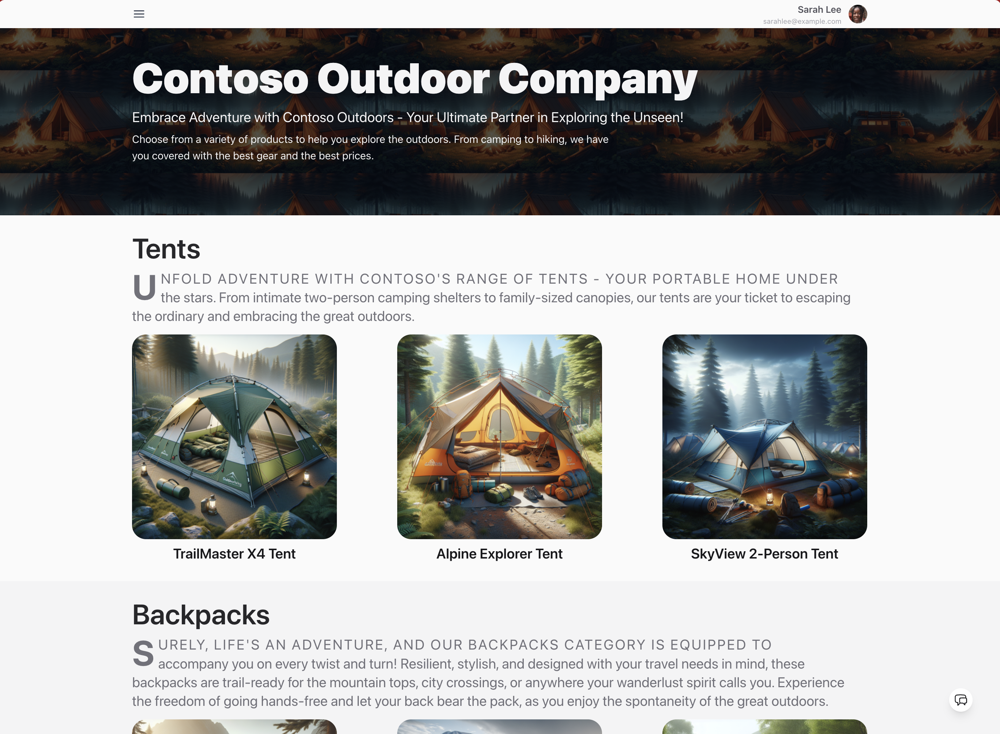
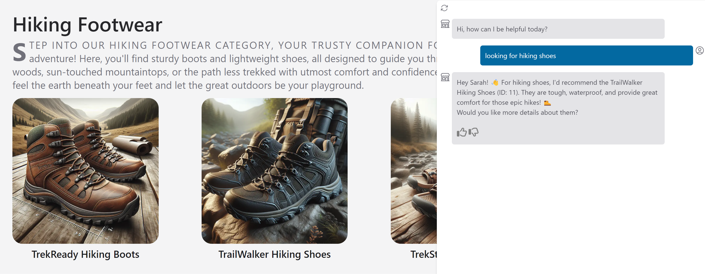

<!-- YAML front-matter schema: https://review.learn.microsoft.com/en-us/help/contribute/samples/process/onboarding?branch=main#supported-metadata-fields-for-readmemd -->

> [!WARNING]  
> **This sample is being actively updated at present and make have breaking changes**. We are refactoring the code to use new Azure AI platform features and moving deployment from Azure AI Studio to Azure Container Apps. We will remove this notice once the migration is complete. Till then, please pause on submitting new issues as codebase is changing.
>
> **Some of the features used in this repository are in preview.** Preview versions are provided without a service level agreement, and they are not recommended for production workloads. Certain features might not be supported or might have constrained capabilities. For more information, see [Supplemental Terms of Use for Microsoft Azure Previews](https://azure.microsoft.com/en-us/support/legal/preview-supplemental-terms/).**


# Contoso Chat: Retail RAG Copilot with Azure AI Studio and Prompty

[](https://github.com/codespaces/new?hide_repo_select=true&machine=basicLinux32gb&repo=725257907&ref=main&devcontainer_path=.devcontainer%2Fdevcontainer.json&geo=UsEast)
[](https://vscode.dev/redirect?url=vscode://ms-vscode-remote.remote-containers/cloneInVolume?url=https://github.com/azure-samples/contoso-chat)


## Table of Contents

- [Overview](#overview)
- [Features](#features) · [Architecture Diagram](#architecture-diagram) 
- [Pre-Requisites](#pre-requisites)
- [Getting Started](#getting-started) 
    - [GitHub Codespaces](#github-codespaces) 
    - [VS Code Dev Containers](#vs-code-dev-containers) 
    - [Local Environment](#local-environment) 
- [Development](#development) 
- [Testing](#testing) 
- [Deployment](#deployment)
- [Guidance](#guidance) - [Region Availability](#region-availability) · [Costs](#costs) · [Security](#security)
- [Workshop](#workshop) 🆕 · [Versions](#versions)
- [Resources](#resources) · [Code of Conduct](#code-of-conduct)
· [Responsible AI Guidelines](#responsible-ai-guidelines)


## Important Security Notice 

This template, the application code and configuration it contains, has been built to showcase Microsoft Azure specific services and tools. We strongly advise our customers not to make this code part of their production environments without implementing or enabling additional security features.  

For a more comprehensive list of best practices and security recommendations for Intelligent Applications, visit our [official documentation](https://learn.microsoft.com/azure/developer/ai/get-started-securing-your-ai-app).

> [!WARNING]  
>
> **Some of the features used in this repository are in preview.** Preview versions are provided without a service level agreement, and they are not recommended for production workloads. Certain features might not be supported or might have constrained capabilities. For more information, see [Supplemental Terms of Use for Microsoft Azure Previews](https://azure.microsoft.com/en-us/support/legal/preview-supplemental-terms/).

**Sample application code is included in this project**. You can use or modify this app code or you can rip it out and include your own.

<br/>

## Overview

_Contoso Outdoor_ is an online retailer specializing in hiking and camping equipment for outdoor enthusiasts. The website offers an extensive catalog of products - resulting in customers needing product information and recommendations to assist them in making relevant purchases.



This sample implements _Contoso Chat_ - a retail copilot solution for Contoso Outdoor that uses a _retrieval augmented generation_ design pattern to ground chatbot responses in the retailer's product and customer data. Customers can ask questions from the website in natural language, and get relevant responses with potential recommendations based on their purchase history - with responsible AI practices to ensure response quality and safety.



The sample illustrates the end-to-end workflow (GenAIOps) for building a RAG-based copilot **code-first** with Azure AI and Prompty. By exploring and deploying this sample, you will learn to:

1. Ideate and iterate rapidly on app prototypes using [Prompty](https://prompty.ai)
1. Deploy and use [Azure OpenAI](https://learn.microsoft.com/azure/ai-services/openai/) models for chat, embeddings and evaluation
1. Use Azure AI Search (indexes) and Azure CosmosDB (databases) for your data
1. Evaluate chat responses for quality using AI-assisted evaluation flows
1. Host the application as a FastAPI endpoint deployed to Azure Container Apps
1. Provision and deploy the solution using the Azure Developer CLI
1. Support Responsible AI practices with content safety & assessments


## Features

The project template provides the following features:

- [Azure OpenAI](https://learn.microsoft.com/azure/ai-services/openai/) for embeddings, chat, and evaluation models
- [Prompty](https://prompty.ai) for creating and managing prompts for rapid ideati
- [Azure AI Search](https://azure.microsoft.com/products/ai-services/ai-search) for performing semantic similarity search
- [Azure CosmosDB](https://learn.microsoft.com/azure/cosmos-db/) for storing customer orders in a noSQL database 
- [Azure Container Apps](https://learn.microsoft.com/azure/container-apps/overview) for hosting the chat AI endpoint on Azure

It also comes with:
- Sample product and customer data for rapid prototyping
- Sample application code for chat and evaluation workflows
- Sample datasets and custom evaluators using prompty assets

### Architecture Diagram 


## Pre-requisites

To deploy and explore the sample, you will need:

1. An active Azure subscription - [Signup for a free account here](https://azure.microsoft.com/free/)
1. An active GitHub account - [Signup for a free account here](https://github.com/signup)
1. Access to Azure OpenAI Services - [Learn about Limited Access here](https://learn.microsoft.com/legal/cognitive-services/openai/limited-access)
1. Access to Azure AI Search - [With Semantic Ranker](https://learn.microsoft.com/en-us/azure/search/semantic-search-overview) (premiun feature)
1. Available Quota for: `text-embedding-ada-002`, `gpt-35-turbo`. and `gpt-4`

We recommend deployments to `swedencentral` or `francecentral` as regions that can support all these models. In addition to the above, you will also need the ability to:
 - provision Azure Monitor (free tier)
 - provision Azure Container Apps (free tier)
 - provision Azure CosmosDB for noSQL (free tier)

From a tooling perspective, familiarity with the following is useful:
 - Visual Studio Code (and extensions)
 - GitHub Codespaces and dev containers
 - Python and Jupyter Notebooks
 - Azure CLI, Azure Developer CLI and commandline usage

## Getting Started

You have three options for setting up your development environment:

1. Use GitHub Codespaces - for a prebuilt dev environment in the cloud
1. Use Docker Desktop - for a prebuilt dev environment on local device
1. Use Manual Setup - for control over all aspects of local env setup

**We recommend going with GitHub Codespaces** for the fastest start and lowest maintenance overheads. Pick one option below - click to expand the section and view the details.

### GitHub Codespaces

1. You can run this template virtually by using GitHub Codespaces. Click this button to open a web-based VS Code instance in your browser:

    [](https://github.com/codespaces/new?hide_repo_select=true&machine=basicLinux32gb&repo=725257907&ref=main&devcontainer_path=.devcontainer%2Fdevcontainer.json&geo=UsEast)

1. Once the codespaces environment is ready (this can take several minutes), open a new terminal in that VS Code instance - and proceed to the [Development](#development) step.

### VS Code Dev Containers

A related option is to use VS Code Dev Containers, which will open the project in your _local Visual Studio Code editor_ using the [Dev Containers extension](https://marketplace.visualstudio.com/items?itemName=ms-vscode-remote.remote-containers):

1. Install [Docker Desktop](https://www.docker.com/products/docker-desktop) (if not installed), then start it.
1. Open the project in your local VS Code by clicking the button below:
   
    [](https://vscode.dev/redirect?url=vscode://ms-vscode-remote.remote-containers/cloneInVolume?url=https://github.com/azure-samples/contoso-chat)

1. Once the VS Code window shows the project files (this can take several minutes), open a new terminal in that VS Code instance - and proceed to the [Development](#development) step.

### Local environment

1. **Install the required tools** in your local device:
    - [Azure Developer CLI (azd)](https://aka.ms/install-azd)
    - [Python 3.10+](https://www.python.org/downloads/)
    - [Docker Desktop](https://www.docker.com/products/docker-desktop/)
    - [Git](https://git-scm.com/downloads)

    **Note for Windows users:** If you are _not_ using a container to run this sample, note that our post-provisioning hooks make use of shell scripts. While we update scripts for different local device environments, we recommend using [git bash](https://gitforwindows.org/) to run samples correctly.

1. **Initialize the project** in your local device:
    - Create a new folder `contoso-chat` and `cd` into it
    - Run this command to download project template. Note that this command will initialize a git repository, so you do not need to clone this repository.
        ```bash
        azd init -t contoso-chat-openai-prompty
        ```
1. **Install dependencies** for the project, manually. Note that this is done for you automatically if you use the dev container options above.
    ```bash
        cd src/api
        pip install -r requirements.txt
    ```

You can now proceed to the next step - [Development](#development) - where we will provision the required Azure infrastructure and deploy the application from the template using `azd`.


## Development

Once you've completed the setup the project (using [Codespaces](#github-codespaces), [Dev Containers](#vs-code-dev-containers), or [local environment](#local-environment)) you should now have a Visual Studio Code editor open, with the project files loaded, and a terminal open for running commands. Let's verify that all required tools are installed.

```bash
az version
azd version
prompty --version
python --version
```

We can now proceed with next steps - click to expand for detailed instructions.

<details>
<summary> 1️⃣ | Authenticate With Azure </summary>

1. Open a VS Code terminal and authenticate with Azure CLI. Use the `--use-device-code` option if authenticating from GitHub Codespaces. Complete the auth workflow as guided.

    ```bash
    az login --use-device-code
    ```
1. Now authenticate with Azure Developer CLI in the same terminal. Complete the auth workflow as guided. 

    ```bash
    azd auth login --use-device-code
    ```
1. You should see: **Logged in on Azure.** This will create a folder under `.azure/` in your project to store the configuration for this deployment. You may have multiple azd environments if desired.

</details>

<details>
<summary> 2️⃣ |  Provision-Deploy with AZD </summary>

1. Run `azd up` to provision infrastructure _and_ deploy the application, with one command. (You can also use `azd provision`, `azd deploy` separately if needed)

    ```bash
    azd up
    ```
1. You will be asked for  a _subscription_ for provisioning resources, an _environment name_ that maps to the resource group, and a _location_ for deployment. Refer to the [Region Availability](#region-availability) guidance to select the region that has the desired models and quota available.
1. The `azd up` command can take 15-20 minutes to complete. Successful completion sees a **`SUCCESS: ...`** messages posted to the console. We can now validate the outcomes.
</details>

<details>
<summary> 3️⃣ | Validate the Infrastructure </summary>

1. Visit the [Azure Portal](https://portal.azure.con) - look for the `rg-ENVNAME` resource group created above
1. Click the `Deployments` link in the **Essentials** section - wait till all are completed.
1. Return to `Overview` page - you should see: **35** deployments, **15** resources
1. Click on the `Azure CosmosDB resource` in the list
    - Visit the resource detail page - click "Data Explorer"
    - Verify that it has created a `customers` database with data items in it
1. Click on the `Azure AI Search` resource in the list
    - Visit the resource detail page - click "Search Explorer"
    - Verify that it has created a `contoso-products` index with data items in it
1. Click on the `Azure Container Apps` resource in the list
    - Visit the resource detail page - click `Application Url`
    - Verify that you see a hosted endpoint with a `Hello World` message on page
1. Next, visit the [Azure AI Studio](https://ai.azure.com) portal
    - Sign in - you should be auto-logged in with existing Azure credential
    - Click on `All Resources` - you should see an `AIServices` and `Hub` resources
    - Click the hub resource - you should see an `AI Project` resource listed
    - Click the project resource - look at Deployments page to verify models
1. ✅ | **Congratulations!** - Your Azure project infrastructure is ready!
</details>


<details>
<summary> 4️⃣ | Validate the Deployment </summary>

1. The `azd up` process also deploys the application as an Azure Container App
1. Visit the ACA resource page - click on `Application Url` to view endpoint
1. Add a `/docs` suffix to default deployed path - to get a Swagger API test page
1. Click `Try it out` to unlock inputs - you see `question`, `customer_id`, `chat_history`
    - Enter `question` = "Tell me about the waterproof tents"
    - Enter `customer_id` = 2
    - Enter `chat_history` = []
    - Click **Execute** to see results: _You should see a valid response with a list of matching tents from the product catalog with additional details_.
1. ✅ | **Congratulations!** - Your Chat AI Deployment is working! 

</details>

## Testing

We can think about two levels of testing - _manual_ validation and _automated_ evaluation. The first is interactive, using a single test prompt to validate the prototype as we iterate. The second is code-driven, using a test prompt dataset to assess quality and safety of prototype responses for a diverse set of prompt inputs - and score them for criteria like _coherence_, _fluency_, _relevance_ and _groundedness_ based on built-in or custom evaluators.

<details>
<summary> 1️⃣ | Manual Testing (interactive) </summary>
<br/>

The Contoso Chat application is implemented as a _FastAPI_ application that can be deployed to a hosted endpoint in Azure Container Apps. The API implementation is defined in `src/api/main.py` and currently exposes 2 routes:
 - `/` - which shows the default "Hello World" message
 - `/api/create_request` - which is our chat AI endpoint for test prompts

To test locally, we run the FastAPI dev server, then use the Swagger endpoint at the `/docs` route to test the locally-served endpoint in the same way we tested the deployed version/

- Change to the root folder of the repository
- Run `fastapi dev ./src/api/main.py` - it should launch a dev server
- Click `Open in browser` to preview the dev server page in a new tab
    - You should see: "Hello, World" with route at `/`
- Add `/docs` to the end of the path URL in the browser tab
    - You should see: "FASTAPI" page with 2 routes listed
    - Click the `POST` route then click `Try it out` to unlock inputs
- Try a test input
    - Enter `question` = "Tell me about the waterproof tents"
    - Enter `customer_id` = 2
    - Enter `chat_history` = []
    - Click **Execute** to see results: _You should see a valid response with a list of matching tents from the product catalog with additional details_.
1. ✅ | **Congratulations!** - You successfully tested the app locally

</details>

<details>
<summary> 2️⃣ | AI-Assisted Evaluation (code-driven) </summary>
<br/>

Testing a single prompt is good for rapid prototyping and ideation. But once we have our application designed, we want to validate the _quality and safety_ of responses against diverse test prompts. The sample shows you how to do **AI-Assisted Evaluation** using custom evaluators implemented with Prompty.

- Visit the `src/api/evaluators/` folder
- Open the `evaluate-chat-flow.ipynb` notebook - "Select Kernel" to activate
- Clear inputs and then `Run all` - starts evaluaton flow with `data.jsonl` test dataset
- Once evaluation completes (takes 10+ minutes), you should see
    - `results.jsonl` = the chat model's responses to test inputs
    - `evaluated_results.jsonl` = the evaluation model's scoring of the responses
    - tabular results = coherence, fluency, relevance, groundedness scores

Want to get a better understanding of how custom evaluators work? Check out the `src/api/evaluators/custom_evals` folder and explore the relevant Prompty assets and their template instructions.

The Prompty tooling also has support for built-in _tracing_ for observability. Look for a `.runs/` subfolder to be created during the evaluation run, with `.tracy` files containing the trace data. Click one of them to get a _trace-view_ display in Visual Studio Code to help you drill down or debug the interaction flow. _This is a new feature so look for more updates in usage soon_.

</details>

## Deployment

The solution is deployed using the Azure Developer CLI. The `azd up` command effectively calls `azd provision` and then `azd deploy` - allowing you to provision infrastructure and deploy the application with a single command. Subsequent calls to `azd up` (e.g., ,after making changes to the application) should be faster, re-deploying the application and updating infrastructure provisioning only if required. You can then test the deployed endpoint as described earlier.

## Guidance

### Region Availability

This template currently uses the following models: `gpt35-turbo`, `gpt-4` and `text-embedding-ada-002`, which may not be available in all Azure regions, or may lack sufficient quota for your subscription in supported regions. Check for [up-to-date region availability](https://learn.microsoft.com/azure/ai-services/openai/concepts/models#standard-deployment-model-availability) and select a region during deployment accordingly

**We recommend using `francecentral`**

### Costs

Pricing for services may vary by region and usage and exact costs are hard to determine. You can _estimate_ the cost of this project's architecture with [Azure's pricing calculator](https://azure.microsoft.com/pricing/calculator/) with these services:

- Azure OpenAI - Standard tier, GPT-35-turbo and Ada models. [See Pricing](https://azure.microsoft.com/pricing/details/cognitive-services/openai-service/)
- Azure AI Search - Basic tier, Semantic Ranker enabled. [See Pricing](https://azure.microsoft.com/en-us/pricing/details/search/)
- Azure Cosmos DB for NoSQL - Serverless, Free Tier. [See Pricing](https://azure.microsoft.com/en-us/pricing/details/cosmos-db/autoscale-provisioned/#pricing)
- Azure Monitor - Serverless, Free Tier. [See Pricing](https://azure.microsoft.com/en-us/pricing/details/monitor/)
- Azure Container Apps - Severless, Free Tier. [See Pricing](https://azure.microsoft.com/en-us/pricing/details/container-apps/)


### Security

This template uses [Managed Identity](https://learn.microsoft.com/entra/identity/managed-identities-azure-resources/overview) for authentication with key Azure services including Azure OpenAI, Azure AI Search, and Azure Cosmos DB. Applications can use managed identities to obtain Microsoft Entra tokens without having to manage any credentials. This also removes the need for developers to manage these credentials themselves and reduces their complexity.

Additionally, we have added a [GitHub Action tool](https://github.com/microsoft/security-devops-action) that scans the infrastructure-as-code files and generates a report containing any detected issues. To ensure best practices we recommend anyone creating solutions based on our templates ensure that the [Github secret scanning](https://docs.github.com/code-security/secret-scanning/about-secret-scanning) setting is enabled in your repo.

<br/>

## Workshop 

The sample has a `docs/workshop` folder with step-by-step guidance for developers, to help you deconstruct the codebase, and understand how to to provision, ideate, build, evaluate, and deploy, the application yourself, with your own data. 
 - The workshop may be offered as an _instructor-guided option_ (e.g., on [Microsoft AI Tour](https://aitour.microsoft.com))
 - The workshop can be completed at home as a **self-paced lab** with your own subscription.

### Lab Guide

1. [View Workshop Online](https://aka.ms/aitour/contoso-chat/workshop) - view a pre-built workshop version in your browser
1. **View Workshop Locally** - The workshop is built using Mkdocs. To preview it locally, 
    - install mkdocs: `pip install mkdocs-material`
    - switch to folder: `cd docs/workshop`
    - launch preview: `mkdocs serve` 
    - open browser to the preview URL specified

Have issues or questions about the workshop? Submit [a new issue](https://github.com/Azure-Samples/contoso-chat/issues/new) with a `documentation` tag.


## Resources

1. [Prompty Documentation](https://prompty.ai)
1. [Azure AI Studio Documentation](https://aka.ms/aistudio)
1. [Azure AI Templates with Azure Developer CLI](https://aka.ms/ai-studio/azd-templates)


## Code of Conduct

This project has adopted the [Microsoft Open Source Code of Conduct](https://opensource.microsoft.com/codeofconduct/). Learn more here:

- [Microsoft Open Source Code of Conduct](https://opensource.microsoft.com/codeofconduct/)
- [Microsoft Code of Conduct FAQ](https://opensource.microsoft.com/codeofconduct/faq/)
- Contact [opencode@microsoft.com](mailto:opencode@microsoft.com) with questions or concerns

For more information see the [Code of Conduct FAQ](https://opensource.microsoft.com/codeofconduct/faq/) or
contact [opencode@microsoft.com](mailto:opencode@microsoft.com) with any additional questions or comments.

## Responsible AI Guidelines

This project follows below responsible AI guidelines and best practices, please review them before using this project:

- [Microsoft Responsible AI Guidelines](https://www.microsoft.com/en-us/ai/responsible-ai)
- [Responsible AI practices for Azure OpenAI models](https://learn.microsoft.com/en-us/legal/cognitive-services/openai/overview)
- [Safety evaluations transparency notes](https://learn.microsoft.com/en-us/azure/ai-studio/concepts/safety-evaluations-transparency-note)

---


