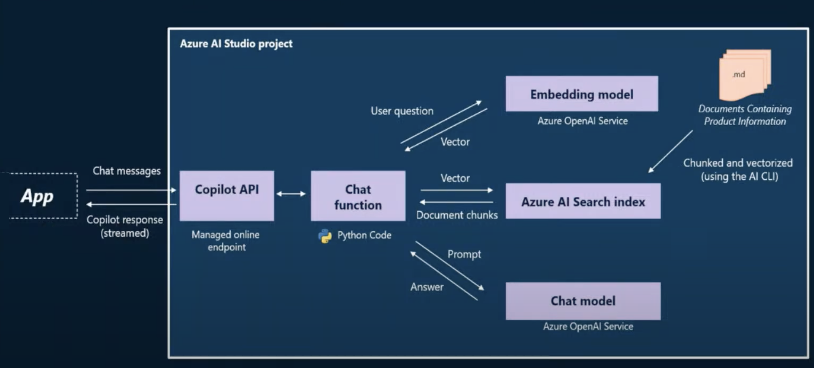
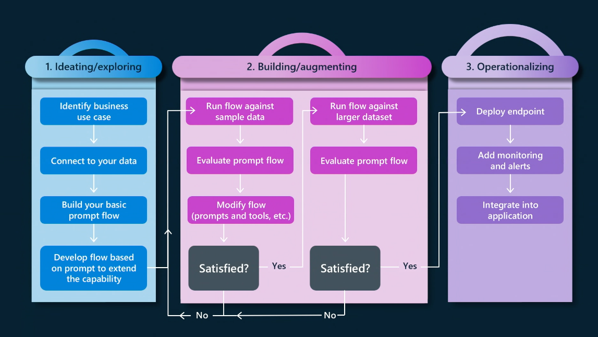

# Deconstructing Contoso Chat: An Interactive Workshop 

[Contoso Chat](https://github.com/Azure-Samples/contoso-chat) is an open-source application sample that teaches you how to build a modern generative AI application using the Azure AI platform (development) and the Azure Developer CLI (deployment) to streamline your end-to-end developer experience. 

This is an interactive workshop that walks you through the steps needed to understand the application scenario, architecture, codebase, and developer workflow (setup-develop-evaluate-deploy-iterate) required for building a retail copilot application end-to-end on the Azure AI platform.

The workshop supports 3 delivery formats:
 
1. **Instructor-Led** 👉🏽 Bring your laptop or use a provided laptop. You will have access to a temporary Azure subscription with pre-provisioned resources. (This is the format used at Microsoft AI Tour.)
1. **Partner-Led** 👉🏽 Bring your own laptop. You may need your own Azure subscription and to self-deploy resoources.
1. **Self-guided** 👉🏽 Bring your laptop and your own Azure subscription. You must self-deploy resources.

This workshop uses Codespaces as the developer interface for particpants. We recommend participants will be directed to **fork this repository**.

## Requirements for participants

To participate in this workshop, particpants will need:

1. A laptop.
   * It need only be capable of running a browser and GitHub Codespaces, so almost any laptop will do.
   * A recent version of Edge, Chrome or Safari is recommended.
1. An Azure subscription.
   * Self-guided participants will use their own Azure subscription. Instructor-led labs may provide temporary Azure subscrptions to use.   
1. A GitHub Account.
   * If you don't have one, [sign up for a free account](https://github.com/signup) now.
   * After this workshop is complete, you will have a fork of the "contoso-chat" repository in your GitHub account, which includes all the materials you will need to reproduce this workshop at home.
1. (recommended) Familiarity with Visual Studio Code. 
   * We will run all code in GitHub Codespaces, a virtualized Linux machine, instead of your local laptop. We won't be running anything on the laptop directly.
   * VS Code Online will be our development environment in GitHub Codespaces.
   * If you are familiar with running Codespaces within VS Code Desktop on your laptop, feel free to do so. 
1. (preferred) Familiarity with the `bash` shell. 
    * We'll be using `bash` to run commands in the VS Code terminal.
1. (preferred) Familiarity with Python and Jupyter Notebooks.
    * We'll be creating Python scripts and running them from the command line and from Notebooks.

## Using these materials

There are several steps required to run or participate in this workshop content. Depending on the workshop format, you will need to follow some or all of guides below:

* [0-Preprovision.md](0-Preprovision.md) (40 minutes): Pre-provision resources into an Azure subscription. 
  * If you are a participant in an instructor-led workshop, this step has already been done for you. Your instructor will explain how access your resources.
* [1-GetStarted.md](1-GetStarted.md) (5 minutes)
  * Launch a GitHub Codespaces environment to run the workshop in.
* [2-Instructions.md](1-Instructions.md) (60-75 minutes): Instructions for workshop participants. 
  * Follow this guide on your own or in an instructor-led workshop to explore and how to build the Contoso Chat RAG application.
* [3-CleanUp.md](2-CleanUp.md) (10 minutes): Instructions for deleting resources after the workshop is over. In an instructor-led workshop this may be done for you.

## Application Scenario

This workshop teaches participants how to design, develop, evaluate, and deploy, a _retail copilot application_ using the Azure AI platform. The application scenario focuses on a fictional retailer (Contoso Outdoor Company) that has a website where outdoor enthusiasts can purchase hiking and camping equipment as shown below. The company has two data sources:
- A site product catalog (with indexes stored in Azure AI Search)
- A customer orders database (with data stored in Azure Cosmos DB)

Participants will build the _Contoso Chat_ RAG application. This implements the copilot AI backend that integrates with the website front-end, allowing customers to "chat with the copilot" to get answers about the products and recommendations based on their order history - _simply by clicking the chat icon seen at the bottom right corner of the website_. This chat experience is powered by the Contoso Chat API endpoint that you will be deploying by the end of this workshop, allowing customer requests to be responded to in real-time using a custom model that is grounded in the product catalog and customer history data.

## 2. Copilot Implementation

The _basic copilot_ implementation is shown at a high level in the diagram below. the Contoso Chat API (copilot API) exposes a _managed online endpoint_ that receives requests from remote clients like the website. 
- The requests are handled by your _chat application_ which implements the "chat function" block seen below.
- This uses a Retrieval Augmented Generation pattern on input prompt (_user question_) to enhance the request (_model prompt_).
- The model prompt is sent to a chat model (_Azure OpenAI service_) which returns a response (_answer_).
- The answer is then presented to the user on the chat UI (_website_) to complete the interaction.

The Contoso Chat scenario extends this basic copilot implementation with **an additional "customer lookup" step** that retrieves relevant customer orders related to the user question. This information is added into the previously created model prompt, to generate a new _model prompt_ that is send to the chat model. The final response will now reflect both the product catalog and customer history data.

## 3. End-to-End Workflow

The Contoso Chat application sample reflects the end-to-end developer workflow for building a generative AI application on the Azure AI platform. You'll go from from _prompt engineering_ (ideation using the RAG pattern with promptflow) to _LLM Ops_ (iterative evaluation for response quality, and deployment for operationalization) as shown below.

## 4. Developer Experience

The end-to-end developer experience is streamlined by the use of four core components in our developer platform:
- **Azure AI Studio**: A unified platform for exploring AI models, managing AI application resources, and building AI projects. It supports both code-first (SDK) and low-code (UI) approaches for building generative AI applications end-to-end.
- **Promptflow**: An open-source framework that simplifies the ideation and evaluation phases of this workflow with support for
  - _prompty assets_ for simplifying your prompt engineering process
  - _dag-flow_ option for building applications as a directed acyclic graph
  - _flex-flow_ option (new) that supports more flexibility in tool integrations
  - _pf tools_ with CLI and IDE based options for simplifed developer experience
- **Azure Developer CLI**: A command-line tool that supports _infrastructure-as-code_ configuration for consistent and repeatable deployments of AI applications on Azure - that can also be version controlled and shared across teams. It provides three key features:
  - _azd-template_ configuration for managing application resources
  - _azd_ CLI for managing resource provisioning & deployments from command-line
  - _azd extension_ for Visual Studio Code, achieving the same goals from the IDE
- **Dev Containers**: These enforce a _configuration-as-code_ approach by defining the required development dependencies in a "development container" that can be launched in the cloud (with GitHub Codespaces) or in your local device (with Docker Desktop). It has 3 key features:
  - Python runtime with all required tools (`azd`, `pf`, `az`) and packages (`pip` dependencies) pre-installed.
  - Visual Studio Code IDE with required extensions - for local development
  - GitHub Codespaces support - for local development in a cloud-hosted VM

---