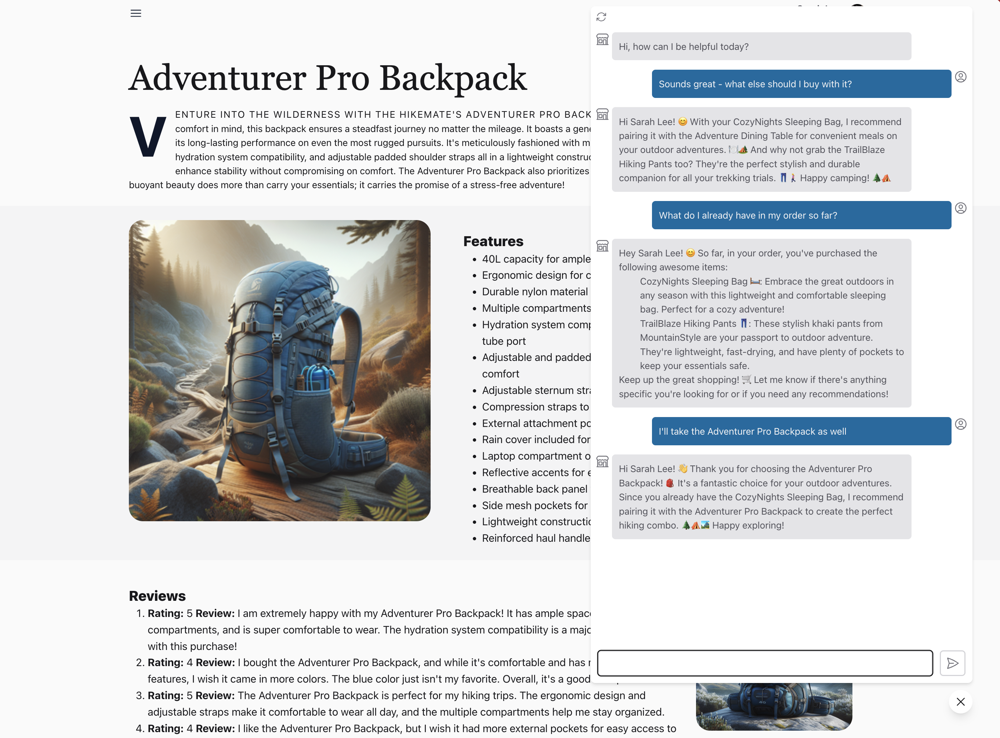

# Let's Build Contoso Chat

!!!example "About This Guide"

    This developer guide teaches you how to build, run, evaluate, deploy, and use, an LLM application with Retrieval Augmented Generation. We'll walk you through the end-to-end development process from _prompt engineering_ to _LLM Ops_ with step-by-step instructions all the way. Here's what you need to know:
    
     - We'll build **[Contoso Chat](https://github.com/Azure-Samples/contoso-chat)**, a customer service AI application for the **[Contoso Outdoors](https://github.com/Azure-Samples/contoso-web)** company website. 
     - We'll use **[Azure AI Studio](https://ai.azure.com)** and **[Prompt Flow](https://github.com/microsoft/promptflow)** to streamline  LLMOps from ideation to operationalization!

## What You'll Need

The main workshop takes about **60-75 minutes** to complete. Significant time is taken by _provisioning_ Azure resources and _deploying_ your final promptflow-based LLM application. Some parts of the workshop **may be automated or completed in parallel** to reduce that time.

You will need:

 - A _GitHub account_ (with GitHub Codespaces access)
 - An _Azure account_ (with Azure OpenAI access)
 - A _modern browser_ (to run Codespaces, access Azure portals)
 - Familiarity with _Python, Jupyter Notebooks & VS Code_

!!!example "Instructor Led Sessions"

    This documentation is meant for self-guided completion of the workshop. The workshop may also be offered in _instructor-led sessions_ at events like the [2024 Microsoft AI Tour](https://aka.ms/msaitour) using a _Lab On Demand_ platform that comes with a pre-provisioned Azure subscription and built-in guide. Instructions should be comparable, but experience may vary.

## What You'll Build

The main workshop focuses on building **Contoso Chat**, an AI application that uses Retrieval Augmented Generation to build a _customer support_ chat agent for **Contoso Outdoors**, an online store for outdoor adventurers. The end goal is to _integrate customer chat support_ into the website application for Contoso Outdoors, as shown below.
       

!!!example "Azure-Samples Repositories"

    The workshop will refer to two different applications in the overview. The _[contoso-chat](https://github.com/Azure-Samples/contoso-chat)_ sample provides the basis for building our **RAG-based LLM Application** to implement the chat-completion AI. The  _[contoso-web](https://github.com/Azure-Samples/contoso-web)_ implements the **Contoso Outdoors Web Application** with an integrated chat interface that website visitors will use, to interact with our deployed AI application. We'll cover the details in the **[01 | Introduction](./01%20|%20%20Introduction/1-paradigm-shift.md)** section of the guide.

----

## How You'll Build It

The workshop is broadly organized into these steps, some of which may run in parallel.

- [x] 1. Lab Overview
- [x] 2. Setup Dev Environment (GitHub Codespaces)
- [x] 3. Provision Azure (via Azure Portal, Azure AI Studio)
- [x] 4. Configure VS Code (Azure Login, Populate Data)
- [x] 5. Setup Promptflow (Local & Cloud Connections)
- [x] 6. Run & Evaluate Flow (Locally on VS Code)
- [x] 7. Deploy & Use Flow (Cloud, via Azure AI Studio)

With this workshop, you get hands-on experience with the _ideating/exploring_ and _building/augmenting_ phases of the LLM App development lifecycle. The workshop ends with deploying the endpoint to kickstart the _operationalizing_ phase of LLM Ops.

If time permits, continue operationalizing your app with the following _Bonus Exercises_:

- [x] 8.1 | Contoso Website Chat (Integration)
- [x] 8.2 | GitHub Actions Deploy (Automation)
- [x] 8.3 | Intent-based Routing (Multi-Agent)
- [x] 8.4 | Content Filtering (Responsible AI)

---

## Get Started .. 🚀

- Want to understand the app dev lifecycle first? Start here 👉🏽 **[01 | Introduction](./01%20|%20%20Introduction/1-paradigm-shift.md)**.
- Want to jump straight into building the application? Start here 👉🏽  **[02 | Workshop](./02%20|%20Workshop/1%20|%20Lab%20Overivew/README.md)**.
- Want to learn more about LLM Ops? Watch this first 👇🏽 **[#MSIgnite 2023 Breakout](https://ignite.microsoft.com/sessions/16ee2bd5-7cb8-4419-95f6-3cab36dfac93?source=sessions)**

!!!example "Breakout Session: End-to-End App Development: Prompt Engineering to LLM Ops"

    **Abstract** | Prompt engineering and LLMOps are pivotal in maximizing the capabilities of Language Models (LLMs) for specific business needs. This session offers a comprehensive guide to Azure AI's latest features that simplify the AI application development cycle. We'll walk you through the entire process—from prototyping and experimenting to evaluating and deploying your AI-powered apps. Learn how to streamline your AI workflows and harness the full potential of Generative AI with Azure AI Studio.

    <iframe width="1000" height="420" src="https://www.youtube.com/embed/DdOylyrTOWg" title="End-to-End AI App Development: Prompt Engineering to LLMOps | BRK203"></iframe>