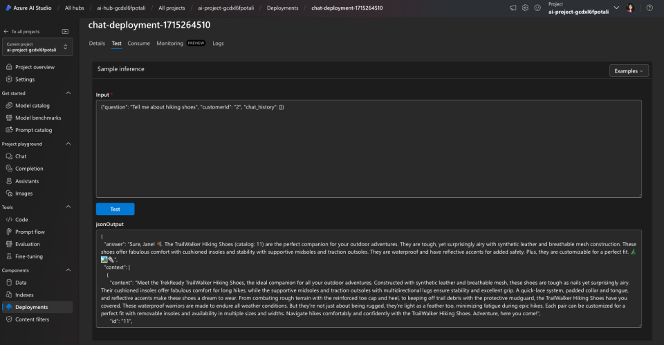

# Contoso Chat With Prompty, Flex Flow and AZD

> [!WARNING]
> This file should be deleted before final merge or release of the Contoso Chat template. It is meant only to capture feedback for the team from my testing process.

---

## Quickstart (Desired Path)

1. Fork repo and clone it to local device
1. Run Docker Desktop (to have a container host running)
1. Open cloned repo in VS Code - and launch in container
1. Validate necessary tools exist in environment (my current versions below)
    ```bash 
    python --version
    Python 3.11.9

    azd version
    azd version 1.9.0 (commit 651394c3ddcfadff194d177f8b0ddf06fe3752bf)

    az --version
    azure-cli                         2.60.0

    pf version
    {
    "promptflow": "1.10.0",
    "promptflow-core": "1.10.0",
    "promptflow-devkit": "1.10.0",
    "promptflow-tracing": "1.10.0"
    }
    ```

## Test Things Locally 

> To test this locally, you need to have completed at least an `azd provision` step so Azure resources are available for client-side access to relevant Azure AI services, Azure AI search indexes and Azure CosmosDB databases.

1. Explore prompts locally
    ```bash
    pf flow test --flow ./contoso-chat --inputs question="Tell me about hiking shoes" chat_history=[] customerId="2"
    ```
1. Test flow locally with UO
    ```bash
    pf flow test --flow ./contoso-chat --inputs question="Tell me about hiking shoes" chat_history=[] customerId="2" --ui
    ```

## Then Deploy to Production

1. Authenticate with Azure
    ```bash
    azd auth login
    ```
1. Provision and Deploy App To Azure
    ```bash
    azd up
    ```
1. Wait for deployment to complete on https://ai.azure.com/build/ (for project)
    - On completion you will see a "Test" tab when ready
    - Use this test question: `{"question": "Tell me about hiking shoes", "customerId": "2", "chat_history": []}` 
    - You should see a reponse like this: **Congratulations** You deployed Contoso Chat v2.

      
1. On subsequent app changes, we only need to redeploy (not reprovision)
    ```bash
    azd deploy
    ```
1. Note: Azure AI Search is the only resource that is hardcoded to `eastus` (dependency for semantic ranker). All others are deployed to the region specified during initial setup in the `--location`.

---

## Troubleshooting

Documenting potential issues and fixes taken to resolve them:

1. Updated `azure.yaml` to add environment variable overrides for env vars that will be required by app in Azure runtime.
1. Had to manually add in the Cognitive Services OpenAI User assignment to the Azure AI Services resources. This should be automated in azd in the future. For now do this manually **after the chat app deployment is complete**.
    - Go to Azure Portal, open this resource group
    - Find the Azure AI Services resources - click for details
    - Go to Access Control (IAM) tab and select "Add Role"
    - Search for the "Cognitive Services OpenAI User" role
    - Click "Managed Services" and "Add Members"
    - Select the Managed ML Endpoint resource - pick the instance for this resource group and select it.
    - On the main page, verify this role assignment is now present and click "Review+Assign" - twice - and save.
    - You should see an alert confirming the role assigment is complete. Return to Azure AI Studio and refresh the chat deployment details page.
    - Try the test message - it should work. 

---

## Managed Identity Changes

> These changes exist in the [aad auth PR#110](https://github.com/Azure-Samples/contoso-chat/pull/110/files) and will need to be copied in for testing later..

This PR had changes to 3 files:
- [`ai_search.py`](https://github.com/Azure-Samples/contoso-chat/pull/110/files#diff-6c0251d538c1b48e689a30f577c3668096de92079407f0337cbe5b9962ae922b) - add and use DefaultAzureCredential
- [`chat_request.py`](https://github.com/Azure-Samples/contoso-chat/pull/110/files#diff-43c2f1da4e97373ae88c1685935a829c375946f1f98a8b1845e98db41cba18d3) - add and use DefaultAzureCredential
- [`main.bicep`](https://github.com/Azure-Samples/contoso-chat/pull/110/files#diff-7ef659fc9cf6968e718894d300490b14ea7a52091e7d4bcffae3a5029ac721d4) - add `principalId` support

---

## Env Vars Standarization

Different names and vars were used in different contexts. Capturing them all here for now, and will reconcile and standardize them next. The naming is shown with just enough prefix context to provide usable references in workshop documentation.

```bash
AZURE_ENV_NAME="msbuild-flexflow-test"
AZURE_LOCATION="swedencentral"
AZURE_SUBSCRIPTION_ID="#########"
AZURE_TENANT_ID="#########"

AZURE_RESOURCE_GROUP="rg-#########"
AZUREAI_HUB_NAME="ai-hub-gcdx#########"
AZUREAI_PROJECT_NAME="ai-project-gcdx#########"
AZURE_CONTAINER_REGISTRY_ENDPOINT="crgcdx#########.azurecr.io"
AZURE_CONTAINER_REGISTRY_NAME="crgcdx#########"
AZURE_KEY_VAULT_ENDPOINT="https://kv-gcdx#########.vault.azure.net/"
AZURE_KEY_VAULT_NAME="kv-gcdx#########"

AZURE_OPENAI_NAME="aoai-gcdx#########"
AZURE_OPENAI_API_VERSION="2023-03-15-preview"
AZURE_OPENAI_CHAT_DEPLOYMENT="gpt-35-turbo"
AZURE_OPENAI_ENDPOINT="https://aoai-gcdx#########.openai.azure.com/"
AZURE_OPENAI_KEY="#########"

AZURE_SEARCH_NAME="srch-gcdxl#########"
AZURE_SEARCH_ENDPOINT="https://srch-gcdx#########.search.windows.net/"
AZURE_SEARCH_KEY="#########"
CONTOSO_SEARCH_ENDPOINT="https://srch-gcdx#########.search.windows.net/"

AZURE_COSMOS_NAME="cosmos-gcdx#########"
COSMOS_ENDPOINT="https://cosmos-gcdx#########.documents.azure.com:443/"
COSMOS_KEY="#########"
```

---