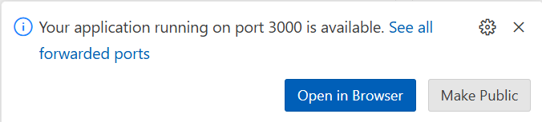

# AI Tour Lab: Build a Retail Copilot Code-First on Azure AI

This lab is offered as an **instructor-led** session at Microsoft AI Tour 2024-2025 on the Prototype to Production track.

If you're not at an AI Tour event right now, you can register for an upcoming event in a city near you.

- [**Register to attend**](https://aitour.microsoft.com/) at a tour stop near you.
- [**View Lab resources**](https://aka.ms/aitour/wrk550) to continue your journey.

## Resources

[Azure-Samples/contoso-chat-rag-aca (github.com)](https://github.com/Azure-Samples/contoso-chat-rag-aca)

https://learn.microsoft.com/en-us/azure/container-apps/containerapp-up

https://learn.microsoft.com/en-us/azure/developer/azure-developer-cli/

---

**Table of Contents**

- [Lab Instructions: Build a Retail Copilot Code-First on Azure AI](#lab-instructions-build-a-retail-copilot-code-first-on-azure-ai)
  - [resources](#resources)
  - [1. Learning Objectives](#1-learning-objectives)
  - [2. Log into your Azure account from the terminal](#2-log-into-your-azure-account-from-the-terminal)
  - [3. Our goal: build a retail website with an AI-powered chat assistant](#3-our-goal-build-a-retail-website-with-an-ai-powered-chat-assistant)
  - [3. Explore the resources](#3-explore-the-resources)
    - [3.1 Visit Azure Portal](#31-visit-azure-portal)
    - [Customer data: CosmosDB](#customer-data-cosmosdb)
    - [Product purchase history: CosmosDB](#product-purchase-history-cosmosdb)
    - [Product information: Azure AI Search](#product-information-azure-ai-search)
    - [Model endpoints: Azure AI Studio](#model-endpoints-azure-ai-studio)
  - [4. Build a basic chat endpoint](#4-build-a-basic-chat-endpoint)
  - [5. Build A Custom Copilot](#5-build-a-custom-copilot)
    - [5.1 Install VS Code Extensions](#51-install-vs-code-extensions)
    - [5.2 Create `chat.prompty` (v1)](#52-create-chatprompty-v1)
    - [5.3 Create `chat_request.py` (v1)](#53-create-chat_requestpy-v1)
    - [5.4 Create `flex.flow.yaml` (app)](#54-create-flexflowyaml-app)
    - [5.5 Run your copilot app](#55-run-your-copilot-app)
  - [6. Evaluate A Custom Copilot](#6-evaluate-a-custom-copilot)
    - [6.1 Understand the metrics](#61-understand-the-metrics)
    - [6.2 Understand the tools](#62-understand-the-tools)
    - [6.3 Create evaluation dataset](#63-create-evaluation-dataset)
    - [6.4 Create evaluation flow](#64-create-evaluation-flow)
    - [6.5 Evaluate your copilot (v1)](#65-evaluate-your-copilot-v1)
  - [7. Chat with your data (RAG)](#7-chat-with-your-data-rag)
    - [7.1 Understand RAG Pattern](#71-understand-rag-pattern)
    - [7.2 Setup AI Search Index](#72-setup-ai-search-index)
    - [7.3 Setup Azure CosmosDB](#73-setup-azure-cosmosdb)
    - [7.4 Update `chat.prompty` (v2)](#74-update-chatprompty-v2)
    - [7.5 Update `chat_request.py` (v2)](#75-update-chat_requestpy-v2)
    - [7.6 Run your copilot application](#76-run-your-copilot-application)
    - [7.7 Evaluate your copilot (v2)](#77-evaluate-your-copilot-v2)
  - [8. Deploy \& Test the Copilot](#8-deploy--test-the-copilot)
    - [8.1 Understand Azure AI Studio](#81-understand-azure-ai-studio)
    - [8.2 View Copilot Deployment](#82-view-copilot-deployment)
    - [8.3 Test Copilot Deployment](#83-test-copilot-deployment)
  - [9. Integrate with Contoso Web](#9-integrate-with-contoso-web)
    - [9.1 Fork Contoso-Web Repo](#91-fork-contoso-web-repo)
    - [9.2 Launch GitHub Codespaces](#92-launch-github-codespaces)
    - [9.3 Set Environment Variables](#93-set-environment-variables)
    - [9.4 Preview Contoso Web](#94-preview-contoso-web)
    - [9.5 Test Contoso Web UI](#95-test-contoso-web-ui)
  - [10. Wrap-Up](#10-wrap-up)
    - [10.1 Cleanup Resource](#101-cleanup-resource)
    - [10.2 Star or Watch Repo](#102-star-or-watch-repo)
    - [10.3 Browse Resources](#103-browse-resources)

_If you find this sample useful, consider giving us a star on GitHub! If you have any questions or comments, consider filing an Issue on the [source repo](https://github.com/Azure-Samples/contoso-chat)_.

## 1. Learning Objectives

In this workshop, you will learn how to:

* Use Azure AI Studio as a code-first platform for building custom copilots​

* Prototype a custom copilot on VS Code with powerful tools (Prompty, Promptflow, Codespaces)​

* Optimize your custom copilot with manual testing & AI-assisted evaluation (Quality, Safety)​

* Operationalize your custom copilot by deploying to Azure AI Studio (Monitoring, Filters, Logs)​

* Customize the sample to suit your application scenario (data, functions, frameworks, models)

If you've gotten this far, you have already:

* Launched the Lab instructions
* Reviewed pre-requisites for this workshop
* Forked the repository for this workshop
* Launched GitHub Codespaces
* Opened this file in VS Code Online

## 2. Log into your Azure account from the terminal

We have provided you with a temporary Azure subscription for you to use with this workshop. It is pre-deployed with all the resources you will need.

You can find the username and password at the bottom of the Lab Instructions window titled "Build a Retail Copilot Code-First on Azure AI".

* Find the username and password for your Azure subscription in the Lab Instructions window.

* Click the Terminal Pane in the VS Code online window

    * It's just below these instructions, in the bottom-right corner of your browser

* Copy the command below and paste it into the command line, and hit ENTER:
```
azd auth login --use-device-code
```

* Copy the code show to your clipboard, and then click enter. 

    * A new browser window will open

* If you are prompted to select an account, click "Use another account"

    * This can happen if you have previously used this browser to log Azure using yout own account, for example

* Copy your username from the Lab Instructions window, paste it in, and click Next

* Copy your username from the Lab Instructions window, paste it in, and click Sign In

* At the prompt "Are you trying to sign in to Microsoft Azure CLI?", click Continue

* Close the "Microsoft Azure Cross-platform Command Line Interface" tab

## 3. Our goal: build a retail website with an AI-powered chat assistant

Let's install the website now. To do this we will:

 - Copy the contents of https://github.com/Azure-Samples/contoso-web to the Codespace
 - Install Next.js into the app (this is a Next app)
 - Launch the web app in Codespace

1. Click to activate VS Code Terminal pane (below these intructions)
1. Enter these commands in turn
```
git clone https://github.com/Azure-Samples/contoso-web
cd contoso-web
npm install 
```

3. Now, create a file called `.env` in the current (contoso-web) folder with the following contents:

```
PROMPTFLOW_ENDPOINT=https://ACTUAL-ENDPOINT-GOES-HERE.francecentral.inference.ml.azure.com/score
PROMPTFLOW_KEY=ACTUAL-KEY-GOES-HERE
```

4. Edit the `.env` file with the REST Endpoint and Primary Key found in the Consume tab of AI Studio. (TODO: Check sequencing.)

```bash
npm run dev
```

VS Code will generate a popup like this. Click "Open in Browser".



You now have the complete working contoso-web app deployed!

* Observe logged-in state of Sarah Lee

* Scroll through the page to see the product catalog

* Click on the Cozy Nights Sleeping Bag to see the product information page

    * Description, features, reviews, FAQ, return policy, cautions, user guide, warranty, technical specifications

* Click Back to return to home page

* Click "chat" icon

* Questions to ask:

```
What can you do?
```
```
What is a good sleeping bag for winter use?
```
```
How much is the Cozy Nights Sleeping bag?
```
```
How should I take care of it?
```
```
What did I order last time?
```
## 3. Explore the resources

We have deployed several resources to your Azure Subscription that will be used in this RAG architecture. 

First, lets take a look at the resources as they appear in the Azure Portal. Then, we'll use the Codespaces terminal to take a look at some of them in a little more detail.

### 3.1 Visit Azure Portal

* Open a new browser tab for the Azure Portal 
    - **Navigate to** https://portal.azure.com **in a new tab**.
    - You may be prompted to **log in**, in which case use the Username and Password provided in the Skillable Lab window.
 
* Launch the "Resource Groups" tool
    - **Click the hamburger menu** (in the top-left corner)
    - Select **Resource Groups**

* Explore the contents of the resource group
    - **Click** the name of the resource group: **rg-AITOUR**
    - You will see: Overview page with 14 resources listed.
    - Look at the Type column and see that you have the following resources deployed:
        - **Search service**: (Azure AI Search, a vector database to store product information)
        - **Azure Cosmos DB account**(Azure CosmosDB, a relational database to store customer data and orders)    
        - **Azure AI services** (endpoints for OpenAI models used in the application)
        - **Azure AI hub** (a hub in Azure AI Studio collecting the shared resources used in the app)
        - **Azure AI project** (the project in Azure AI Studio containing the assets for the RAG application)

### Customer data: CosmosDB

Customer data is sourced from a collection of JSON files and then loaded into Cosmos DB.

* **Explore** the JSON files in [../data/customer_info](../data/customer_info), for example [customer_info_1.json](../data/customer_info/customer_info_1.json)
    * Customer id, name, age, contact info, membership tier
    * Product Purchase history
        * Product info, purchase date, price
* The script used to load the data into Cosmos DB has already been run for you. Take a look at the Notebook version [../data/customer_info/create-cosmos-db.ipynb](../data/customer_info/create-cosmos-db.ipynb), but don't run any cells
* **Open the notebook** [../data/customer_info/investigate-cosmos-db.ipynb](../data/customer_info/investigate-cosmos-db.ipynb)
* **Run each of the cells** to take a look at the data in Cosmos DB

### Product purchase history: CosmosDB

The product data you see in CosmosD was sourced from a CSV file:

* **Open** [../data/product_info/products.csv](../data/product_info/products.csv)
  * Product id
  * Name
  * Price
  * Category
  * Brand
  * Description

Observe that these details match those in the customer order history stored in Cosmos DB.

### Product information: Azure AI Search

TODO: Have the user use the CLI to do some test searches on the Azure AI Search.

### Model endpoints: Azure AI Studio

 1. Once provisioning completes, monitor progress for app deployment.
    - Visit the [Azure AI Studio](https://ai.azure.com/build)
    - Click Sign In if necessary
    - Look for an AI Project associated with the above resource group
    - Click `Deployments` to track the status of the application deployment
 1. Test the deployed endpoint from Azure AI Studio
    - Click the newly-created `chat-deployment-xx` endpoint listed
    - In the details page, click the `Test` tab for a built-in testing sandbox
    - In the `Input` box, enter a new query in this format and submit it:
        ```
        {"question": "Tell me about hiking shoes", "customerId": "2", "chat_history": []}
        ```
    - If successful, the response will be printed in the area below this prompt.

You can find your deployed retail copilot's _Endpoint_ and _Primary Key_ information on the deployment details page in the last step. Use them to configure your preferred front-end application (e.g., web app) to support a customer support chat UI capability that interacts with the deployed copilot in real time.

Now let's try calling the endpoint from a Python script.

1. Click the Consume tab
1. Under "Consumption types", choose Python
1. Copy the contents of the sample file provided to a file called "test-endpoint.py" in the /workspaces/contoso-chat folder
1. Replace Line 18 with the following:
```
data = {"question": "What is a good sleeping bag?", "customerId": "2", "chat_history": []}
```
5. Replace Line 24 with text like the following, but replace the text between the quotes with Primary Key shown in AI Studio between the quotes
```
api_key = 'PRIMARY-KEY-GOES-HERE'
```
6. Run your test script with the command
```
python test-endpoint.py
```

## 4. Build a basic chat endpoint

@revodavid ➜ /workspaces/contoso-chat (aitour-fy25) $ mkdir mychat
@revodavid ➜ /workspaces/contoso-chat (aitour-fy25) $ cd mychat/
Right-click mychat -> New Prompty
Edit basic.prompty
Add endpoint
Add deployment_name (model name)
Click Run in basic.prompty window
Authenticate using Skillable Azure ID
- It will now run

Add some examples of changing fields and seeing impacts. Use Run button to see changes.

Rename to mychat.prompty 
Right click, choose "Add Prompt flow code"

Open mychat_promptflow.py
Click run

Edit mychat_promptflow.py

Delete everything below @tool and replace with

```python
@tool
def get_response(customerId, question, chat_history):
    print("inputs:", customerId, question)
    #customer = get_customer(customerId)
    #embedding = get_embedding(question)
    #context = get_context(question, embedding)
    #print("context:", context)
    #print("getting result...")

    configuration = AzureOpenAIModelConfiguration(
        #azure_deployment=os.environ["AZURE_DEPLOYMENT_NAME"],
        azure_deployment="gpt-35-turbo",
        api_version=os.environ["AZURE_OPENAI_API_VERSION"],
        azure_endpoint=os.environ["AZURE_OPENAI_ENDPOINT"]
    )
    override_model = {
        "configuration": configuration,
        "parameters": {"max_tokens": 512}
    }
    # get cwd
    data_path = os.path.join(pathlib.Path(__file__).parent.resolve(), "./chat.prompty")
    prompty_obj = Prompty.load(data_path, model=override_model)

    result = prompty_obj(question = question, customer = customer, documentation = context)

    print("result: ", result)

    return {"answer": result, "context": context}

# if __name__ == "__main__":
#     get_response(4, "What hiking jackets would you recommend?", [])
#     #get_response(argv[1], argv[2], argv[3])
```


## 5. Build A Custom Copilot

### 5.1 Install VS Code Extensions

<details> 
<summary> Click to view instructions </summary>
</details>

### 5.2 Create `chat.prompty` (v1)

<details> 
<summary> Click to view instructions </summary>
</details>

### 5.3 Create `chat_request.py` (v1)

<details> 
<summary> Click to view instructions </summary>
</details>

### 5.4 Create `flex.flow.yaml` (app)

<details> 
<summary> Click to view instructions </summary>
</details>

### 5.5 Run your copilot app

<details> 
<summary> Click to view instructions </summary>
</details>


## 6. Evaluate A Custom Copilot

### 6.1 Understand the metrics

<details> 
<summary> Click to view instructions </summary>
</details>

### 6.2 Understand the tools

<details> 
<summary> Click to view instructions </summary>
</details>

### 6.3 Create evaluation dataset

<details> 
<summary> Click to view instructions </summary>
</details>

### 6.4 Create evaluation flow 

<details> 
<summary> Click to view instructions </summary>
</details>

### 6.5 Evaluate your copilot (v1)

<details> 
<summary> Click to view instructions </summary>
</details>


## 7. Chat with your data (RAG)

### 7.1 Understand RAG Pattern

<details> 
<summary> Click to view instructions </summary>
</details>

### 7.2 Setup AI Search Index

<details> 
<summary> Click to view instructions </summary>
</details>

### 7.3 Setup Azure CosmosDB

<details> 
<summary> Click to view instructions </summary>
</details>

### 7.4 Update `chat.prompty` (v2)

<details> 
<summary> Click to view instructions </summary>
</details>

### 7.5 Update `chat_request.py` (v2)

<details> 
<summary> Click to view instructions </summary>
</details>

### 7.6 Run your copilot application

<details> 
<summary> Click to view instructions </summary>
</details>

### 7.7 Evaluate your copilot (v2)

<details> 
<summary> Click to view instructions </summary>
</details>


## 8. Deploy & Test the Copilot

### 8.1 Understand Azure AI Studio 

<details> 
<summary> Click to view instructions </summary>
</details>

### 8.2 View Copilot Deployment

<details> 
<summary> Click to view instructions </summary>
</details>

### 8.3 Test Copilot Deployment

<details> 
<summary> Click to view instructions </summary>
</details>


## 9. Integrate with Contoso Web
### 9.1 Fork Contoso-Web Repo

<details> 
<summary> Click to view instructions </summary>
</details>

### 9.2 Launch GitHub Codespaces

<details> 
<summary> Click to view instructions </summary>
</details>

### 9.3 Set Environment Variables

<details> 
<summary> Click to view instructions </summary>
</details>

### 9.4 Preview Contoso Web 

<details> 
<summary> Click to view instructions </summary>
</details>

### 9.5 Test Contoso Web UI

<details> 
<summary> Click to view instructions </summary>
</details>

## 10. Wrap-Up

### 10.1 Cleanup Resource

<details> 
<summary> Click to view instructions </summary>
</details>

### 10.2 Star or Watch Repo

<details> 
<summary> Click to view instructions </summary>
</details>

### 10.3 Browse Resources

<details> 
<summary> Click to view instructions </summary>
</details>

