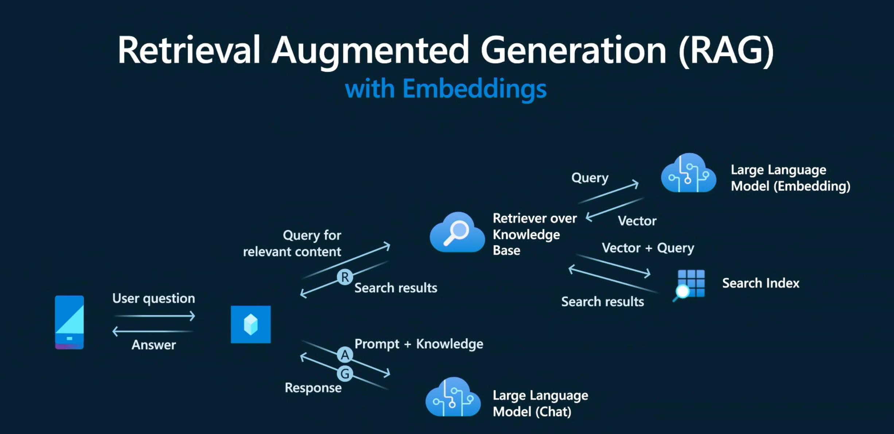

# 2. The RAG Pattern

The workshop teaches you to **build, evaluate, and deploy a retail copilot** code-first on Azure AI - using the _Retrieval Augmented Generation_ (RAG) design pattern to make sure that our copilot responses are grounded in the (private) data maintained by the enterprise, for this application.

 

Let's learn how this design pattern works in the context of our Contoso Chat application. Click on the tabs in order, to understand the sequence of events shown in the figure above.

---

=== "1. Get Query"

    !!! info "The user query arrives at our copilot implementation via the endpoint (API)"

    Our deployed Contoso Chat application is exposed as a hosted API endpoint using Azure Container Apps. The inoming "user query" has 3 components: the user _question_ (text input), the user's _customer ID_ (text input), and an optional _chat history_ (object array).

    The API server extracts these parameters from the incoming request, and invokes the Contoso Chat application - starting the workflow reflecting this RAG design pattern.

=== "2. Vectorize Query" 

    !!! info "The copilot sends the text query to a **retrieval** service after first vectorizing it."

    The Contoso Chat application converts the text question into a vectorized query using a Large Language "Embedding" Model (e.g., Azure Open AI `text-embedding-ada-002`). This is then sent to the information retrieval service (e.g., Azure AI Search) in the next step.

=== "3. **Retrieve** Matches"

    !!! info "The retrieval service uses vectorized query to return matching results by similarity"

    The information retrieval service maintains a search index for relevant information (here, for our product catalog). In this step, we use the vectorized query from the previous step to find and return _matching product results_ based on vector similarity. The information retrieval service can also use features like _semantic ranking_ to order the returned results.

=== "4. **Augment** Query"

    !!! info "The copilot augments user prompt with retrieved knowledge in request to model"

    The Contoso Chat application combines the user's original _question_ with returned "documents" from the information retrieval service, to create an enhanced _model prompt_. This is made easier using prompt template technologies (e.g., Prompty) with placeholders - for chat history, retrieved documents, and customer profile information - that are filled in at this step.
    

=== "5. **Generate** Response"

    !!! info "The chat model uses prompt to generate a grounded response to user question."

    This enhanced prompt is now sent to the Large Language "chat" model (e.g., Azure OpenAI `gpt-35-turbo` or `gpt-4o`) which sees the enhanced prompt (retrieved documents, customer profile data, chat history) as _grounding_ context for generating the final response, improving the quality (e.g., relevance, groundedness) of results returned from Contoso Chat.