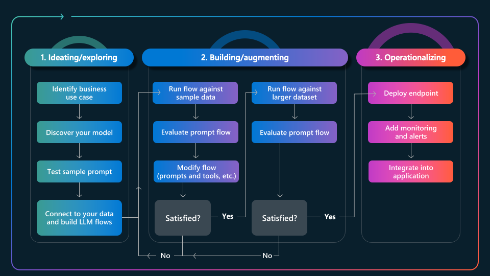

# 4. The App Lifecycle

Building generative AI applications requires an iterative process of refinement from _prompt_ to _production_. The application  lifecycle (GenAIOps) is best illustrated by the three stages shown:

1. **Ideation** - involves building the initial prototype, validating it manually with a test prompt.
2. **Evaluation** - involves assessing it for quality and safety with large, diverse test datasets.
3. **Operationalization** - involves deploying it for real-world usage & monitoring it for insights.

In the next section, we'll map this app lifeycle to a simplified development workflow that identifies the core developer task at each stage, and highlights a key developer tool that streamlines its execution.