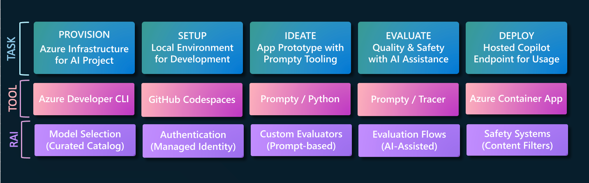

# 5. The Dev Workflow

In the previous section, we saw the GenAIOps lifecycle: **Ideation, Evaluation, Operationalization**. Let's map those stages into the developer workflow shown below. Explore the [Learning Resources](./../01-Introduction/index.md) for deeper dives into the tools and responsible AI considerations involved. 

!!! info "Click on the tabs below to understand the task to be completed at each stage."

=== "1. PROVISION"

    **Setup the Azure infrastructure for the project.** This includes creating the Azure AI project (resources, models) and support services (Azure CosmosDB, Azure AI Search, Azure Container Apps). _By the end of this step, you should have created an Azure resource group._

    !!! note "This step is completed for you in instructor-led sessions." 

=== "2. SETUP"

    **Setup the development environment for your project.** This involves forking the sample repo to your own profile, launching GitHub Codespaces to get a pre-built development environment and configure it to talk to your provisioned Azure infrastructure. _By the end of this step, you should be ready to start the ideation step of development_.
    
=== "3. IDEATE"

    **Go from first prompt to functional prototype.** This involves creating a prompt template, configuring it to use a deployed chat model, then using a sample input to iterate on the prompt template design till a satisfactory response is returned. _By the end of this step, you should have a Prompty asset and a Python application script for Contoso Chat._

=== "4. EVALUATE"

    **Assess response quality with larger test dataset.** This involves creating a test dataset, creating custom evalators (for quality metrics) and orchestrating an AI-assisted evaluation workflow to scores responses from our application before we can deploy to production. _By the end of this step, you should be ready to take the prototype to production._

=== "5. DEPLOY"

    **Deploy application to get a hosted API endpoint.** This involves creating an API application server (using FastAPI), packaging it up in am Azure Container App, and deploying it to Azure using `azd deploy`. _By the end of this step, you should have a hosted Contoso Chat AI endpoint, ready to integrate with frontend clients_.
