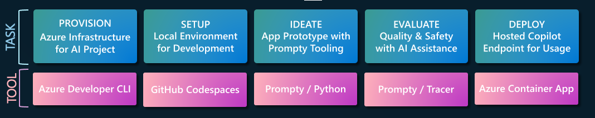

# Validate Your Setup

!!! success "SETUP IS COMPLETE: Let's Review where we are right now"

    

    We just completed the **PROVISION** and **SETUP** stages of the end-to-end workflow. 

    - [X] We launched GitHub Codespaces and forked the sample repo
    - [X] We have provisioned infrastructure resources on Azure
    - [X] We authenticated with Azure and refreshed our local env vars
    - [X] We completed post-provisioning tasks to populate data

In this section, we'll validate our setup quickly, and organize our development environment into browser tabs before we move to the **IDEATE** phase of development. 

---

### 3.1 Azure Portal Tab

!!! tip "The Azure Portal helps us view the resources provisioned on Azure and check that they are setup correctly"

Here's a reminder of the Azure Application Architecture - let's check our provisioned Resource Group to make sure these resources were created.


1. Open a new browser tab and navigate to the link below. You may be prompted to login.
    ``` title=""
    https://portal.azure.com/#browse/resourcegroups
    ```

1. **Sign in** → If prompted, use the `Username` and `Password` from the "Azure Credentials" section in your Skillable Lab instructions panel.
1. You may be presented with a "Welcome to Microsoft Azure" screen. Click **Cancel** (to dismiss it) or click **Get Started** (to take an introductory tour of the Azure Portal).
1. You should be taken directly to the Resource Groups page for your subscription.
    - You should see an `rg-AITOUR` resource. This was created for you and contains all the resources needed to build and deploy your RAG-based copilot. 
1. **Click** `rg-AITOUR` to visit the Resource Group overview page.
    - **Check:** Deployments (look under "Essentials") - You should see: *35 succeeded*. 
    - **Check:** Resources (in Overview) - You should see: *15 resources*.

!!! task "Leave the Azure Portal open on this tab. We'll revisit it later."

---

### 3.2 Azure AI Studio

!!! tip "The Azure AI Studio portal lets us view and manage the Azure AI project for our app."

1. Open a new browser tab and [navigate to this page](https://ai.azure.com?feature.customportal=false#home):
    ``` title=""
    https://ai.azure.com
    ```

1. **Click `Sign in`** → you will auto-login with the Azure credentials used to sign into the portal.

    - **Check:** You should see a Hub resource (with a name like _ai-hub-XXXXXXXX_)
    - **Check:** You should see a Project resource (with a name like _ai-project-XXXXXXXX_)

        !!! info "The [Azure AI hub](https://learn.microsoft.com/azure/ai-studio/concepts/ai-resources) collects AI resources that can be shared between AI projects. The [Azure AI project](https://learn.microsoft.com/azure/ai-studio/how-to/create-projects?tabs=ai-studio) helps you organize your work when building applications."

    - Click the Project link. You will be taken to a Project details page.
    - Click "Connected Resources" in the left pane,
    - **Check:** You should see Hub connections to OpenAI endpoints, Azure AI Search & Storage.
    - Click "Models + endpoints" in the left pane.
    - **Check:** You should see deployed models for this project.

        !!! info "For this application, we will use the chat completion models `gpt-4` and `gpt-35-turbo`, and the embedding model `text-embedding-ada-002`." 


---

### 3.3 Azure Container App Tab

!!! tip "The Azure Container App provides the hosting environment for our copilot (API endpoint)"

[Azure Container Apps](https://learn.microsoft.com/azure/container-apps/overview) will host the endpoint used to serve the Contoso Chat application on the Contoso Outdoors website. The Azure provisioning should have deployed a default Azure Container App to this endpoint.

1. Return to the Azure Portal tab
1. Visit the `rg-AITOUR` Resource group page
1. Click the `Container App` resource to display the Overview page
1. Look for `Application Url` (at top right), and click it to launch in new tab 
1. You should see: A `Hello World` message on the screen (confirming app was deployed)


!!! info "Azure Container Apps (ACA) is used to host our chat AI application. The application server is implemented using FastAPI and exposes a `/create_request` API endpoint to make requests to our copilot."


## 3.4. Check Azure Cosmos DB

The Azure CosmosDB resource holds the customer data for our application. It is a noSQL database that contains JSON data for each customer, and the prior purchases they made.

1. Switch to the **Azure Portal** tab and display the `rg-AITOUR` resource group Overview
1. **Click** the `Azure Cosmos DB account` resource name to visit its details page
1. **Click** `Data Explorer` in the top-nav menu 
    - dismiss the popup dialog to skip the movie
    - see: `contoso-outdoor` container with `customers` database
    - click `customers`, then select `Items`
    - you should see: **12 data items in database**


## 3.5. Check Azure AI Search 

The Azure AI Search resources contains the product index for our retailer's product catalog. It is the information **retrieval** service for **R**AG solutions, using sentence similarity and semantic ranking to return the most relevant results for a given customer query.

1. Switch to the Azure Portal tab and display the  `rg-AITOUR` resource group Overview
1. Click the `Search service` resource name to visit its details page
1. Click `Search Explorer` in the top-nav menu  
    - see Search explorer with default index `contoso-products`
    - **click** "Search" with no other input
    - you will see: Results dialog filled with index data for the entire product database.
1. Enter `sleeping bag` in the text box, and click Search
    - Verify that the first result returned relates to a sleeping bag from the catalog       
    !!! tip "Check the 'value' section of the response for semantically-ranked results." 
1. Enter `something to make food with` in the text box, and click Search       
    - Verify that the first result returned relates to a camping stove


## 3.6. Check Azure Container App

!!! info "How The Custom Copilot Experience Works"

    Our chat application works by sending chat messages to a custom endpoint hosted as an Azure Container App. 
    
    - The inputs to the endpoint are 
        - **question** → the customer's chat message), 
        - **customer_id** → the logged-in customer's ID number)
        - **chat_history** → the prior conversation, for context. 
    - The **response** from the endpoint is the response returned by the chatbot.

    When iterating on a prototype application, we start with manual testing, using a single "test prompt" to validate our scenario. We then move to automated evaluations with larger test datasets.
  
The FastAPI server exposes a `Swagger API` endpoint that we can use for manual testing in both local (Codespaces) and cloud (Container Apps). Let's try it out now!

1. Return to your deployed Azure Container App tab
1. Add a `/docs` suffix to the URL and browse to that path - you will see: **FastAPI** page
1. Expand the `POST` section by clicking the arrow
    - click `Try it out` to make inputs editable
    - enter `Tell me about your tents` for **question**
    - enter `2` for **customer_id**
    - enter `[]` for **chat_history**
    - enter **Execute** to run the endpoint with the provided parameters.
    
You will get a response body with `question`, `answer` and `context` components. 

- **Check** `question` -  is the customer's question the same as that typed in the chat window on the Contoso Outdoor website
- **Check** `answer` -  is the chatbot's response to the customer's `question`, as generated by this RAG application
- **Check** `context` - is the additional information provided to the Generative AI model being used by it used to ground its answer.
    - In this app, that includes information about products relevant to the customer question.
    - The products selected may depend on `customer_id` and the associated order history. 
    - The web app provides `chat_history` from the chat window - which can serve as additional context that the model can use to ground the response.

!!! note "Exercise → Repeat exercise with a different customer ID (between 1 and 12). How did the response change?"

---

## 3.7. Let's Connect The Dots 💡

!!! info "Recall that the [Retrieval Augmented Generation](https://learn.microsoft.com/en-us/azure/ai-studio/concepts/retrieval-augmented-generation#how-does-rag-work) works by *retrieving* relevant knowledge from your data stores, and _augmenting_ the user query with it to create an enhanced prompt - which _generates_ the final response."

To implement this RAG pattern, we need to execute three steps:

1. **Setup data sources** and populate them with our data (product catalog, customer orders)
1. **Create [indexes](https://learn.microsoft.com/azure/ai-studio/concepts/retrieval-augmented-generation#how-does-rag-work)** for efficient information retrieval by LLMs (e.g., find matching products)
1. **Connect our Azure AI project** to access data/indexes code-first, for use in processing steps.

In the previous section we setup the data sources (provisioning infra) and populated them with data (post-provisioning scripts) as follows:

1. **Azure CosmosDB** - loaded **12 records** from `data/customer_info`, got _customers_ database.
1. **Azure AI Search** - loaded **20 records** from `data/product_info`, got _contoso-products_ index.

This checks off the first two idents from our RAG checklist above. Now, let's see how we can achieve the thirst ep with a code-first approach that makes use of the Azure AI Search, Azure CosmosDB and Azure OpenAI services through their Azure SDKs.

---

!!! success "CONGRATULATIONS. You validated your setup! It's time to IDEATE!"

