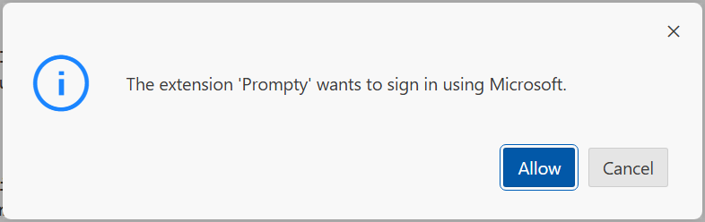

# 3.1 Create a New Prompty

[Prompty](https://prompty.ai) is an open-source generative AI templating framework that makes it easy to experiment with prompts, context, parameters, and other ways to change the behavior of language models. The [prompty file spec](https://prompty.ai/docs/prompty-specification) describes the sections of a Prompty file in detail, but we'll explore Prompty now by changing sections step by step.

## 1. Create Sandbox Folder

1. Return to the GitHub Codespaces tab and open the VS Code terminal.
1. Create an empty directory in root of your filesytem. From the Terminal:

    ``` title=""
    mkdir sandbox
    ```
1. Switch to the new directory

    ``` title=""
    cd sandbox
    ```

## 2. Create New Prompty

1. In the VS Code Explorer (left pane), right-click on the new `sandbox` folder
1. Select `New Prompty` from the drop-down menu.
1. This will create the new file `basic.prompty` and open it in VS Code. 

## 3. Run The Prompty

!!! danger "This step will fail with an error. Don't worry, that's expected."

1. Make sure the `basic.prompty` file is open in the editor pane.
1. Click the "play" button in the top-left corner (or press F5). 
1. You will be prompted to sign in. Click `Allow`
1. Select your Azure account in the follow-up dialog.



**Result:** The Visual Studio Code console will switch to the "Output" tab.

- **You will get an Error** in the Output pane as shown below. 
    - ❌ | ` Error: 404 The API deployment for this resource does not exist.`
- This is expected. It is because we haven't yet configured a model for Prompty to use.

---

!!! success "CONGRATULATIONS. You created and ran your first Prompty!"

