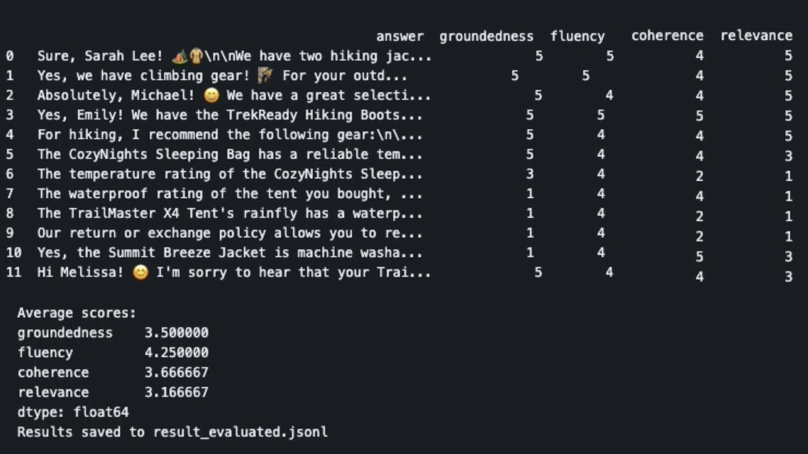

# 4. Understand Eval Workflow

!!! note "The evaluation flow takes 7-9 minutes to complete. Let's use the time to explore the code and understand the underlying workflow in more detail"

## 1. Explore: Create Response

1. Open the file `src/api/evaluators/data.jsonl`
    - This file contains the suite of test questions, each associated with a specific customer.
       - Sample question: _"what is the waterproof rating of the tent I bought?"_

1. Take another look at  `src/api/evaluate-chat-flow.ipynb`
    - Look at Cell 3, beginning `def create_response_data(df):`
    - For each question in the file, the `get_response` function (from our chat application) is invoked to generate the response and associated context
    - The {question, context, response} triples are then written to the `results.jsonl` file.

## 2. Explore: Evaluate Response

1. Take another look at  `src/api/evaluate-chat-flow.ipynb`
    - Look a cell 4, beginning `def evaluate():`
    - **Observe**: It loads the results file from the previous step
    - **Observe**: For each result in file, it extracts the "triple"
    - **Observe**: For each triple, it executes the 4 evaluator Promptys
    - **Observe**: It writes the scores to an `evaluated_results.jsonl` file

## 3. Explore: Create Summary

1. When notebook execution completes, look in the `src/api/evaluators` folder:
    - You see: **Chat Responses** in `result.jsonl`
    - You see: **Evaluated Results** in `result_evaluated.jsonl` (scores at end of each line)
    - You see: **Evaluation Summary** computed from `eval_results.jsonl` (complete data.)

1. Scroll to the bottom of the notebook to view the results cell:
    - Click the `View as scrollable element` link to redisplay output
    - Scroll to the bottom of redisplayed cell to view scores table
    - You should see something like the table below - we reformatted it manually for clarity.

## 4. Understand: Eval Results

The figure shows you what that tabulated data looks like in the notebook results. Ignore the formatting for now, and let's look at what this tells us:

1. You see 12 rows of data - corresponding to 12 test inputs (in `data.jsonl`)
1. You see 4 metrics from custom evaluators - `groundedness`,`fluency`,`coherence`,`relevance`
1. Each metric records a score - between `1` and `5`

Let's try to put the scores in context of the responses we see. Try these exercises:

1. Pick a row above that has a `groundedness` of 5.
    - View the related row in the `result_evaluation.jsonl` file
    - Observe related answer and context in file - _was the answer grounded in the context?_
1. Pick a row that has a `groundedness` of 1.
    - View the related row in the `result_evaluation.jsonl` file
    - Observe related answer and context in file - _was THIS answer grounded in the context?_

As one example, we can see that the first response in the visualized results (`row 0`) had a groundedness of 5, while the third row from the bottom (`row 9`) had a groundedness of 1. You might find that in the first case the answers provided matched the data context. While in the second case, the answers may quote specific context but did not actually reflect correct usage.

!!! note "Explore the data in more detail on your own. Try to build your intuition for how scores are computed, and how that assessment reflects in the quality of your application."
