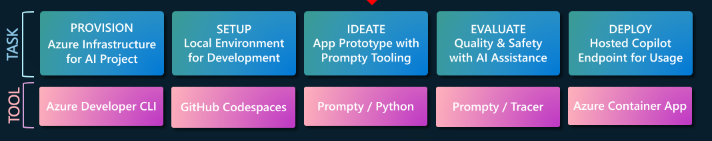

# 5. Deploy with Azure Container Apps

!!! success "Let's Review where we are right now"

    

    In the previous step, we evaluated our application for quality using 4 key metrics and a larger test inputs dataset. After getting acceptable results, it's time to deploy the protoype to production. **But how can we go from Prompty prototype to hosted API endpoint?** Let's build a FastAPI app and serve it with Azure Container Apps.

## Build with FastAPI

[FastAPI](https://fastapi.tiangolo.com/) is a modern, high-performance Python web framework for building and serving APIs. Build an application server (that listens on a specified port), configure it for the API endpoint (with different routes for various requests), and map routes to handler functions (that are invoked when requests are received at that route).

- You can run the application server _locally_ with hot reload, allowing code changes to be reflected instantly for rapid iterations.
- You can run the application server _in production_ with a container hosting service like Azure Container Apps, to support real-world use.

In this section, we'll see how a Prompty-based chat prototype can be packaged into a containerized application, and deployed to a hosted API endpoint on Azure.
