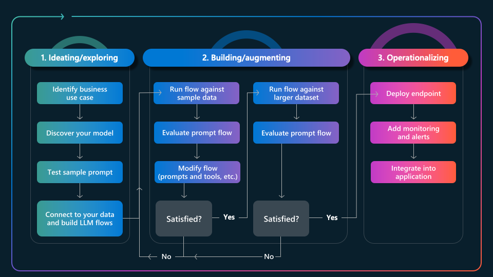

# 4. The App Lifecycle

Building generative AI applications requires an iterative process of refinement from _prompt_ to _production_. The application  lifecycle (GenAIOps) is best illustrated by the three stages shown:

1. **Ideation** - involves building the initial prototype, validating it manually with a test prompt.
2. **Evaluation** - involves assessing it for quality and safety with large, diverse test datasets.
3. **Operationalization** - involves deploying it for real-world usage & monitoring it for insights.

Building these solutions end-to-end requires not just a paradigm shift, but also robust developer tooling that can be tailored to suit every stage of the lifecycle. The figure below shows the rich tooling support in Azure AI Foundry today. Read [the post](https://techcommunity.microsoft.com/blog/aiplatformblog/the-future-of-ai-the-paradigm-shifts-in-generative-ai-operations/4254216) to see how these tools streamline your GenAIOps developer journey.

In the next section, we'll map this app lifeycle to a simplified development workflow that identifies the core developer task at each stage, and highlights a key developer tool that streamlines its execution.