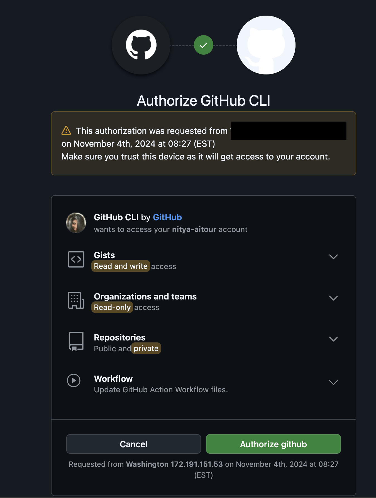

# 2.1 Self-Guided Setup

This is the start of the self-guided workshop track using your own Azure subscription.

!!! quote "ARE YOU CURRENTLY AT AN AITOUR SESSION? → [JUMP TO SKILLABLE-BASED SETUP](./../2-Provisioning/02-Skillable.md) instead"  


---

## 1. Review Pre-Requisites

Need a refresher on the pre-requisites for the workshop? [Review them here](./../1-Pre-Requisites/index.md).

---

## 3. Launch GitHub Codespaces

The Contoso Chat sample repository has a [dev container](https://containers.dev) defined. We can activate this in GitHub Codespaces to get a prebuilt development environment with all required tools and depenencies installed. Let's do that now.

!!! quote "On completing this step, you should have the following:"
    - [X] Launched GitHub Codespaces to get the pre-built dev environment.
    - [X] Forked the sample repo to your personal GitHub profile.

!!! info "**TIP**: Use `Copy to clipboard` feature to copy commands and reduce errors"
    In the following sections, you will encounter _codeblocks_ that have commands you will need to run in the VS Code terminal. 
    Hover over the codeblock to get a _Copy to clipboard_ icon for quick copy-paste operations.

### 3.1 Navigate to GitHub & Login


1. Open a new browser tab. Navigate to the link below.


    ``` title=""
    https://aka.ms/contoso-chat/prebuild
    ```

1. You will be prompted to log into GitHub. **Login with your GitHub profile.**

### 3.2 Setup GitHub Codespaces

1. You see a page titled **"Create codespace for Azure-Samples/contoso-chat"**
    - Check branch is `contoso-chat-v4` 
    - Click dropdown for **2-core** and verify it is `Prebuild ready`

        !!! tip "Using the pre-build option makes your GitHub Codespaces load up faster."

1. Click the green "Create codespace" button
    - You should see a new browser tab open to a link ending in `*.github.dev`
    - You should see a Visual Studio Code editor view loading (takes a few mins)
    - When ready, you should see the README for the "Contoso Chat" repository
    
        !!! warning "**CLOSE THE README TAB.** We will not be using those instructions today."

### 3.3 Fork Repo To Your Profile

Your GitHub Codespaces is running on the _original_ Azure Samples repo for this sample. Let's fork this now, so we have a personal copy to modify and reviist. We will use the GitHub CLI to complete this in just a few quick steps!


1. Open VS Code Terminal. Run this command to verify GitHub CLI is installed.

    ```bash title=""
    gh --version
    ```
    
1. Then run this command to authenticate with GitHub, with scope to allow forks. 

    ```bash title=""
    GITHUB_TOKEN="" gh auth login --hostname github.com --git-protocol https --web --scopes workflow 
    ```

1. Follow the prompts to complete auth flow in three steps (screenshots below).

    ??? quote " STEP 1 - Complete Device Activation flow (expand for screenshot)"

        - Say "Yes" when prompted to authenticate with GitHub credentials
        - Copy the one-time code provided in the console
        - Press "Enter" to open the Device Activation window
        - Copy the code into that window as shown below

            Here is an example of what that looks like:

            

    ??? quote "STEP 2 - Confirm GitHub authorization scope (expand for screenshot)"

        - You should see this authorization dialog on activation
        - Click the green "Authorize github" button to continue
        - This gives the GitHub CLI (this session) permission to do the fork

            

    ??? quote "STEP 3 - Verify you are Logged in."

        - The console log should show you are logged in successfully

            

1. Next, run this command to fork the repo. 

    ``` title=""
    GITHUB_TOKEN="" gh repo fork --remote
    ```

!!! success "CONGRATULATIONS. You have a personal fork of the repo in your profile!"

---

## 4. Authenticate with Azure

To access the provisioned Azure resources, we need to be authenticated from our development environment. We will do this **in two steps**.

!!! task "STEP ONE: Authenticate with `az` for post-provisioning tasks"

1. Log into the Azure CLI `az` using the command below. 

    ``` title=""
    az login --use-device-code
    ```

    - Copy the 8-character code shown to your clipboard.
    - Visit [https://microsoft.com/devicelogin](https://microsoft.com/devicelogin) in a new tab and paste code.
    - Select account with Username shown in your Skillable Lab panel. 
    - Click Continue and complete flow. Close the tab when prompted.
    - Return to GitHub Codespaces tab and view the VS Code terminal.
    - Press Enter to select the default presented subscription and tenant.
    - **This completes the az login workflow**


!!! task "2. STEP TWO: Authenticate with `azd` for managing application deployment"

1. Log into the Azure Developer CLI using the command below. 

    ``` title=""
    azd auth login --use-device-code
    ```

    - Follow the same process as before to complete the authentication workflow.
    - Note: Now you will just select the Skillable login from options (no password needed)


!!! success "CONGRATULATIONS. You are logged in from Azure CLI and Azure Developer CLI"

---

## 5. Provision & Deploy App

This repository is an [AI Application Template](https://aka.ms/ai-apps) that can be provisioned and deployed using the [Azure Developer CLI](https://aka.ms/azd) tool with a single command. Let's see how this works.

1. Open the Visual Studio Code terminal and type this command:

    ```bash title=""
    azd up
    ```

1. You will be prompted for the following inputs:

    - **Subscription**  specify your own active Azure subscription ID
    - **Environment name**  for resource group - we recommend using `AITOUR` 
    - Location for deployment - we recommend using `francecentral`

        !!! tip "Refer to [Region Availability](https://github.com/Azure-Samples/contoso-chat?tab=readme-ov-file#region-availability) guidance and pick the option with desired models and quota available."

1. Wait for the process to complete. It may take 15-20 minutes or more.
1. On successful completion you will see a **`SUCCESS: ...`** message on the console.


!!! success "CONGRATULATIONS. You've completed the SELF-GUIDED Setup!"

!!! alert "NEXT STEPS:[VALIDATE YOUR SETUP](./03-Validation.md) AND CHECK YOUR DEPLOYMENT1"


---