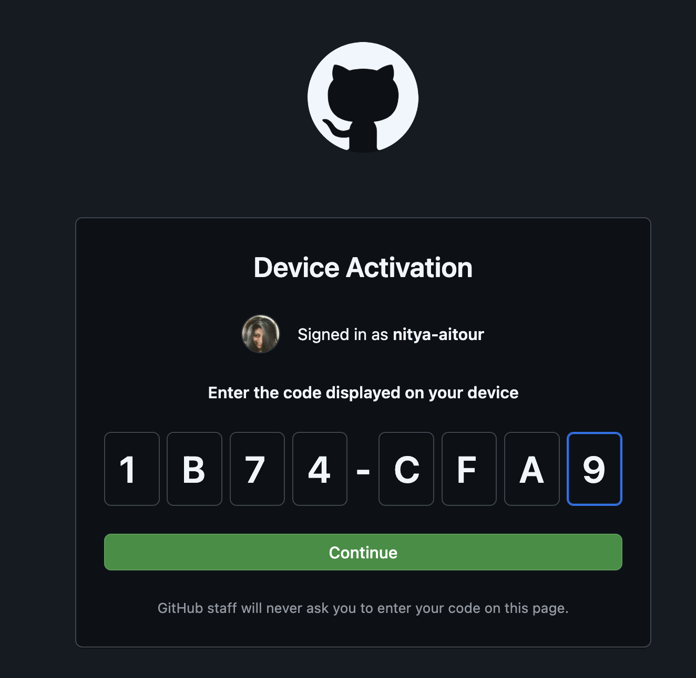
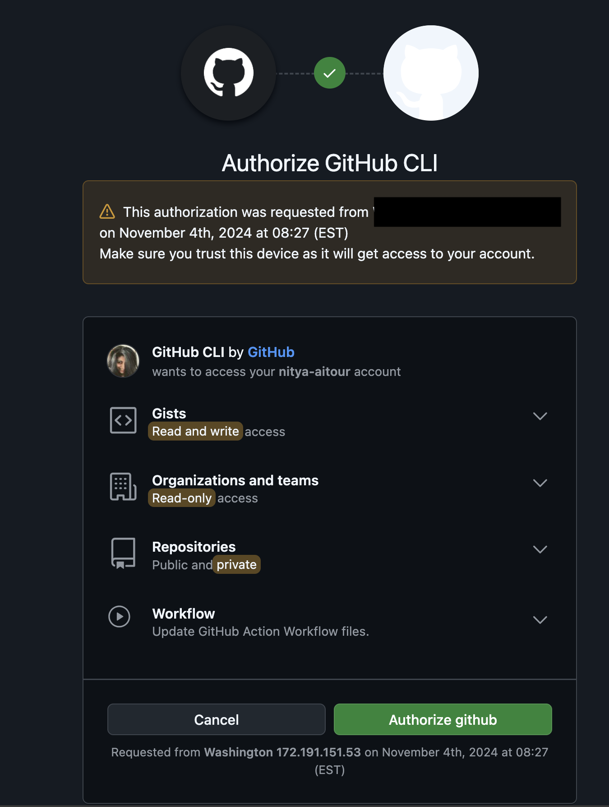
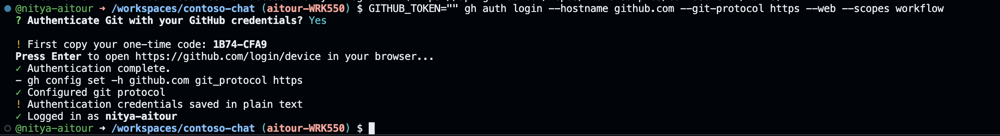

# 2.2 Skillable-Based Setup

This is the start of the instructor-led workshop track for Microsoft AI Tour attendees.

!!! quote "ARE YOU REVISITING THE LAB AT HOME AFTER AITOUR? → [JUMP TO SELF-GUIDED SETUP](./../2-Provisioning/01-Self-Guided.md) instead"  

---

## 1. Review Pre-Requisites

Need a refresher on the pre-requisites for the workshop? [Review them here](./../1-Pre-Requisites/index.md).

---

## 2. Launch Skillable VM

To continue with Skillable-based Setup, you will need the **Lab Launch URL** (link or QR Code) given to you by your instructor at the start of the session. 

!!! quote "On completing this step, you should have the following:"

    - [X] The Skillable VM tab open, with the Azure subscription details shown.
    - [X] The Skillable countdown timer visible, with _at least 1h 15 mins_ remaining.
    - [X] This instruction guide open, with this section in focus.

**If you already completed this stage, [move directly to Step 3](#3-launch-github-codespaces)**. Otherwise, expand the section below to get detailed instructions, and complete the task now.

??? task "LAUNCH SKILLABLE LAB → Check subscription status, open instruction manual "
    1. **Get Skillable Lab Link**. The lab code is `WRK550`. The Lab instructor in-venue will share a link (URL or QR Code) to the Skillable lab at the start of the in-venue session. _Ask a proctor if you don't have that handy._
    1. Open the browser and navigate to the link - _verify it says WRK550_.
    1. Click the **Launch** button - _this may take a few minutes to complete_.
        - When ready, you should see a new browser tab or window.
        - You will see a `Login` screen at left - **do NOT log in. We won't use it**.
        - You will see a countdown timer at top right - **verify it has at least 1hr 15 minutes**
        - You will see an instructions panel at right - **we'll review this next**
    1. Review the **Instructions Panel** and verify it has the following:
        - Lab Title - should be _Build a Retail Copilot Code-First on Azure AI_
        - Azure subscription - should have _username & password_ details filled in
        - Workshop guide - should open to a hosted version of this page.
    1. **IMPORTANT**: Leave this Skillable Session tab open in your browser!
        - We will refer to the Azure credentials in the next step
        - You can track the remaining time for the session in this tab.
        - You will return to this at the end to "End Session" cleanly.

---

## 3. Launch GitHub Codespaces

The Contoso Chat sample repository has a [dev container](https://containers.dev) defined. We can activate this in GitHub Codespaces to get a prebuilt development environment with all required tools and depenencies installed. Let's do that now.

!!! quote "On completing this step, you should have the following:"
    - [X] Launched GitHub Codespaces to get the pre-built dev environment.
    - [X] Forked the sample repo to your personal GitHub profile.

!!! info "**TIP**: Use `Copy to clipboard` feature to copy commands and reduce errors"
    In the following sections, you will encounter _codeblocks_ that have commands you will need to run in the VS Code terminal. 
    Hover over the codeblock to get a _Copy to clipboard_ icon for quick copy-paste operations.

### 3.1 Navigate to GitHub & Login


1. Open a new browser tab. Navigate to the link below.


    ``` title=""
    https://aka.ms/contoso-chat/prebuild
    ```

1. You will be prompted to log into GitHub. **Login with your GitHub profile.**

### 3.2 Setup GitHub Codespaces

1. You see a page titled **"Create codespace for Azure-Samples/contoso-chat"**
    - Check branch is `contoso-chat-v4` 
    - Click dropdown for **2-core** and verify it is `Prebuild ready`

        !!! tip "Using the pre-build option makes your GitHub Codespaces load up faster."

1. Click the green "Create codespace" button
    - You should see a new browser tab open to a link ending in `*.github.dev`
    - You should see a Visual Studio Code editor view loading (takes a few mins)
    - When ready, you should see the README for the "Contoso Chat" repository
    
        !!! warning "**CLOSE THE README TAB.** We will not be using those instructions today."

### 3.3 Fork Repo To Your Profile

Your GitHub Codespaces is running on the _original_ Azure Samples repo for this sample. Let's fork this now, so we have a personal copy to modify and reviist. We will use the GitHub CLI to complete this in just a few quick steps!


1. Open VS Code Terminal. Run this command to verify GitHub CLI is installed.

    ```bash title=""
    gh --version
    ```
    
1. Then run this command to authenticate with GitHub, with scope to allow forks. 

    ```bash title=""
    GITHUB_TOKEN="" gh auth login --hostname github.com --git-protocol https --web --scopes workflow 
    ```

1. Follow the prompts to complete auth flow in three steps (screenshots below).

    ??? quote " STEP 1 - Complete Device Activation flow (expand for screenshot)"

        - Say "Yes" when prompted to authenticate with GitHub credentials
        - Copy the one-time code provided in the console
        - Press "Enter" to open the Device Activation window
        - Copy the code into that window as shown below

            Here is an example of what that looks like:

            

    ??? quote "STEP 2 - Confirm GitHub authorization scope (expand for screenshot)"

        - You should see this authorization dialog on activation
        - Click the green "Authorize github" button to continue
        - This gives the GitHub CLI (this session) permission to do the fork

            

    ??? quote "STEP 3 - Verify you are Logged in."

        - The console log should show you are logged in successfully

            

1. Next, run this command to fork the repo. 

    ``` title=""
    GITHUB_TOKEN="" gh repo fork --remote
    ```

!!! success "CONGRATULATIONS. You have a personal fork of the repo in your profile!"

---

## 4. Authenticate with Azure

To access the provisioned Azure resources, we need to be authenticated from our development environment. We will do this **in two steps**.

!!! task "STEP ONE: Authenticate with `az` for post-provisioning tasks"

1. Log into the Azure CLI `az` using the command below. 

    ``` title=""
    az login --use-device-code
    ```

    - Copy the 8-character code shown to your clipboard.
    - Visit [https://microsoft.com/devicelogin](https://microsoft.com/devicelogin) in a new tab and paste code.
    - Select account with Username shown in your Skillable Lab panel. 
    - Click Continue and complete flow. Close the tab when prompted.
    - Return to GitHub Codespaces tab and view the VS Code terminal.
    - Press Enter to select the default presented subscription and tenant.
    - **This completes the az login workflow**


!!! task "2. STEP TWO: Authenticate with `azd` for managing application deployment"

1. Log into the Azure Developer CLI using the command below. 

    ``` title=""
    azd auth login --use-device-code
    ```

    - Follow the same process as before to complete the authentication workflow.
    - Note: Now you will just select the Skillable login from options (no password needed)


!!! success "CONGRATULATIONS. You are logged in from Azure CLI and Azure Developer CLI"

---

## 5. Configure Env Variables

We will be using the Azure SDK for code-first implementation in our development environment. This requires us to set environment variables to use the various Azure and Azure AI resources provisioned earlier. We can do this easily using the `azd` tool.


1. Run this command in your VS Code Terminal. This will create a `.azure/` folder for the `azd` tool to use in managing the provisioning process.

    ``` title=""
    azd env set AZURE_LOCATION francecentral -e AITOUR --no-prompt
    ``` 

1. Next, run this command to refresh environment variables. Select the default Azure subscription presented when prompted.

    ``` title=""
    azd env refresh -e AITOUR 
    ```

2. Verify the environment variables were refreshed.
    
    - Open the `.azure/AITOUR/.env` file in your Visual Studio Code editor
    - Verify that it was updated with env variable values (there should be 22 entries)

        !!! note  "Observe that the `.env` file does not have any secrets (passwords or keys). Instead, we use  [Azure Managed Identities](https://learn.microsoft.com/entra/identity/managed-identities-azure-resources/overview) for keyless authentication as a _security best practice_" 

3. Update the Azure Container Apps instance to show the `Hello World` version.

    The pre-provisioned Skillable subscription has an Azure Container apps resource with a default endpoint setup. In this step, we push the initial version of the Contosot Chat application to the resource and update that endpoint by running this command:

    ``` title=""
    azd deploy
    ```
    
    Wait till the command completes - this may take a couple of minutes but you should see progress updates in the terminal. Wait till you get the "Success" message.

!!! success "CONGRATULATIONS. Your development environment is configured for your Azure AI project!"

---

## 6. Do Post-Provisioning

Our infrastructure is provisioned and our development environment is setup and configured to use the infrastructure. Now, we need to upload our data to support our RAG design pattern. We'll populate Azure CosmosDB with customer data, and create a search index in Azure AI Search for our product catalog data. **Let's do this, next!**.


1. Open the VS Code Terminal and run this command. It takes a few minutes to complete.

    ``` title=""
    bash ./docs/workshop/src/0-setup/azd-update-roles.sh
    ```

    !!! note "WHAT JUST HAPPENED → With Skillable setup, we pre-provison resources using a service principal identity. To populate data, we need to give this user identity the write access. This step is not required in the Self-Guided path where user does the initial provisioning and has access by default"
    

1. Next, run this command to populate the data. It takes a few minutes to complete.

    ``` title=""
    azd hooks run postprovision
    ```

    !!! note "WHAT JUST HAPPENED → The repository contains the relevant data in the `data/` subfolder, along with scripts that can be run to populate the data into Azure AI Search and Azure CosmosDB resources. This command runs those scripts."
   
!!! success "CONGRATULATIONS. You populated the data and your Skillable setup is COMPLETE!"

---

